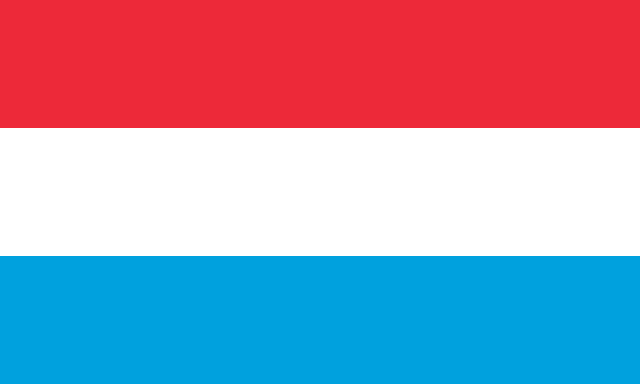

# HW 2 - CSS

### Introduction

In HW2, we want students to practice (1) CSS selectors and (2) CSS properties by replicating country flags. 
The homework will consist of five questions — for Q1 to Q4, 
you will implement the flags of Luxembourg, Thailand, Romania, and Mexico respectively. 
These questions will help students understand the concepts of flexbox as well as height and width properties. 
For Q5, the students will change the font and the size of the heading and subscripts 
for each flag to practice the styling of texts using CSS.

### Learning Objectives

- Selectors, id vs. class
- Basic properties of CSS
- Inline styling
- Flexbox, Margin, and Padding
- Text styling

## Setup
The starter code for this homework available on GitHub Classroom, and should be submitted
to Gradescope. 

[Homework 2](https://classroom.github.com/a/5fEn7SHk)

## Q1 - Luxembourg

First, we will replicate the flag of Luxembourg. 
Fill out the blank with correct selectors in `styles.css` to set the width, height, and background color of
of each `<div/>`. 
**Do not change the HTML for this question.**
You may need to add selectors or modify existing classes.

**Hint:** Recall specificity rule for CSS. The more specific the selector is, the higher priority it has.



```html
<h2>Luxembourg</h2>
<div class="flag">
  <div class="red threevert"></div>
  <div class="red threevert" id="white"></div>
  <div class="light-blue threevert"></div>
</div>
```

Now that you’ve seen how to style the HTML elements that you want using selectors, 
you can leverage that fact that multiple elements can share the same class 

:::caution
This is **not** true for `id`s
::: 

Elements with the same class will also share the same style properties that you set, and you only need to set it once.

## Q2 - Thailand

Now, we will replicate the Thailand flag. 
Style each horizontal stripe with CSS properties like `width`, `height`, and `background-color`. 
The hex codes you'll need are

- red: #B5002D
- blue: #2E2A4C


**Hint:** See if you can set the width property of the entire flag just once, so that all of the individual stripes automatically have the same width: check out **inheritance** in CSS!

```html
<h2>Thailand</h2>
<div class = "thailand-flag"> 
  <div class = "thailand-red"></div>
  <div class = "thailand-white"></div>
  <div class = "thailand-blue"></div>
  <div class = "thailand-white"></div>
  <div class = "thailand-red"></div>
</div>
```

## Q3 - Romania


Replicate the Romania flag. 
For this question, write HTML code by yourself using only existing CSS classes.
Use inline styling to properly arrange the HTML elements of the flag.

**Hint:** Try setting `display` and `flex-direction` properties to get the correct direction. 
You may find the `.threehoriz` class useful.

:::note
It is best practice to do all of your styling in the style sheet. 
However, inline styling is a very common debugging method and a very useful skill for quickly developing frontend.
:::


```html
<h2>Romania</h2>
<div class="flag" style="">
  <!-- INSERT FLAG HERE -->
</div>
```

## Q4 - Mexico

Replicate the Mexico flag. Again write HTML code by yourself and use the image provided below. 
Don’t create a separate `<div/>` tag for a white tag since you can also apply flexbox to ``.

**Hint:** To handle the image’s size, consider using `max-height`, `max-width` and `align-self`. 
As always, don’t be afraid to Google all of these properties! Feel free to use the provided `eagle.png`


```html
<h2>Mexico</h2>
<div class="flag">
  <!-- insert flag here -->
</div>
```

## Q5 - Text Styling

The flags are pretty, but I want to make my website a bit more interactive. Each flag is labeled using the `label` heading.
To make it more fun, give the labels a color.

Now, let's go further. I want to show the text changing when I `hover` over each text title. Specifically, I want it to 
get bigger and change to a warm color of your choice. 

**Hint: Try using the `hover` pseudoclass**

## Q6 - Margin and Padding

When spacing between and around elements there is a subtle distinction between margin and padding. 
Recall the margin is space **outside** of the element’s border while padding is space **between** the element and its border.
To see this, feel free to open inspect element and play around with the margin and padding settings.

1. Separate the two provided rectangles by a total of 10px using margin. Feel free to style the rectangles as any flag you like, but you don’t need to.
2. Shrink the provided inner rectangle so that the height and width are 60px smaller, by using padding.

## Submission

Because this is a frontend project, the staff would like to see both the code and the render. 
To enable this, we will be publishing your work to GitHub pages. GitHub pages is a lightweight website deployment
tool which we will use for many of our frontend assignments. 

1. Ensure that all of your code is in the classroom repository, and ensure that you have pushed to GitHub
2. To publish a page, go to `Settings > Pages`. Ensure that `Source` is "Deploy from branch". For branch, choose `main`, and for folder, choose `/(root)`
3. Click `build` or `save`. This will start the build process. 
4. Wait a few moments, and refresh the page. The top of the page should say "Your site is live at [url]"
5. Copy the url into the `README.md` in your repository. Commit and push that change.
6. Submit to Gradescope

### Conclusion

That's the end of this styling exercise! 
Now you should be familiar with some different flags 
and how CSS can cleverly transform simple HTML boxes into these different designs. 
Remember, you have a ton of flexibility with selecting elements 
and modifying them with an endless amount of properties that we have not even covered but are available to you!
