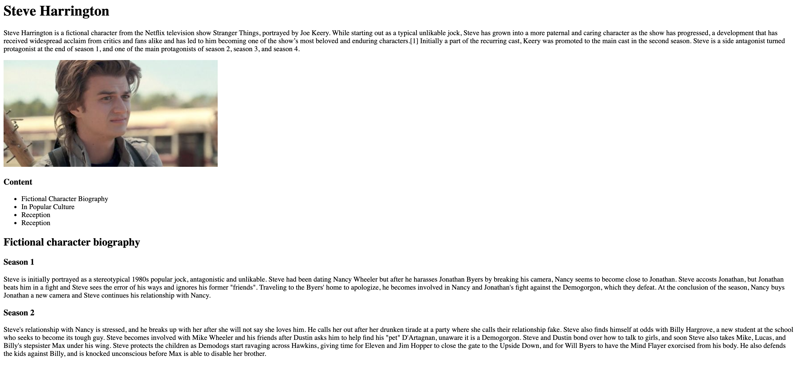

# HW 1 - HTML

## Introduction

If you are creating anything that is for the web, you need to understand how
basic HTML tags format text, embed images, and create links.

Before the web, we used ink on paper. Now, **HTML is the ink and the browser is
the paper.** The browser converts HTML into something formatted to make it
easier to read.

## Learning Outcomes

In this homework, you'll learn:

1. How to use the essential HTML tags
2. Setting up different pages for your website

## Part 0: Read the Notes

Make sure you read the [HTML](/docs/Lessons/Lesson2) notes before getting
started on this homework. Remember, if anything doesn't make sense in this
homework or in the reading, feel free to search on the internet, ask a friend,
or ask on Piazza!

## Goals

In this homework, we'll slowly add various HTML elements to a webpage to build
it up into a creating a wikipedia page for your favorite TV show character. It
will have a survey at the end that can be filled out. You don't have to do yours
about Steve Harrington (although we will appreciate it if you do).

Here's the wikipedia page for Steve Harrington:

After finishing this assigment, your wesbite should look something like this:

Are you ready? Good — let's begin!

## Setup

The starter code for this HW is here: https://github.com/fullstack-decal/sp22-assignment1-starter.git

To see your HTML code in a browser, right-click on the index.html file and
select Open With: Chrome (or your default browser)

## Requirements

### Add Texts of Different Sizes

Add some text to your HTML page with tags including `h1`, `h2`, and `p`. You
don't need to limit yourself to these — use whatever tags you'd like!

### A List of Table of Contents

Let's make a table of contents, like the wikipedia page, except that we will not
include links just yet. Instead, our table of contents will be simply text for
now. Use `ul` and `li` tags to create a table of contents.

### Add an Image

Let's break through the monotony with some fun images! Use the `img` tag to add
an image to your wiki page. Here's an
[image](https://static.wikia.nocookie.net/strangerthings8338/images/8/8b/ST3_Steve_Harrington_portrait.jpg/revision/latest?cb=20190321055351)
to use, for convinience!

Right now, your website should look like this:

### A Link That Navigates Away

Now, let's add a link that navigates the user to elsewhere on the web! Use the
`a` tag to add an link to the actual wiki page from your wiki page.
[Here's](https://en.wikipedia.org/wiki/Steve_Harrington) the link to the actual
wiki page.

### Add A Button

Let's add a button to this page! When clicked, the button should pop up an
`alert` message that thanks the user for being a big Steve Harrington fan!
[Here's](https://www.w3schools.com/jsref/met_win_alert.asp) a quick breakdown on
the `alert` function.

### Linking to Another Page

In your folder, let's create another HTML page! We'll call this page
secret.html. Use the skeleton code given above for this page too, and add a
simple secret message. Now, we want to create a link in our main index.html that
navigates to the secret.html page.

### Add A Form To The Secret Page

Now that we have a secret page, we can do ~ secret stuff ~. That is to say,
we're going to ask for the user's name and email on the secret page. Using the
`form` and `input` tags, create a form that accepts a name and email, with a
submit button.

Your form should look something like this:

### More Meta Tags

Final job: Let's add `meta` tags to `index.html`. There should already be 3 meta
tags in `index.html`. Consult
[this list](https://www.w3schools.com/tags/tag_meta.asp) to add one more. The
page shouldn't look any different, but your metadata should be much better!

**That's the end of the requirements! Feel free to play around and make the
website as detailed as you want. Have fun!**

## Submission

After you finish, create a repo on Github named `WDB-education`. This is the repo you'll store all your homework in!

Upload your HTML file to this repo under the name `assign1p1.html` and `assign1p2.html` for both your files!

Turn your code into a GitHub pages link, and upload the link to your page to Gradescope. The Gradescope can be found on the syllabus, and instructions for creating a GitHub page link can be found at the end of homework 1.

<aside>
❗ After you upload both files and setup the github page, if you directly visit the github page url, you will get a 404 Not Found. This is expected since you don't have a `index.html` page. 
To see the two html pages you have created, please go to the github page url + `/assign1p1.html` and `/assign1p2.html`. 
When you are submitting this homework, make sure you submit both links & properly label them as well.

</aside>

# Helpful Resources

[HTML Introduction](https://www.w3schools.com/html/html_intro.asp)

[HTML basics](https://developer.mozilla.org/en-US/docs/Learn/Getting_started_with_the_web/HTML_basics)

---

**Contributors**

- [Jerrick Zhu](https://www.linkedin.com/in/jerrickzhu/)
- [Samarth Goel](https://www.linkedin.com/in/samarth-goel-1047b8187/)
- [Arushi Somani](https://amks.me)
- [Nitya Krishnakumar](https://www.linkedin.com/in/nitya-krish/)
