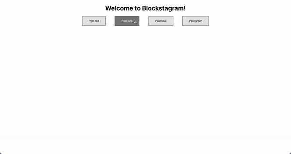
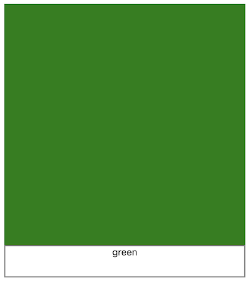

# HW 4 - React
### Introduction

One of the reasons that the React framework is so powerful, is that instead of updating the the entire HTML website every time you change a component, you can simply just update that singular component, without having other parts of the website realize it! In this homework we will be using that notion and the idea of components to create our own implementation of that.

We are going to be building a website very similar to Instagram, but much simpler... Let's call it Blockstagram. Blockstagram has 2 key features: 

1. It lets you post your very own special square block ranging from 4 colors (more if you're feeling ambitious).
2. It updates your main feed automatically, so whatever block that was recently posted is at the top of the screen.



## Learning Objectives

- Why use/learn React?
- Building familiarity with React syntax
- Knowledge of both class and functional components

## Setup

The starter code for this homework is available on GitHub Classroom.
[Starter Code](https://classroom.github.com/a/iHnsg1G5)


After cloning, run the below command to install the packages this app depends on!
```bash
npm install
```

## Q1 - HTML vs. React

Once setup, you’ll find two folders within your new repo named ‘html-example’ and ‘react-example’. 
Inside you'll find quick mockups of a social media user’s profile component, including their username, a bio, a circular profile picture, and a follow button.
Below you'll see both examples, HTML on the left and React on the right. 
We encourage you to look at the different files and see how exactly you can condense HTML/CSS code into re-usable components in React! 


Nothing to be done for this question.

## Q2 - Functional Components vs. Class Components

If you look at the Color component in `Color.js` you will notice that it looks different from the other components in this project. This is because the Color component is a Class Component, while the rest of the components are Functional Components. 

Your task for this question is to convert the Color component from a class component to a functional component. Look at the structure of the other components in this project as a reference for how to do this. Additionally, none of the logic for this component should change.

```jsx
import React from "react"

class Color extends React.Component {

    constructor(props) {
        super(props);
    }

    render() {
        return <button onClick={() => this.props.handleClick(this.props.color)}>Post {this.props.color}</button>
    }
}

export default Color;
```

## Q3 - An Example of a Component: Menu

Your second task is to build out the Menu component for Blockstagram! This component should have a button for each color and clicking that button will automatically create a post with the corresponding color. For this task you will need to use state hooks and props.

- **Hint:**
    What other component (that you've already implemented) has this functionality?
    

```jsx
import React from 'react';
// Add any imports you think you might need here!

const Menu = () => { 

    return (
      <div className="colorOptions">
          {/* TODO */}
      </div>
    );
}

export default Menu;
```

## Q4 - Constructing the Blockstagram Feed and Posts

Now it’s time to build the rest of Blockstagram! Your task now is to create the Block component (aka an “instagram post”) and the Feed component. This might seem a little daunting at first, but let’s first break it down and just focus on what a “Block” will look like: We see it has a square filled with a color, and then a small outlined rectangle at the bottom representing where a caption may go.



1. Look at the ***Components/Block.js*** file and think about how you could use ***props*** as a way to pass in an attribute — What exactly is changing from block to block?
- **Hint:**
    Consider using [inline styling](https://www.educative.io/answers/how-to-create-inline-styles-in-react) to assign the Block’s background color!
    

```jsx
import '../Styles/Block.css';
import React from 'react';

const Block = (props) => {
    /* YOUR CODE HERE */

    return (
        // ignore this data-testid, it's purely for testing :)
        <div data-testid='main-component'>
            {/* You'll notice pre-assigned class names 'post' and 'caption', 
            we took care of the basic block styling! 
            If curious, check out the css in Styles/Block.css */}

            {/* Refer to hint if stuck on how to color the posts */}
            <div className="post"></div>
            <div className="caption"></div>
        </div>
    );
}

export default Block;
```

2. Once you think you’ve completed Block (you can always go back and edit if necessary), navigate to the ***Components/Feed.js*** file. You essentially have two tasks:
    1. Create a variable that keeps track of your posts/blocks
    2. Edit the `posts` variable to represent multiple `<Block/>` components
- **Hint:** 
    Consider the useState hook for the new variable! Think of the state of the feed as a **LIST** of Block components, where every time you add a block, the list now contains the newly added block :]
    

```jsx
import { useState } from 'react';
import React from 'react';
import Menu from './Menu';
import Block from './Block';

const Feed = () => {
    /* TODO: Declare a new state variable to keep track of the blocks on your Blockstagram feed! */
    // Refer to Hint 2 for more help!

    /* Use the map() function to render multiple Blocks! */
    const posts = null; // TODO: edit this variable

    return (
        <div>
            <Menu></Menu>

            {/* Below is where all of your Blocks should render! */}
            {posts}
        </div>
    );
}

export default Feed;
```

Remember you can run your React app locally to see what you've built so far with the below command!
```bash 
npm start
```

## Submission

After you finish, push these changes into your Classroom repository.

1. Turn your code into Gradescope for the assignment **Homework 4**.
2. This assignment has a **checkoff** component. To get credit,
you must get checked off. We will specifically carve out time during lecture just for check offs.

## Conclusion

Congrats on finishing your first React assignment! We hope you're a bit more comfortable with React now, and feel free to play around and add more features to Blockstagram!
Even though it's just a static page right now, in the next assignment you will see how to make your React app more dynamic with APIs.

## Resources

Using Props: [https://reactjs.org/docs/components-and-props.html](https://reactjs.org/docs/components-and-props.html)

Inline Styles in React: [https://www.educative.io/answers/how-to-create-inline-styles-in-react](https://www.educative.io/answers/how-to-create-inline-styles-in-react)

UseState Hook: [https://reactjs.org/docs/hooks-state.html](https://reactjs.org/docs/hooks-state.html)

map() Function: [https://reactjs.org/docs/lists-and-keys.html](https://reactjs.org/docs/lists-and-keys.html)

---

**Contributors**
- [Nitya Krishnakumar](https://www.linkedin.com/in/nitya-krish/)
- [Abigail Delgado](https://www.linkedin.com/in/abigail-gee-delgado/)
