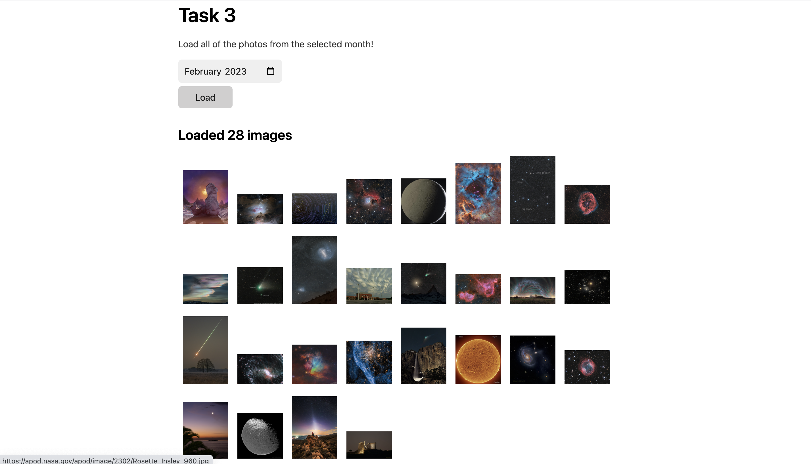

# Introduction

In this homework, we will utilize the NASA daily picture API to create a backend server that allows users to store, delete, and retrieve their favorite pictures of planets and nebulas.

## **Learning Objectives:**

- What is an API?
  - What is the backend and how does the frontend communicate with the backend
- What is HTTP? How to use Postman?
- What is NodeJS
- What is Express and how to use Express to develop APIs

## Introduction

**Query Parameters**

Query parameters are a defined set of parameters attached to the end of a url. You have probably seen this on almost every website you visit. If you are watching a video on Netflix, the url will look something like:

> [https://www.netflix.com/watch/80186941?trackId=14170286](https://www.netflix.com/watch/80186941?trackId=14170286)

The query parameters begin after a question mark (?) in the url, and a series of key-value pairs. In this example, the key is _trackId_ and the value is _14170286_. If there were multiple query parameters, they would be concatenated by an ‘&’.

To access a query parameter in Express, we use **req.query**, which returns an object of key-value pairs.

**NASA APOD (Astronomy Picture of the Day) API**

In this homework, we will be using the NASA APOD API, an API which returns details about the Astronomy Picture of the Day for a specific day. For example, the APOD for Christmas 2018 was the following:


Read the details of the APOD API at [https://api.nasa.gov/](https://api.nasa.gov/) before starting on this homework.

## Setup

To use the NASA API, you will need an API key. This is a way of authenticating with the NASA API server, and it is how NASA prevents unauthorized users from calling the API.

To generate an API key, go to [https://api.nasa.gov/](https://api.nasa.gov/) and scroll down to the “Generate API Key” section. Fill in your first name, last name, and email, and click sign up. You should be presented with a similar screen to the following:


Keep track of your API key, you will need it for the first of the homework when making requests to the NASA API.

[](https://fullstackdecal.com/docs/Assignments/Homework/HW5#setup)

The starter code for this homework is in Classroom:

[Homework 6](https://classroom.github.com/a/k9_Yh6kP)

Take a look around the codebase and try to understand how it's put together. It contains an Express server, as well as the [axios](https://axios-http.com/) library, which we will be using to make calls to the APOD API.

## Task 0 - Start the Backend

Before we start building anything, we have to ensure that all of the dependecies have been properly installed for the Express server:

- cd into the directory: `cd homework6-starter/node-server`
- Install dependencies: `npm i`

The starter code that we have provided sets up a basic Express server, and then launches it such is it’s listening on the port 3000:

```go
const express = require('express')
const axios = require("axios");
const cors = require('cors');

const port = process.env.PORT || 3000
const app = express();

app.use(express.json());
app.use(cors());

app.listen(port, () => {
	console.log(`Listening on port ${port}`)
});
```

To run the server, call `npm start`.

You should see output that looks something like this:

```go
> node-server@1.0.0 start
> node index.js

Listening on port 3000
```

## Task 1 - Spaceman Postman

Your first task is to implement the `/apod-for-date` GET route that returns the NASA Astronomy Picture of the Day for a specific date.

**Query Parameters**

- `date`: the date to fetch the APOD for in `YYYY-MM-DD` format

<aside>
💡 You can assume that any date passed in matches the `YYYY-MM-DD` format

</aside>

**JSON Response**

- `name`: the name of the image (taken from the `title` field of the NASA API response)
- `url`: the URL of the image
- `date` the date of the image

**Hint:** You can access the query parameters in your API handler using `req.query`.

After you’re done with this, use Postman to test your new `/apod-for-date` API to make sure that it’s returning the correct value. For example, if you call the API with the `date` parameter set to `2020-12-25` , the response should **exactly** match the following:

```json
{
  "name": "Northern Winter Night",
  "url": "https://apod.nasa.gov/apod/image/2012/WinterSceneBlock.jpg",
  "date": "2020-12-25"
}
```

After you are done, open `index.html` and look at the first section. Choose a date and click the “Load” button. If you have implemented the API correctly, you should see the corresponding APOD appear along with its name! Feel free to play around with this before moving on to the next section.


## Task 2 - To the Moon 🚀

Now that you have worked with the API, implement the `/apods-for-april` GET route that returns a list of all APODs in April 2022. you must only use **ONE** call to NASA’s API to answer this question.

**Query Parameters**

None

**JSON Response**

- an array of APOD objects, where each element is in the same format as your response to Task 1

```jsx
[
	{
		"name": "Leaning Tower, Active Sun",
		"url": "https://apod.nasa.gov/apod/image/2204/sunspotsleaningtowerofpisa1024.jpg",
		"date": "2022-04-01"
	},
	{
		"name": "Nova Scotia Northern Lights",
		"url": "https://apod.nasa.gov/apod/image/2204/Z62_5747-Edit1090.jpg",
		"date": "2022-04-02"
	},
	...
]
```

**Hint:** How many days are in April?

****\*\*\*\*****Hint:****\*\*\*\***** What parameters does the NASA API provide other than `date`?

After you are done, look at the second section of `index.html` and click the “Load” button. If you have implemented the API correctly, you should see the all of the images for April 2022 being loaded onto the webpage!


## Q3 - All Month Long

Now, to top it all off, implement the `/apods-for-month` route that takes in 2 query parameters for the month and year, and returns all APOD images for that month.

**Query Parameters**

- `month`: the month to fetch APODs for e.g. `01` for January, `02` for February, and so on
- `year`: the year to fetch APODs for

**JSON Response**

- an array of APOD objects, of the form below, where each element is in the same forma as your response to Task 1

```json
[
	{
		"name": "Leaning Tower, Active Sun",
		"url": "https://apod.nasa.gov/apod/image/2204/sunspotsleaningtowerofpisa1024.jpg",
		"date": "2022-04-01"
	},
	{
		"name": "Nova Scotia Northern Lights",
		"url": "https://apod.nasa.gov/apod/image/2204/Z62_5747-Edit1090.jpg",
		"date": "2022-04-02"
	},
	...
]
```

**Hint**: As you implement this API, you might notice that it is similar to your solution for Q3. How might you reuse the code in Q3 for this question as well?

**Hint:** Use the built in Javascript object, Date() to figure out the end date for a given month - Google is your friend! (Note that the `month` parameter for Date is zero-indexed, so January has an index of 0).

After you are done, look at the last section of `index.html` and click the “Load” button after selecting a specific month. If you have implemented the API correctly, the page should load a random image from the month you selected!



### Submission

After you finish, push these changes into your Classroom repository.

Turn your code into Gradescope for the assignment Homework 6.

### Conclusion

Congratulations! You should now be familiar with using Postman, formatting an API call, and create custom API endpoints of your own. These are all very valuable skills that you will use extensively as you explore further into backend development.

### Contributors

- Isaac Ong
- William Henderson
