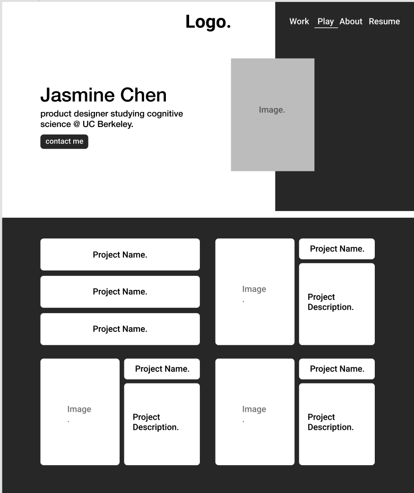
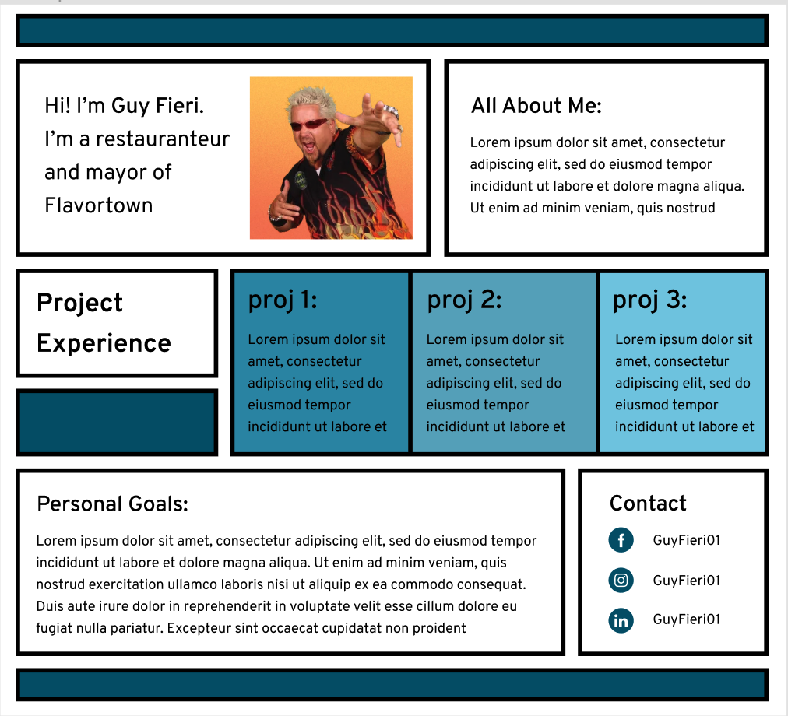
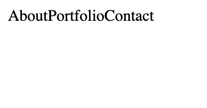
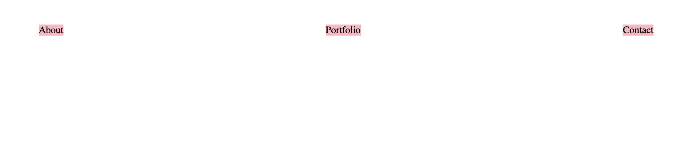

# Project One - Personal Website

## Introduction

Hello, and welcome to your first project! Whoo 🎉

For your first independent venture into web development, we thought to help you make something incredibly practical — your website! Your little corner of the internet, where you can send people curious about who you are, what you do, what you think, what you achieve — you get the idea.

We're going to use our newfound HTML and CSS skills to create website layouts and style them. By the end of this project, you'll have a brand new personal website.

## Part 0: Hello, Flexboxes

We're going to use a lot of flexboxes to make our website look nice. So, let's have a little aside, and practice using flexboxes.

Similar to what you may have heard in Lecture, flexboxes are an easy way to ensure the cohesion of a website in a way that looks appealing to the user as well as making it easy for the developer to organize their components.

To get started, complete all levels on Flexbox Froggy.

[Flexbox Froggy](https://flexboxfroggy.com/)

## Part 1: Getting Started with Design

Alright! Now that we are comfortable with using flexbox, let's get started on developing our personal website! We begin by providing you some design details. You will be trying to replicate **one** of the following Figma templates shown below, or you can choose to create your own (as long as it is sufficiently complex).

Sufficiently complex websites must utilize principles of flexboxes and must display a good understanding of page layouts.

[Figma Link](https://www.figma.com/file/l8wZgVAFvc4cyVynEGmYUI/WDB-Project-1-Site-Templates?node-id=0%3A1) (helpful details like font type, size, colors, etc)

Use one of these three templates as your starting point:

- Website Design 1
  
- Website Design 2
  
- Website Design 3
  

## Part 2: Let's Talk Requirements

How you choose to do make your personal website will be entirely up to you since there will be multiple ways to accomplish the same thing. That being said there will still be some guidelines and set of restrictions that you should abide by:

- The code you write must be readable and efficient (eg. Sensible Variable names, Appropriate use of CSS classes, etc...)
- There are 3 sections you _must_ include within the website:
  - **About**: A short introduction on who you are and what you bring to the table.
  - **Work**: This could include past projects that you have worked on, current projects that you are currently doing, class projects, internships, and clubs!
  - **Contact:** A section where potential site-visitors could find your social media handles, and an email or phone number to contact you.

## Part 3: Starter Code

You can find all starter code here: [https://github.com/web-at-berkeley/full-stack-decal/tree/main/projects/proj1](https://github.com/web-at-berkeley/full-stack-decal/tree/main/projects/proj1)

We have given you a `template.html` and a `template.css` file to begin with... and that's pretty much it. This is by design. The point of this project is for you to get creative as to how you want your personal website to look. However, we will be walking you through one example of how to implement a flexbox, using the `navbar` div structure we've provided.

### Making a Nav Bar Horizontal Using Flexboxes


Currently, this is what our personal website looks like. A nav bar is supposed to be _horizontal, not vertical!_ This simply won't do. Let's fix it. We'll navigate to our `template.css` file, and add the following code there:

```css
.nav {
  display: flex;
}
```

Notice how we're not editing the `nav-button`, but their parent div, which we'll henceforth call it's "container".

Now, your website should look something like this:



Progress! Sort of. This still doesn't look much like a navbar. Things needs to be spread out a little bit. Let's add another line to our css file:

```css
.nav {
  display: flex;
  justify-content: space-around;
}

/* For the aesthetics */
.nav-button {
  background-color: lightpink;
}
```



That's a little bit better! Try resizing the window and watch the distance between them adjust on its own ✨

And that's it — that's all you have to do, just over and over again. Something that's really helped me in using flexbox-es over the years is this website:

[A Complete Guide to Flexbox](https://css-tricks.com/snippets/css/a-guide-to-flexbox/)

It's an extremely thorough guide to flexbox-es and I recommend keeping it open as a reference!

And that's it! From here on out, it's completely up to you. Try a hand at this project, ask for help, and all the best!

- Helpful Resources
  ### Old Project 1
  
  [The News Times](https://btholt.github.io/intro-to-web-dev-v2/news.html)
  ### Tips and Guidelines from the Old Project 1 that are helpful for this project:
  - Google everything. No one expects you to remember these things off the top of your head. It's not cheating. This is not an exam. Knowing how to Google programming things is literally your job.
  - If you want to change an images size, you change the `<width>` / `<height>`  attributes, where you replace width and height with a number. This will be the size of your image in pixels.
  - This project's navigation box (with all the colors) was the hardest part. It uses `display: flex` inside of `display: flex` and uses `flex` and `flex-direction`.
  - The top row and the bottom row are using `display: flex` to manage the size of those columns. They both use the same class.
  - Like any Web Design project, there's a lot of room to re-use classes on this.
  - Take it one step at a time. Take one section on the page, style it, and then use those small building blocks to make larger building blocks.
  - Your browser has fantastic dev tools built into it. The easiest way to start playing with them is to right-click on something on the web and click "Inspect Element". This will take you to the Elements Explorer. It lets you look at the HTML that's on the page and the CSS that's affecting those elements. Super useful. Poke around and get used to playing with the dev tools. You'll live here as front end developer.

## Submission

Submit your code on gradescope as well as a url to the github page of this assignment.

## Acknowledgments

This project was created by [Brian Holt](https://www.linkedin.com/in/btholt/) as part of the [Frontend Masters](https://frontendmasters.com/courses/) [Complete Intro to Web Development, v2](https://frontendmasters.com/courses/web-development-v2/) course. Adapted by WDB course staff, templates by [Tijmen Sep](https://www.linkedin.com/in/tijmen-sep-582469175/) and [Jasmine Chen](https://www.linkedin.com/in/jasmine-chen-8894901b6/).
