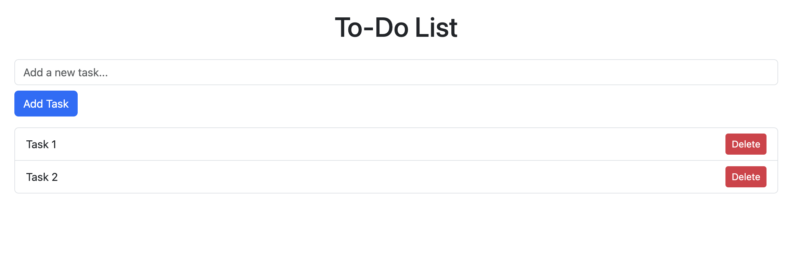

# CSS Frameworks and Redux

In this assignment, we’ll be building a simple to-do list app, but with a twist—using **Bootstrap** to handle all the styling and **Redux** to manage our data. Here’s what that looks like:

- **Using Bootstrap**: We’ll make our app look clean and professional without writing tons of custom CSS. Bootstrap will give us the classes we need to style the form, buttons, and list items so they’re all neat and responsive.
    - Check out [https://getbootstrap.com/](https://getbootstrap.com/) for more information and Bootstrap styles!
- **Managing Data with Redux**: Instead of each part of the app managing its own tasks, we’ll keep everything organized in one central place using Redux. This makes it easy for different parts of the app to know what’s going on and stay in sync.

By the end of this, you’ll have a to-do list app that looks polished and has a well-structured way of handling data—two things that are super useful when building bigger apps later on!

---

**Project Structure + Appearance**

After creating your React app with `create-react-app`, you should have a basic file structure. Here’s a quick overview of the folder:

```
react-todo-app/
├── public/
├── src/
│   ├── components/
│   │   ├── TaskForm.js
│   │   ├── TaskList.js
│   ├── App.js
│   ├── index.js
│   ├── store.js
└── package.json

```

The website should look something like this:



### **Summary**

1. **`index.js`** initializes the app with Bootstrap styling and the Redux store.
2. **`store.js`** holds the central state (tasks) and manages updates through actions (you will need to create this file).
3. **`App.js`** serves as the app’s main structure, bringing together `TaskForm` and `TaskList`.

Components folder:

1. **`TaskForm.js`** lets users add tasks, dispatching actions to update the state (you will need to create this file).
2. **`TaskList.js`** displays the current list of tasks, enabling users to delete tasks and see the list update in real-time (you will need to create this file).

### Steps:

Before we begin, make sure to set up a react project and cd into it!

### **1. Setting Up Bootstrap in `src/index.js`**

- **File**: Look for `src/index.js`
- **Task**:
    - Import the Bootstrap CSS at the top to make its styles available throughout your project.
    - Wrap the `<App />` component with `<Provider store={store}>`, which makes the Redux store accessible to the app.
    - Import `Provider` from `react-redux` and `store` from `store.js`.

---

### **2. Setting Up the Redux Store in `src/store.js`**

- **File**: Create `src/store.js`
- **Task**:
    - Define the initial state of your app with an empty list of tasks.
    - Set up a reducer function to handle actions for adding and deleting tasks.
    - Create a Redux store using this reducer, then export the store to use in other parts of the app.

---

### **3. Building the Main Layout in `src/App.js`**

- **File**: Look for `src/App.js`
- **Task**:
    - Set up the main layout for the app, including a title.
    - Import and render the `TaskForm` and `TaskList` components to organize the app structure.

---

### **4. Creating the TaskForm Component in `src/components/TaskForm.js`**

- **File**: `src/components/TaskForm.js`
- **Task**:
    - Create an input form for adding new tasks.
    - Use `useState` to manage the input field’s content.
    - Dispatch an action to the Redux store when a new task is submitted.

---

### **5. Creating the TaskList Component in `src/components/TaskList.js`**

- **File**: `src/components/TaskList.js`
- **Task**:
    - Display the list of tasks from the Redux store.
    - Add a delete button for each task that dispatches an action to remove the specific task.
    - Use `useSelector` to access the tasks in the Redux store, and `useDispatch` to send delete actions.

---

### **6. Running and Testing the App**

1. **Run the app** using `npm start`.
2. **Test** the functionality:
    - **Add tasks** through the form, and they should appear in the list.
    - **Delete tasks** by clicking their delete button, and they should be removed from the list.

### 7. Final Task

When you’re done, submit to Gradescope! Congrats on completing Vitamin 8!