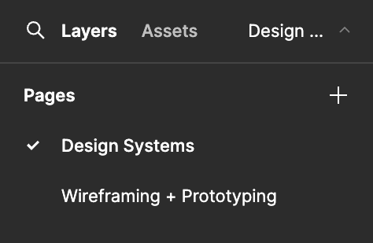

# Design Systems and Wireframing

# Introduction

In this assignment, we will be creating a simple design system and landing page wireframes/mockups for your very own imaginary ice cream shop!

# Learning Objectives

- Create a design system to use as a visual guideline for a cohesive website
- Strategically select colors, fonts, and other elements of a design system to achieve a desired website branding
- Create low, mid, and high-fidelity wireframes/mockups through Figma
- Receive and utilize design feedback

# Part 0:

Make a copy of [this Figma file](https://www.figma.com/design/izCkRJiBcNlgw9nhUeqJ7Z/Fullstack-Decal-Vitamin-9---Design-Systems?node-id=0-1&t=MALRuscnbaThebhX-1). You will be creating both your design system and wireframes here! **Set the file’s share setting to public.**

# Part 1:

On the Figma file, make sure you’re on the “Design Systems” page! You can switch around between pages on a file through the left-hand bar.

## 1.1 Brainstorm and describe the desired branding of your website

How should users feel when viewing your website? How do you want users to perceive your ice cream business? Maybe you want the energy of your website to be playful, or perhaps you want to give off a professional vibe. (1-2 sentences)

## 1.2 Create a color palette

Choose 3+ colors to include in your design system. Explain how the colors you chose fit into your desired branding (1-2 sentences).

The colors you choose for your business should be intentional. Different colors carry different associations, use them to your advantage!

Consider what colors are harmonious with each other. [Coolors](https://coolors.co/generate) is a great resource for finding complementary or contrasting colors.

## 1.3 Choose typography

Choose your heading, subheading, and body text fonts. Explain how the fonts you chose fit into your desired branding (1-2 sentences)

[Fontjoy](https://fontjoy.com/) is a handy resource for finding nice font combinations!

# Part 2:

Switch over to the “Wireframing + Prototyping” page of your Figma file.

## 2.1 Create a low-fidelity wireframe of your ice cream shop’s landing page

Your low-fidelity wireframe is a display of the bare-bones structure of your landing page. 

Lo-fis are typically colorless and use simple shapes as element placeholders. Reference the Figma Basics lecture for more guidelines on what lo-fis typically look like.

## 2.2 Receive feedback on your low-fi from a peer

Since lo-fis lack detail, feedback during this stage is more conceptual and about the general structure of your wireframe.

A few questions you can consider asking are:

1. Are key elements, like buttons or cards, placed where you would expect them to be?
2. Are there any essential features or content that aren’t represented in the wireframe?
3. Is there too much or too little information on the screen?

## 2.3 Create a mid-fidelity wireframe of the landing page

Mid-fis are still colorless, but contain more detail than lo-fis. Reference the previous design lecture for more guidelines on what mid-fis typically look like.

Utilize the feedback you received on your lo-fi to design your mid-fi.

## 2.4 Receive feedback on your mid-fi from a peer

Mid-fis display more detail, allowing us to ask more about the usability, aesthetic, and specifics of the layout. Try get feedback from someone new!

A few questions you can consider asking are:

1. Understanding + Usability - What is your first impression of the wireframe, and how well do you understand the purpose of each screen or element?
2. Layout + Structure - Does the layout of the wireframe seem logical and easy to follow? Were there any areas where the structure confused you or felt unintuitive?
3. Overall suggestions for Improvement - What key improvements or changes would you recommend to make the wireframe clearer and more effective in conveying the intended functionality?

## 2.5 Create a hi-fidelity mockup of the landing page

Use the mid-fi feedback and design system you created in Part 1 of this vitamin to design a hi-fi mockup of the landing page. 

Hi-fi mockups should look like a static version of the final product, fleshed out with the chosen colors, fonts, and elements from your design system.

# Submission

Congrats! You’ve designed the landing page of your ice cream shop from scratch!

To submit, upload your Figma file link onto Gradescope. **Make sure your Figma file’s share setting is public.**