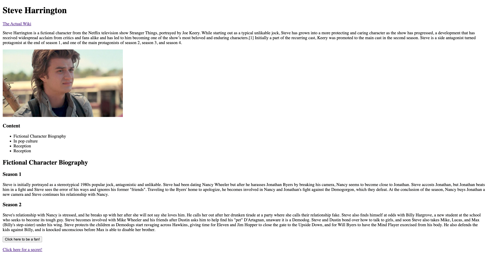

# HTML and CSS

## Part 1: HTML

### Introduction

In this part we want students to learn how to create an HTML webpage using all the widely used common HTML tags.

Although this is your first homework, if you bear with us, we’ll try our best to guide you through it. Today, you’ll be creating a webpage about famous Stranger Things actor Steve Harrington. This website includes an image, a table of contents, headings, paragraphs, and so much more!

Please follow the exact content given in the following instructions above and try to copy the above image exactly so that the autograder can give you full points.

Your website at the end should look something like this:


### Learning Objectives

- Using essential HTML (text) tags
  - h1, h2, p, b, i, sub, sup, br, etc.
  - Creating bulleted lists using `<ul>`, `<ol>`, and `<li>` tags
- Embedding an image in the webpage using ``. Alternate text prop
- Linking to different pages - 1 live page and 1 local page (`<a>` tag).
- A button to perform a basic task like an alert.
- Creating a basic form on the local page.
- Basic info about meta tags

### Setup

Create an HTML file named `index.html`.

:::info What is index.html?
The file name index.html is often used for landing pages as many
web servers treat it as the 'default' document. As in, when you go
to https://apple.com/, it's really loading https://apple.com/index.html!
:::

### Question 0: Boilerplate

Every HTML file must have some bare-minimum code to be considered valid, known as the boilerplate. Right now your `index.html` file
should be empty. Add the boilerplate to your website. If you forgot how to do this, refer to the [HTML lesson](../../Lessons/Lesson2).

:::info
_Must_ is a strong word. Browsers today are built to be extremely compliant, even if an HTML file is invalid.
That way a user can often see _something_ rather than just a giant error message. This means that if you have an
HTML file that has some syntax error or doesn't have the "boilerplate" it may still _work_.
:::

At the end of this step you should have a:

- doctype declaration
- `<html>` tag
- `<head>` tag
- `<body>` tag

### Question 1: Title, Heading

First, we will need a title to tell our readers what they will be reading about

- Set the title of the webpage as “Steve Harrington Tribute”.
- After the title, set the heading as “Steve Harrington”. This should be a size 1 heading (**hint:** h1).

:::tip Title vs heading?
In HTML, the word "title" refers to what appears in the browser menu bar, while "heading" refers to text in the
document's content.
:::

### Question 2: Links

Now, let's add a link that navigates the user to elsewhere on the web! Use the `<a>` tag to add a link to the actual Wikipedia page from your wiki page. 
Here's the link to the actual wiki page. Look up the **`<a>`** tag to see how you can make the new page open up in a new tab.

> https://en.wikipedia.org/wiki/Steve_Harrington

### Question 3: Content

Copy the following paragraph into your HTML page using a `<p>` tag:

> Steve Harrington is a fictional character from the Netflix television show Stranger Things, portrayed by Joe Keery.
> While starting out as a typical unlikable jock, Steve has grown into a more protecting and caring character
> as the show has progressed, a development that has received widespread acclaim from critics and fans alike
> and has led to him becoming one of the show’s most beloved and enduring characters.[1]
> Initially a part of the recurring cast, Keery was promoted to the main cast in the second season.
> Steve is a side antagonist turned protagonist at the end of season 1,
> and one of the main protagonists of season 2, season 3, and season 4.

### Question 4: Celebrity Image


Now insert Steve Harrington’s image using the `` tag. Use a height of 250px.

(Right click to download the image)

### Question 5: Table of Contents

Let's make a table of contents, like the Wikipedia page, except that we will not include links just yet. Instead, our table of contents will be simply text for now.
Use `ul` and `li` tags to create a table of contents. Have the table of contents list the topics:

- Fictional Character Biography
- In Popular Culture
- Reception
- References

Above this table of contents, create an _level 3 heading_ named "Contents"

### Question 6: Website Content

Now we are going to write some real stuff and go deeper in the content!

Now create an `<h2>` section named "Fictional Character biography". For each season [from the Wikipedia page](https://en.wikipedia.org/wiki/Steve_Harrington#Fictional_character_biography)
Create an `<h3>` section for that season, and copy and paste the text using a `<p>` tag.

### Question 7: Metadata

The `<meta>` tag defines metadata about an HTML document. Metadata is data (information) about data.

Tags like `title` and `meta` go into the `<head></head>` of your HTML document. These tags are responsible for telling search engines and the browser top-level information about your site.

A common structure is `<meta name="____" content="____"/>`

[HTML meta tags](https://web.dev/learn/html/metadata/#named-meta-tags)

Add a "description" and "theme-color" meta tag to your website.

:::info What did this do?
You probably won't see any changes when you add these tags. That's because meta tags are supposed to be machine-parseable
pieces of info.
:::

### Conclusion

This concludes your fanpage. You are now a Steve Harrington superfan! Even if not a Stranger Things fan,
we hope you are now an HTML fan. Remember, HTML is the outline of the Internet.
In this homework, we learned how to layout and template content.
While it looks ugly right now, we will see in the next homework how to add some snazzy style and even more functionality!

### Other Resources

[HTML Introduction](https://www.w3schools.com/html/html_intro.asp)

[HTML basics](https://developer.mozilla.org/en-US/docs/Learn/Getting_started_with_the_web/HTML_basics)

## Part 2: CSS

### Introduction

In this part, we want students to learn how to use CSS in an HTML document and see how
using a few styles they can create powerful looking websites. In the end, your site should
look something like:


### Learning Objectives

- Use a `<link>` tag to load your CSS in
- Use basic text-styling such as `color`, `font-size`, and more
- Use classes and IDs and understand the difference.

### Starter Code

Create a new file, and copy and paste the following:

```html
<!DOCTYPE html>
<html>
  <head>
    <title>Pencil Point Perfection: Vihan's Favorite Pencil Sharpeners</title>
  </head>
  <body>
    <h1>Pencil Point Perfection</h1>
    <main>
      <section>
        <h2>Latest Posts</h2>
        <ul>
          <li>
            <a href="#">Prismacolor Premier Pencil Sharpener</a>
          </li>
          <li>
            <a href="#">Staedtler Mars 501 Pencil Sharpener</a>
          </li>
          <li>
            <a href="#">Carl Angel-5 Pencil Sharpener</a>
          </li>
        </ul>
      </section>
      <section>
        <h2>About the Blog</h2>
        <p>
          Join us on this pointedly delightful journey as we explore the
          quirkiest and coolest pencil sharpeners ever created. Whether you're a
          nobody, or someone who appreciates the joy of sharpening pencils,
          you're in for a sharp treat.
        </p>
      </section>
    </main>
    <footer>
      <p>&copy; 2023 Pencil Point Perfection</p>
    </footer>
  </body>
</html>
```

### Question 0: Boilerplate

Create a CSS file in the same directory where your HTML file is, name it `style.css`. Use
a `<link>` tag to tell HTML about your CSS file. If you forgot how to do this refer to the
[CSS lesson](../../Lessons/Lesson3).

:::tip
Make sure you include the `rel="stylesheet"` attribute.
:::

### Question 1: Changing the font

The default font browsers use is pretty ugly. Let's change it to my favorite font ever,
`Comic Sans MS`. Since some browsers don't have Comic Sans, lets add a fallback to `Arial`,
and if even that doesn't exist the default browser sans-serif font.

Do this by specifying the font **on the HTML tag only**.

:::caution
Some computers have the font named `Comic Sans MS` others have it named `Comic Sans`, make sure
to support both!
:::

:::tip
Because `font-family` is one of the CSS properties that is inherited, you only need to
declare it once on the top-most element (`<html>`)
:::

:::tip
If nothing is showing up, make sure you are including your stylesheet correctly.
:::

### Question 2: Making the headings

The site looks a lot better with comic sans (or Arial) as the font, but I want to spice it up
more! Make **only the headings** use the `Papyrus` font and make them `purple`.

:::tip
Use the `,` operator in the selector so you only need **one additional style group** to do this.
:::

### Question 3: Horizontal Navigation Bar

Right now the navigation bar looks pretty ugly. Let's make it a bit more stylish. Style the
navigation list (the `<ul>` tag) so that it looks like the following:


Specifically, you can do this by:

- Hide the bullets of the `<ul>` tag
- Arrange the links side by side by giving each `<li>` a `display: inline-block`
- Add 16px of space around each link
- Make the background `gray`
- Make the text of the navigation `black`
- The `<ul>` and `<li>` tags will have some margin and padding automatically added to
  them by the browser. Reset any default margin and padding present.

:::tip Inline or Inline-Block
To align things in a horizontal flow in CSS, we give them `display: inline;`. In CSS a lot of textual
elements automatically have this such as `<strong>`, `<span>`, `<em>`, etc. however `<li>` is aligned in a
vertical (block) flow by default which is why we add this explicitly.

However, we use display `inline-block`. `inline-block` is a hybrid between `inline` and `block`. It allows
us to specify the vertical size (or in our case spacing) for each link more about this in the next lecture!
An element with regular `display: inline` will ignore any height or vertical padding/margin we specify.
:::

### Question 4: Hover Effects

Use a psuedo-class to make a link's background become `#AAA` when you hover over it. This should look like


### Question 5: Formatting the Footer

Lastly, we want to make our footer a little more subtle. Make the footer look like the one below:


Specifically:

- The background is `#DDD` and the text is `#555`.
- The text is centered.
- There is `16px` of vertical space in every direction.
