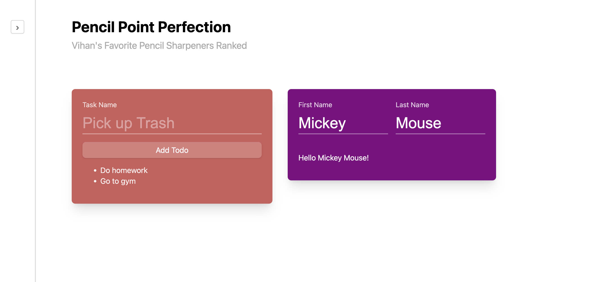
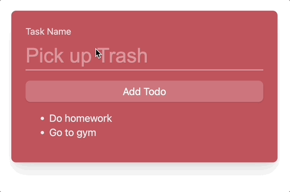

# JavaScript and DOM

## Introduction

In this vitamin, we'll be making our pencil sharpener website interactive!



## Learning Objectives

- Understand how to use JavaScript functions and variables.
- Pratice using if statements
- Learn DOM functions like `addEventListener` and `getElementById`

## Starter Code

The starter code contains a code skeleton where you'll fill in the blanks in the
JavaScript.

Download the starter code from [here](./starter/vitamin4.zip)

The file you'll be looking at is called `script.js`

## Question 0: Getting Oriented

We've upgraded our pencil sharpener blog! Open up `index.html` in your browser and
take a look around. Our website has some features but they don't work yet. That's
your job!

Now, take a look at `index.html`. In its `<head>` tag, there is this line:

```html
<script src="script.js" type="text/javascript"></script>
```

This line tells the browser where to find our JavaScript file. In the starter
code, we've called it `script.js`.

Now, open up `script.js` and take a look. There's a function `question1`, `question2`, etc.
for each question. If you forgot how JavaScript functions work, refer back to the [JavaScript lesson](/docs/Lessons/Lesson5).

As a quick overview, a function in JavaScript looks like:

```js
const functionName = (input1, input2) => {
  // code
};
```

Functions also sometimes dont have a name, in which case you'll only see the part after the equal
sign. You'll see this when you use `addEventListener`.

If you scroll to the bottom of `script.js`, you'll see a line that looks like:

```js
document.addEventListener("DOMContentLoaded", (event) => {
    ...
});
```

What this does is it listens to when the document (i.e. the HTML page) tells JavaScript it is
fully loaded (`DOMContentLoaded`) and then calls the function we provided when that happens. It's
very important that all of your JavaScript is either inside this function or in another function
that's called by this function.

In the starter code, we've already taken care of this for you. However, in your own projects, don't
forget! It's a common mistake that will make your JavaScript not work.

:::tip Debugging JavaScript
If your JavaScript doesn't work! Open up your browser console (alt + command + c on Google Chrome).
This will open a console which shows any error messages your JavaScript has. Unlike HTML and CSS,
if one part of your JavaScript is broken, the entire thing won't work!

Here's [an article](https://learn.microsoft.com/en-us/microsoft-edge/devtools-guide-chromium/console/console-debug-javascript)
by Microsoft teaching you how to use your browser console.

Remember, JavaScript can be tricky, so don't worry about asking for help if something isn't working!
If you do make an Ed post, please include the errors that your console shows and describe what those errors
mean to you.
:::

## Question 1: Interactive Sidebar

The sidebar element has ID `sidebar`. To open, add the `opened` class to
the sidebar. To close it, remove the `opened` class.

The sidebar's button with ID `sidebar-button`. When this button is clicked,
toggle whether or not the sidebar is opened.


**Bonus (2 points):** for an extra two points, when the sidebar is open, have the
button's text be `‹` (this is not an angle bracket!). Make sure to
change it back when the user closes the sidebar.

To get an element with an ID, JavaScript offers the [getElementById funnction](https://developer.mozilla.org/en-US/docs/Web/API/Document/getElementById).
There are other ways to get elements too such as [querySelector](https://developer.mozilla.org/en-US/docs/Web/API/Document/querySelector)
which allows you to get an element that matches a CSS selector.

We recommend using [classList](https://developer.mozilla.org/en-US/docs/Web/API/Element/classList)
to perform actions related to CSS classes on elements.

## Question 2: TODO List

Now, you will implement a simple TODO list. There are the following relevant elements:

- The button has ID `add-todo`
- The input where you enter the todo name has ID `task-name`
- The `<ul>` with the TODOs has ID `todo-list`

When the user clicks on the add-todo button. Append a new `<li>` to the list of TODOs
containing the text that the user entered. After adding the TODO, clear the input.



The following functions may be useful to complete this question. However, there are many
ways to complete this question.

- [`document.createElement`](https://developer.mozilla.org/en-US/docs/Web/API/Document/createElement)
- [`element.append`](https://developer.mozilla.org/en-US/docs/Web/API/Element/append)
- [`input.value`](https://developer.mozilla.org/en-US/docs/Web/HTML/Element/input/text#value)

**Bonus (2 points):** Validate that the todo task name is not empty before adding the list.

:::caution Do not use innerHTML in this question
Using `innerHTML` to set text very often a [severe security vulnerability](https://www.dhairyashah.dev/posts/why-innerhtml-is-a-bad-idea-and-how-to-avoid-it/).
For this reason, we want you to avoid using it in this class.
:::

## Question 3: Greeter

You want to make sure all of your websites users feel welcome so you're using JavaScript to make
a greeter. This question has two input elements with ID `first-name` and `last-name`.
_As the user types_ their name, set the text of the element with ID `message` to the format
`Hello <first name> <last-name>!`. For example, if I entered "John" and "Mayer" the text would be
`Hello John Mayer!`


The following docs may be useful to complete this question. However, there are many
ways to complete this question.

- [`input` event type](https://developer.mozilla.org/en-US/docs/Web/API/HTMLElement/input_event)
- [JavaScript template strings](https://developer.mozilla.org/en-US/docs/Web/JavaScript/Reference/Template_literals)
- [`element.textContent`](https://developer.mozilla.org/en-US/docs/Web/API/Node/textContent)

:::caution Do not use innerHTML in this question
Using `innerHTML` to set text very often a [severe security vulnerability](https://www.dhairyashah.dev/posts/why-innerhtml-is-a-bad-idea-and-how-to-avoid-it/).
For this reason, we want you to avoid using it in this class.
:::

## Submission

To submit, zip of the HTML and CSS files together and upload it to Gradescope.
