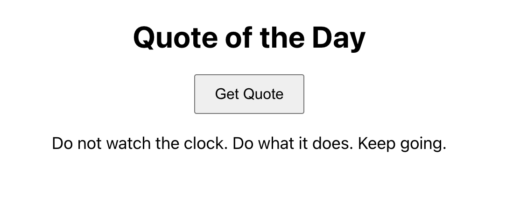
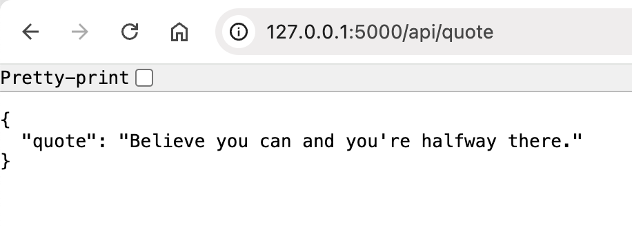

# Flask, Django, and Deploying

## Vitamin 9: Creating a Simple React + Flask Web App with Deployment on Vercel

### **Objective**:

In this assignment, you’ll build and deploy a simple "Quote of the Day" app using **React** for the frontend and **Flask** for the backend. React will handle the user interface, and Flask will give us an easy way to set up an API for serving random quotes. We’re using Flask instead of Django because it’s lightweight and perfect for small projects like this—no need for extra features we won’t even use. You’ll deploy the React app on **Vercel** so it’s live and shareable, and the Flask backend on a platform like Render or Heroku. Deployment is super important because it makes your app accessible online and shows you how to connect the frontend and backend in a real-world scenario. By the end, you’ll have a simple, deployed app to show off!

**NOTE**: If the deployment part does not work, then you do not need to deploy the frontend or backend, as long as you have a basic flask and react web app to show you understand how to use flask.

The React site should look something like this (the quotes should be randomized when you click the button).

The backend flask server should look something like this (refreshing the site will randomly change the quote).

---

### **Part 1: Create a GitHub Repository and Set Up React**

1. **Create a GitHub Repository**:
    - Log in to GitHub and create a new repository for the project.
    - Clone the repository to your local machine using your terminal.
2. **Set Up the React App**:
    - Navigate into the cloned repository directory on your machine.
    - Initialize a React app inside the repository folder.
    - Commit the initial React app to the repository and push it to GitHub.
3. **Test the React App Locally**:
    - Run the React app on your local machine to ensure it works correctly before proceeding.

---

### **Part 2: Deploy React Frontend on Vercel**

1. **Link the GitHub Repository to Vercel**:
    - Log in to Vercel and connect it to your GitHub account.
    - Select the repository you just created and link it to a new Vercel project.
2. **Deploy the React App**:
    - Follow the guided steps in Vercel to deploy your React app.
    - Note the live URL provided by Vercel and test the deployed app to ensure it works as expected.

---

### **Part 3: Set Up Flask Backend**

1. **Set Up a Virtual Environment**:
    - Create a Python virtual environment to isolate your Flask backend dependencies.
2. **Install Flask and CORS**:
    - Install Flask for building the backend and enable CORS to allow the React app to communicate with the backend.
3. **Build the Flask Backend**:
    - Write a Flask API endpoint that serves a random quote.
    - Test the backend locally to ensure it works.
4. **Deploy the Backend**:
    - Use a platform like Render or Heroku to deploy the Flask backend.
    - Note the backend's public URL for later use.

---

### **Part 4: Connect React Frontend to Flask Backend**

1. **Update the React App**:
    - Modify the React app to fetch data from the deployed Flask backend. Replace any local backend URLs with the public URL of your Flask backend.
2. **Push Changes to GitHub**:
    - Commit and push the updated React app code to GitHub. Vercel will automatically redeploy the app.
3. **Test the Deployed App**:
    - Visit your Vercel app's live URL and confirm that it fetches and displays quotes from the backend.

---

### **Part 5: Submit to Gradescope** ###

Congrats on finishing Vitamin 9 yayyy!