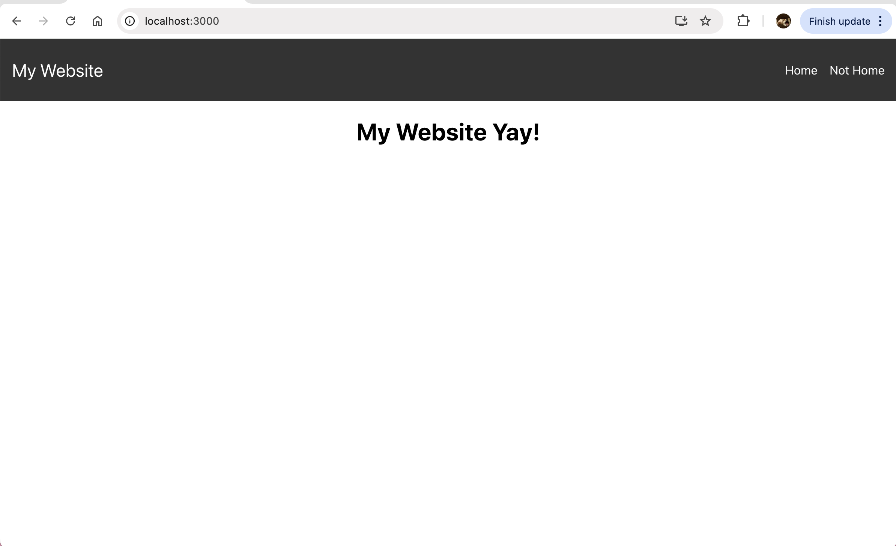
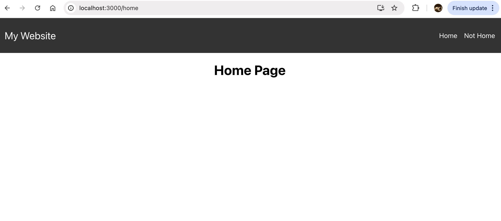
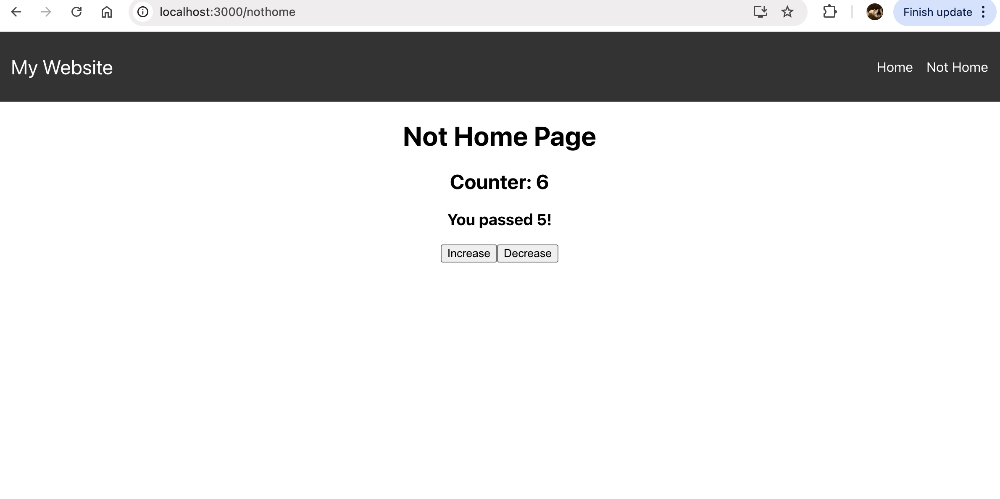

# React

### **Introduction**

In this assignment, you will learn how to set up a basic React project, create components, and use key React Hooks such as `useState`, `useEffect`, and `useContext`. You'll also learn how to manage navigation between pages using React Router. The goal is to give you hands-on practice with some of the core concepts in React.

### **Learning Objectives**

- Understand how to set up a new React project.
- Learn how to use important React Hooks: `useState`, `useEffect`, and `useContext`.
- Set up routes to navigate between different pages using React Router.
- Manage state within components and maintain it across the application.

We will create a basic react website that looks like this:

- Everything I’ve shown you must look like this (in terms of content, not design). But, feel free to add more pages/content if you’d like, as long as you have this base down!
 
 

Clicking on Home will redirect you to:

 

Clicking on Not Home will redirect you to:

 

- Clicking on Increase, will increase the counter bar by +1, conversely, clicking on decrease will result in -1.
- if the counter display shows more than 5, there will be a pop up comment on the bottom that says: You passed 5! (this will only show if its 5+).

---

### **Part 1: Setting Up a React Project**

1. **Create Your Project Folder in your preferred editor (such as VS code):**
    - Use `npx` to create a new React project. It sets up everything you need, including the basic folder structure and initial files.
        - Navigate to the project directory in your terminal.
2. **Running the React Project:**
    - Start your React app locally. You’ll see the default welcome page in the browser at `http://localhost:3000`. Feel free to delete the default content to start fresh.
    - Every time you make changes to your code, the browser will automatically reload to reflect your changes. This makes development easier since you can see changes instantly.
3. **Stop and Restart the Server:**
    - If you need to stop the server at any time, press `Ctrl + C` in your terminal where the project is running.
4. **Install React Router:**
    - Install `react-router-dom` so you can add routing to your app.
        - React Router is not included in the default project, so we need to install it. This will allow us to create navigation between different pages in our app.
5. **Verify Installation:** After installation, check your `package.json` file under `dependencies` to make sure `react-router-dom` was added. It should look like this:
    
    ```json
    "dependencies": {
      "react": "^17.0.2",
      "react-dom": "^17.0.2",
      "react-router-dom": "^6.0.0",
      "react-scripts": "4.0.3"
    }
    ```
    

---

### **Part 2: Creating Basic Components**

1. **Organize Folders:**
    - Inside the `src` folder, create two subfolders: `components` (for reusable components) and `pages` (for different pages of your app).
    - **Why are we doing this?**
        - Breaking your app into reusable components is a key part of React. It allows you to keep your code organized and modular. Components are self-contained and can be reused in different parts of your app.
2. **Create a Navbar Component:**
    - In the `components` folder, create a `Navbar` folder with two files: `Navbar.js` and `Navbar.css`.
    - Write the logic for the `Navbar.js` component that includes links to different pages and style it using `Navbar.css`.
        - css does not need to be exact!
    
    Here’s some starter code to help you out:
    
    ```bash
    //import React
    // Import Link to navigate between pages
    // Import the CSS file for styling
    
    const Navbar = () => {
      return (
       // fill in the rest here!
       // add Home and NotHome, including links (after routing established)
    };
    
    // Always export your components so they can be imported in other files
    
    ```
    
3. **Add the Navbar to App.js:**
    - Open `App.js` and import the `Navbar` component so it appears on every page of the app.
4. **Wrap App in Router:**
    - In `index.js`, wrap the `App` component with `Router` so routing works across the app.
    
    Starter code to help you out:
    
    ```jsx
    //import required here
    
    ReactDOM.render( 
    //... router here, etc.
    );
    
    ```
    
5. **Set Up Routes in App.js:**
    - Add routes for `Home` and `NotHome` pages in `App.js`. Define the paths and link them to the correct components.
        - Home path = /home
        - NotHome path = /nothome
6. **Create Home and NotHome Pages:**
    - In the `pages` folder, create folders for `Home` and `NotHome`. In each folder, create a simple component that displays a title below the navbar.

---

### **Part 3: Using React Hooks**

Now that you have the basic app structure, let's dive into React Hooks! Hooks let you manage state and side effects in functional components.

1. **useState Hook:**
    - `useState` helps manage dynamic values like a counter or form inputs that need to change as the user interacts with your app.
    - In the `NotHome` component, implement a counter using `useState`. Add buttons to increase or decrease the counter.
2. **useEffect Hook:**
    - `useEffect` allows you to perform side effects in your component, such as fetching data or updating the document title. It runs after the component renders.
    - Add logic to update the counter. Use `useEffect` to reset the counter if it goes below 0 and show the message “You passed 5!”  if it passes 5.

---

### How to submit:

1. Please take a quick video of your react website (no longer than 1 min) with the following:
    - main page with the browser bar to show path=””
    - home page with the browser bar to show path=”home”
    - nothome page with the browser bar to show path=”nothome”
        - counter increase and decrease working and “You Passed 5”.

2. Zip and upload your folder of the react project including all files and folders within.