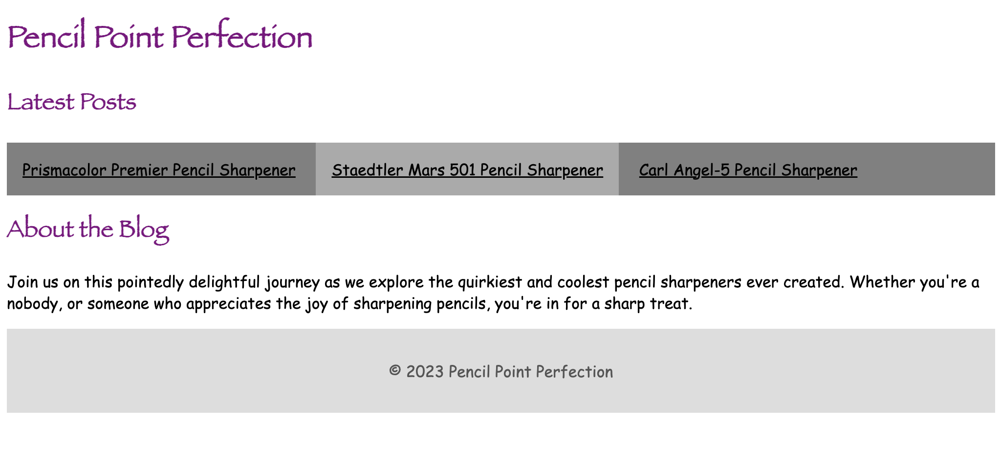
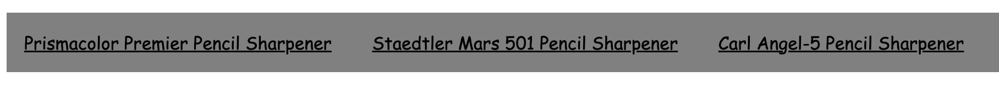

# Vitamin 2: Introduction to CSS

## Introduction

In this vitamin, we want students to learn how to use CSS in an HTML document and see how
using a few styles they can create powerful looking websites. In the end, your site should
look something like:



## Learning Objectives

- Use a `<link>` tag to load your CSS in
- Use basic text-styling such as `color`, `font-size`, and more
- Use classes and IDs and understand the difference.

## Starter Code

You may copy and paste the following into your text editor:

```html
<!DOCTYPE html>
<html>
  <head>
    <title>Pencil Point Perfection: Vihan's Favorite Pencil Sharpeners</title>
  </head>
  <body>
    <h1>Pencil Point Perfection</h1>
    <main>
      <section>
        <h2>Latest Posts</h2>
        <ul>
          <li>
            <a href="#">Prismacolor Premier Pencil Sharpener</a>
          </li>
          <li>
            <a href="#">Staedtler Mars 501 Pencil Sharpener</a>
          </li>
          <li>
            <a href="#">Carl Angel-5 Pencil Sharpener</a>
          </li>
        </ul>
      </section>
      <section>
        <h2>About the Blog</h2>
        <p>
          Join us on this pointedly delightful journey as we explore the
          quirkiest and coolest pencil sharpeners ever created. Whether you're a
          nobody, or someone who appreciates the joy of sharpening pencils,
          you're in for a sharp treat.
        </p>
      </section>
    </main>
    <footer>
      <p>&copy; 2023 Pencil Point Perfection</p>
    </footer>
  </body>
</html>
```

## Question 0: Boilerplate

Create a CSS file in the same directory where your HTML file is, name it `style.css`. Use
a `<link>` tag to tell HTML about your CSS file. If you forgot how to do this refer to the
[CSS lesson](../../Lessons/Lesson3).

:::tip
Make sure you include the `rel="stylesheet"` attribute.
:::

## Question 1: Changing the font

The default font browsers use is pretty ugly. Let's change it to my favorite font ever,
`Comic Sans MS`. Since some browsers don't have Comic Sans, lets add a fallback to `Arial`,
and if even that doesn't exist the default browser sans-serif font.

Do this by specifying the font **on the HTML tag only**.

:::tip
Some computers have the font named `Comic Sans MS` others have it named `Comic Sans`, make sure
to support both!
:::

:::note
Because `font-family` is one of the CSS properties that is inherited, you only need to
declare it once on the top-most element (`<html>`)
:::

:::tip
If nothing is showing up, make sure you are including your stylesheet correctly.
:::

## Question 2: Making the headings

The site looks a lot better with comic sans (or Arial) as the font, but I want to spice it up
more! Make **only the headings** use the `Papyrus` font and make them `purple`.

:::tip
Use the `,` operator in the selector so you only need **one additional style group** to do this.
:::

## Question 3: Horizontal Navigation Bar

Right now the navigation bar looks pretty ugly. Let's make it a bit more stylish. Style the
navigation list (the `<ul>` tag) so that it looks like the following:



Specifically, you can do this by:

- Hide the bullets of the `<ul>` tag
- Arrange the links side by side by giving each `<li>` a `display: inline-block`
- Add 16px of space around each link
- Make the background `gray`
- Make the text of the navigation `black`
- The `<ul>` and `<li>` tags will have some margin and padding automatically added to
  them by the browser. Reset any default margin and padding present.

:::tip Inline or Inline-Block
To align things in a horizontal flow in CSS, we give them `display: inline;`. In CSS a lot of textual
elements automatically have this such as `<strong>`, `<span>`, `<em>`, etc. however `<li>` is aligned in a
vertical (block) flow by default which is why we add this explicitly.

However, we use display `inline-block`. `inline-block` is a hybrid between `inline` and `block`. It allows
us to specify the vertical size (or in our case spacing) for each link more about this in the next lecture!
An element with regular `display: inline` will ignore any height or vertical padding/margin we specify.
:::

## Question 4: Hover Effects

Use a psuedo-class to make a link's background become `#AAA` when you hover over it. This should look like


## Question 5: Formatting the Footer

Lastly, we want to make our footer a little more subtle. Make the footer look like the one below:


Specifically:

- The background is `#DDD` and the text is `#555`.
- The text is centered.
- There is `16px` of vertical space in every direction.

## Conclusion

To submit, zip your `index.html` and `style.css` file together, and upload that zip to Gradescope.
Make sure that all fonts, colors, and sizes are exactly as specified.
