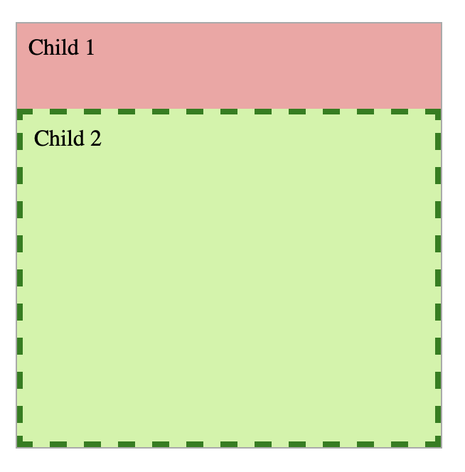
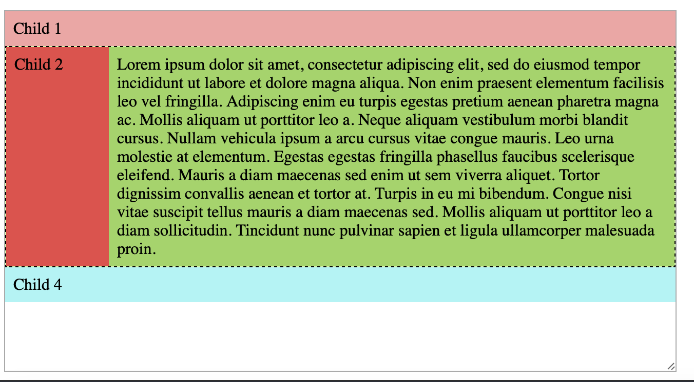
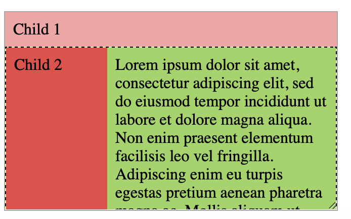
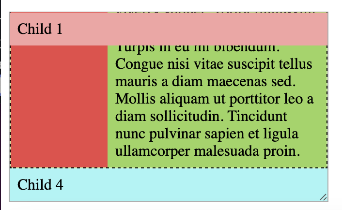

# Vitamin 3: CSS Layout

## Introduction

In this vitamin, we'll be assessing how well you understand how to create
different CSS layouts and make sure they work at different widths.

## Learning Objectives

- Understand the difference between `block`, `inline`, and `inline-block`
- Understand when to use `margin` and when to use `padding`
- Understand how to use `flex`

## Starter Code

The starter code contains sections for code for the container and the children.
A question does not always require both style groups to have rules to be correct.

Download the starter code from [here](./starter/vitamin3.zip)

Please **edit vitamin.css** and add your code to where it says **YOUR CODE HERE**.
The staff solutions solves all questions with around 1-3 lines of CSS per selector.
You may not need to use all the selectors.

A big part of the web is making sure your website looks right on devices of all sizes
like phones, laptops, and TVs. Make sure your layouts work correctly at different sizes.
You can test this by resizing the boxes for each problem.

:::caution Safari Bugs
Safari has a bug where the little icon you use to resize the box for each problem may
disappear. You may still use Safari, but if you encounter this issue, try using Chrome.
:::

## Question 1: Side-by-Side

Align the divs horizontally and center them in their container:

## Question 2: Not-so-Side-by-Side

Align the divs horizontally and center them in their container. The first div should
stay fixed to `150px`. The other divs should evenly split the remaining space.

As you resize the container, only the last two divs should be changing in width.

**Do not hardcode** the widths of the second or third div as the autograder will mark
you wrong.

:::caution Is it really 150px?
Just using `width` may not be enough to guarantee that the sidebar does not shrink below 150px.
Make sure that the sidebar is actually 150px. Is there a flex property you can use to prevent
it from shrinking?
:::

## Question 3: Width? Max-Width?

A common layout is having your actual content in a 60-character or so wide box that
is centered on the screen. Having your content in a narrow column has been shown to
aid readability.

However, when we shrink the screen, we want to make sure that our column shrinks
as needed too.

Make the child stay centered in its parent at a width of `250px` and have it shrink
to be the same width as its parent when the container gets too small.

You do not need flexbox for this.

 

## Question 4: Not-so-side-by-side but Vertically

Now we'll explore using flexbox vertically.

Create the following layout where the top div is a fixed `60px` in height and
the bottom div fills the remaining space.

Note that you **must** use flexbox and the `flex` property. The autograder will not
give credit for answers using `calc()` or other methods.

:::tip
See how you can see all four sides of the dashed border? If you don't see the
bottom part of the dashed border, that means your Child 2 is too big!

There are many things that could cause this problem, one possibility is that
`height: 100%` is being used. This isn't right because we don't want the element
to be 100% of the parent's height, we want it to be 100% _minus_ Child 1's height.
:::

:::tip
Make sure as you resize the container, the first div does not change in height!
:::

:::tip
Recall the syntax for `flex` is `flex: <grow> <shrink>;` think about
what div you want to have grow and shrink.
:::

## Question 5: The holy grail layout

In this question, you will create the infamous "holy grail" layout. It's called
that because this layout extremely common in most websites, but it can be a little
tricky to do! We recommend using flexbox for this. The staff solution uses 5 CSS
rules to achieve this layout.

In this layout, the sidebar (Child 2) is fixed to 100px. Child 3 is horizontally
next to Child 2 and takes up the remaining width. The sidebar and the content
should always have the same height.

The header should be sticky, meaning when you scroll (if you can't scroll, shrink
the problem's container).

The footer (Child 4) is not sticky, it should be at the very bottom when you scroll
all the way down.

 

:::tip
Look at the HTML for question 5, that may glean some insight in how you can achieve
this (notice how Child 2 and Child 3 have a parent element? Can you use that parent
element to horizontally align these like a previous problem).
:::

:::caution Is it really a 100px?
Just using `width` may not be enough to guarantee that the sidebar does not shrink below 150px.
Make sure that the sidebar is actually 150px. Is there a flex property you can use to prevent
it from shrinking?
:::

## Submission

To submit, zip of the HTML and CSS files together and upload it to Gradescope.
