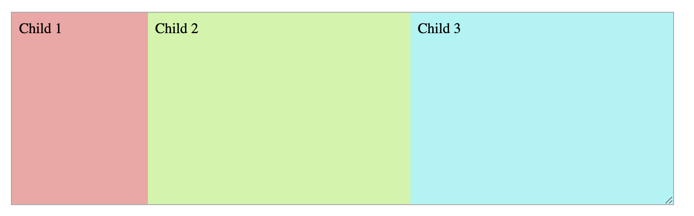
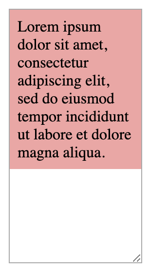
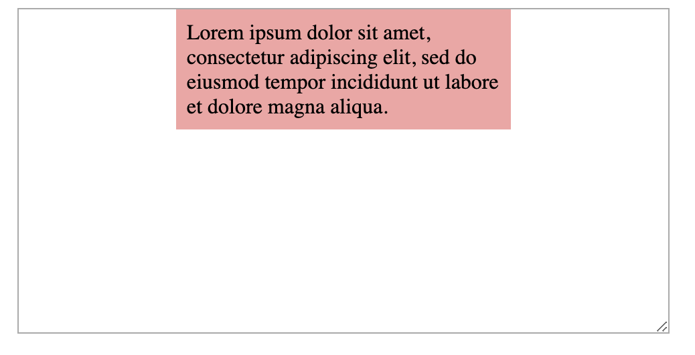
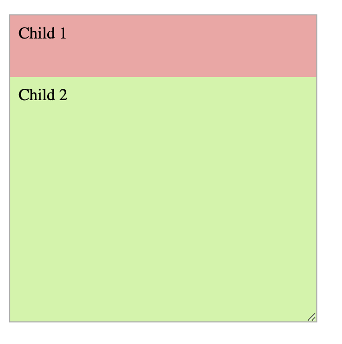

# Vitamin 3: CSS Layout

## Introduction

In this vitamin, we'll be assessing how well you understand how to create
different CSS layouts and make sure they work at different widths.

## Learning Objectives

- Understand the difference between `block`, `inline`, and `inline-block`
- Understand when to use `margin` and when to use `padding`
- Understand how to use `flex`

## Starter Code

The starter code contains sections for code for the container and the children.
A question does not always require both style groups to have rules to be correct.

Download the starter code from [here](./starter/vitamin3.zip)

## Question 1: Side-by-Side

Align the divs horizontally and center them in their container:

## Question 2: Not-so-Side-by-Side

Align the divs horizontally and center them in their container. The first div should
stay fixed to `150px`. The other divs should evenly split the remaining space.

As you resize the container, only the last two divs should be changing in width.

**Do not hardcode** the widths of the second or third div as the autograder will mark
you wrong.

## Question 3: Width? Max-Width?

A common layout is having your actual content in a 60-character or so wide box that
is centered on the screen. Having your content in a narrow column has been shown to
aid readability.

However, when we shrink the screen, we want to make sure that our column shrinks
as needed too.

Make the child stay centered in its parent at a width of `250px` and have it shrink
to be the same width as its parent when the container gets too small.

You do not need flexbox for this.

 

## Question 4: Not-so-side-by-side but Vertically

Now we'll explore using flexbox vertically.

Create the following layout where the top div is a fixed `60px` in height and
the bottom div fills the remaining space.

You **must** use flexbox and the `flex` property. The autograder will not
give credit for answers using `calc()` or other methods.

Make sure as you resize the container, the first div does not change in height!

:::tip
Recall the syntax for `flex` is `flex: <grow> <shrink>;` think about
what div you want to have grow and shrink.
:::

## Submission

To submit, zip of the HTML and CSS files together and upload it to Gradescope.
