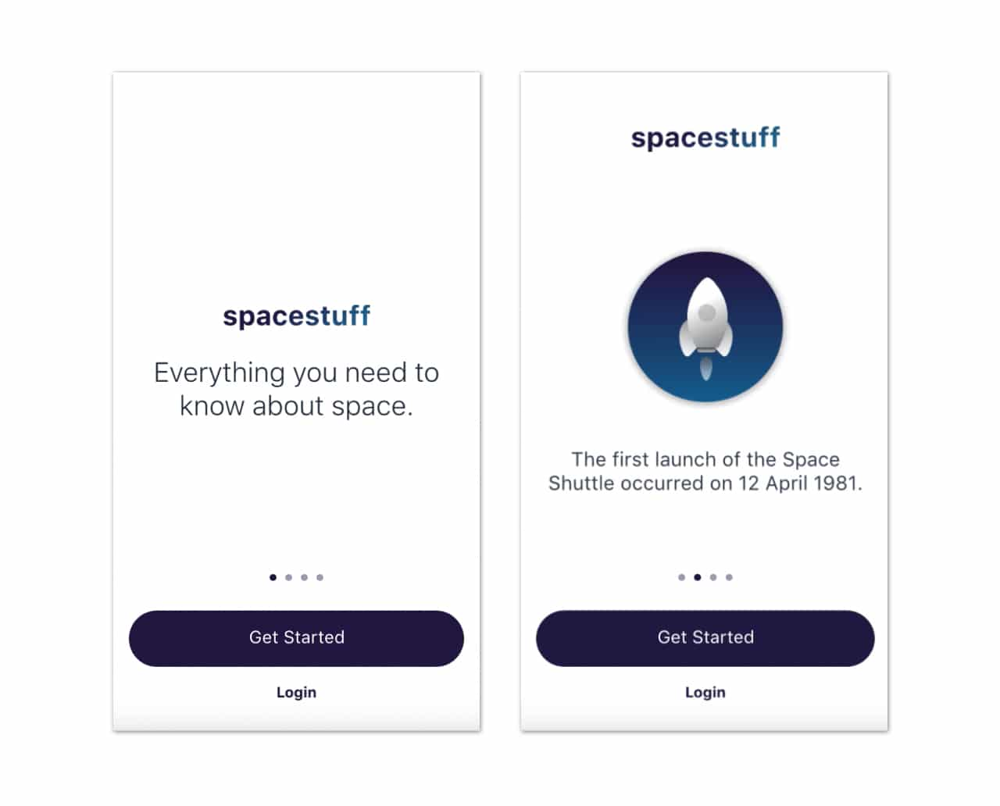

# Figma Basics + Wireframing

# Figma Basics

## What is Figma?

Figma is a collaborative tool for prototyping and designing interfaces. The tool is targeted towards UI/UX and Product Designers with features such as simulating clicks, buttons, swipes, animations, and live updates/collaboration.

## Downloading Figma

To download Figma for education, follow [this link](https://www.figma.com/education/). 

Click on [this link](https://www.figma.com/design/aUVr0FFDlxTupKst60K3n8/Fullstack-Decal---Figma-Basics-Lesson?node-id=0-1&t=cutd6DyT6LfBEkOw-1) to follow along today’s lecture.

## Figma UI Disclaimer

Figma continuously updates their UI and adds new features, so the following videos and images may not look exactly the same as Figma’s interface at the time you are reading this.

## Let’s Learn!

### Frames

Frames are essentially containers for all of your design elements. Thus, all shapes, text, and buttons will go into a frame. Each frame acts as a single screen of your design.

The frame button is located on the upper left toolbar. Create a frame by clicking the button then dragging across the screen. You can adjust the width (W) and height (H) of the frame from the right hand toolbar.

There are also pre-set frame sizes that appear on the right hand toolbar once clicking on the frame button.

### Shapes

Shapes are the base of buttons, cards, and much more. 

Create a shape using the square button on the top left toolbar.

Hold down shift while dragging if you want to keep the dimension ratios of the shape.

You can also use the right hand toolbar to adjust the dimensions, edges, angle, color, stroke, and other features of the shape.

### Vector + Pen Tool

The vector and pen tool can be used to create your own drawings or shapes.

### Extra Tips

- Hold shift while dragging an element to move it in a straight line
- Hold option while dragging an element to create a duplicate
- Hold shift while clicking or drag mouse across screen to select multiple items
- Hold alt to see spacing between elements

### Grouping

Grouping is useful to keep similar elements together. For example, if you have a button, you may want to group elements of the button together (the text and the shape). This will allow for multiple items to act as a single layer and stay together when moved.

Find the “Group Selection” option by right clicking or though Command+G.

Paying attention to the left hand “Layers” bar, we can see that both the shape and text box were placed into a singular group.

### Components

Components are reusable elements. They help with design consistency and in saving a lot of time and energy.

Components are most useful for recurring elements, such as buttons.

Create a component by right clicking and choosing “Create Component,” or clicking the diamond-shaped button on the top toolbar.

This button is now a component! The filled in diamond signifies that the element is a **parent component**.

Avoid using the parent component in your design. Instead, use **child components**, which are essentially copies of the parent component, in your designs. Child components will inherit any changes made to the parent component. Thus, parent components should only be used to make changes impacting all copies of the element.

To create a child component, copy and paste the parent component. 

Pay attention to the left hand “Layers” bar. A child component will have an empty diamond icon next to it.

Changes made to the parent component will impact child components.

### Component Variants

Maybe we want the button to change color on hover or say something different once clicked. This is when variants come into play.

Let’s create a variant of what we want the button to look like on hover.

Create a new variant by selecting the parent component and clicking the diamond button with a + inside on the top toolbar.

Make the changes you want to the new variant.

It is good practice to name your variants, as it will make navigation easier in the future.

### Prototyping

Now that we have the hover variant, we can prototype to display this interaction.

To create an interaction, click “Prototype,” located on top of the right hand toolbar.

Select the element’s original state. There should be a blue circle around the element. Drag the blue circle to the desired end result variant of the element. 

You’ve just created an interaction! You can check the functionality and how it looks through the preview or present option on the top right corner (element must be in a frame).

There are other transition styles, such as dissolve, smart animate, and more.

Creating frame to frame interactions is what will get users from one screen to another, creating user flows.

For example, below, if we wanted to get to the egg frame by clicking the “cook” button on a different frame, select the “cook” button and create an interaction connecting the button to the egg frame.

The resulting prototype:

For the purpose of the video, an extra interaction turning the “cook” button a different color on press has been added to signify when the button has been clicked.

### Collaboration

Design is often collaborative! 

Figma has many tools to boost collaboration.

- Commenting - top left speech bubble icon or “c” on keyboard
- Follow and Spotlight - follow what someone is seeing/doing by clicking on their avatar on the top right corner; spotlight self to invite others to follow you
- [FigJam](https://www.figma.com/figjam/) - FigJam is a whiteboard for team brainstorming and planning

### Good Practices

Here are a few good organizational practices that will make your and other collaborators’ lives easier when using Figma:

- Name everything! Name frames, groups, buttons, etc. This will allow for easier navigation down the road.
- Keep parent components in one spot and separate from your wireframes/prototypes. This will prevent you from accidentally using a parent component and make parent components easier to find.
- Use different pages when things get cluttered or for different stages of designing. This can include placing components, brainstorms, and different iterations onto separate pages.

### Plugins

Plugins are tools that can enhance your design flow.

A few include:

- Stark - Contrast & Accessibility Checker
- Lorem Ipsum - lorem ipsum generator
- RemoveBG - removes background of images

Check out more [here](https://www.figma.com/community/design-tools?resource_type=plugins)!

## Conclusion

You should now know how to create frames, shapes, and interactive screens on Figma! 

However, these are just the very basics of the platform and there are a many other useful tools and skills within Figma. If interested in learning more, there are many free resources, such as the [Figma Decal](https://www.notion.so/1af70b8891634923bed87bdda4d64640?pvs=21) and an endless number of YouTube tutorials!

# Wireframes, Mockups, and Prototypes

## Introduction

Designing a product takes many iterations! We will break down the steps of lo-fi, mid-fi, and hi-fi wireframes/mockups. Between each step, you should always test and get feedback from peers.

## What’s the Difference?

### Low-fidelity

Low-fidelity wireframes display the basic, bare-bones structure of a product. They are great for the initial design stages of a product.

As shown below, they typically do not use color and use very simple shapes as placeholders, such as rectangles with an “X” inside for images and lines for text.

Image from https://mentormate.com/blog/low-fidelity-wireframes-vs-high-fidelity-wireframes/

Wireframes have low time and cost investments, allowing us to make changes quickly. 

However, they carry low levels of visual design elements and detail, therefore having a higher risk of conceptual miscommunication.

Lo-fi wireframes will give you the visual and conceptual base for creating mid-fi mock-ups!

### Mid-fidelity

Mid-fidelity wireframes/mockups, like lo-fis, are non-interactive. Mid-fis carry more detail than wireframes, such specific spacing and shapes, allowing us to see the visual hierarchy in more accurately.

Image from https://mentormate.com/blog/low-fidelity-wireframes-vs-high-fidelity-wireframes/

### High-fidelity - Mockups

Hi-fidelity mockups are static versions of the final product. They are fleshed out with colors, fonts, shapes, etc.

Image from https://mentormate.com/blog/low-fidelity-wireframes-vs-high-fidelity-wireframes/

### High-fidelity - Prototypes

Think of high-fidelity prototypes as your high-fidelity mockups, but ****interactive. They should have the same look **and** **behavior** as the final product. High-fidelity prototypes will allow you to receive the most accurate feedback, insights, and usability testing results.

# Human-Centered Design Principles

## Introduction[​](https://fullstackdecal.com/docs/Lessons/Lesson15#introduction)

IDEO defines human centered design as a “creative approach to problem-solving that starts with people and ends with innovative solutions that are tailor-made to suit their needs”. Since this decal’s focus is not as heavy on design, this will be a very brief overview of what finding a user-centered design solution for a product would would look like.

## The Human Centered Design Process[​](https://fullstackdecal.com/docs/Lessons/Lesson15#the-human-centered-design-process)

The HCD process can be summed up in a cycle of converging and diverging. In order to be intentional with all your decisions make sure at every step you step concrete goals and relate them to how they will relate to the solution for your users. No design process is the exact same. Many times, you may jump from one stage to another or even go back and iterate between two stages. 

IMAGE HCDprocess

That being said, here is the skeleton to the HCD process:

### 0. Define Your Problem Scope[​](https://fullstackdecal.com/docs/Lessons/Lesson15#0-define-your-problem-scope)

Before launching into the HCD process, it is important to understand your problem scope. Ultimately, you are creating a product that is attempting to solve a problem, improve a process, or provide aid in some area. You must be clear of what the current problem is. To clearly define your problem scope, many designers use a “how might we” question to guide their designing. Here are some examples:

- “HMW support users in their tax filing journey to create a seamless experience to reduce confusion and frustration?”
- “HMW improve food packaging that will reduce waste but also be feasible for mass production?”
- “HMW educate incoming college freshmen about Berkeley culture in a virtual setting so they will be included and integrated into the school?”

To read more about “how might we” questions, I suggest reading [this article](https://dscout.com/people-nerds/how-might-we-statements).

### 1. Research: Diverging[​](https://fullstackdecal.com/docs/Lessons/Lesson15#1-research-diverging)

The general goal of the first stage is all about understanding your user group and their pain points/needs as well as keeping an open mind to all possibilities and solutions. Research is considered diverging because you are to collect as much research as possible about your user group. Here are some methods in conducting research:

- Interviews
- Surveys
- Diary Study
- Competitive Analysis
- Secondary Research
- Field Study

### 2. Synthesis: Converging[​](https://fullstackdecal.com/docs/Lessons/Lesson15#2-synthesis-converging)

In the second stage, the data of research gets broken down and visualized in more digestable pieces. The goal of synthesis is to consolidate and personify the research and identify commonality between users. Synthesis is considered converging as you are consolidating your data. Here are some methods of research synthesis:

- Affinity Mapping
- User Personas
- Journey Maps
- Empathy Maps

### 3. Ideation: Diverging[​](https://fullstackdecal.com/docs/Lessons/Lesson15#3-ideation-diverging)

In the ideation phase, ideas are first churned out quickly using rapid ideation. By diverging through throwing all the ideas onto the table, you can maintain an open and creative mind as a designer. The goal of ideation is to come up with as many solutions as possible. As you’re ideating, make sure all your solutions stay centered around the user and their needs.

### 4. Prototyping: Converging[​](https://fullstackdecal.com/docs/Lessons/Lesson15#4-prototyping-converging)

The goal of the prototyping phase is to design your final product. Within web development, this would mean your final high fidelity UI design. Here, you weigh the different solutions that were ideated in the last stage and consider their advantages and disadvantages, slowly eliminating them. Once a solution has been decided upon, you are launched into low fidelity prototypes then high fidelity prototypes along with user flows. Here are some common tools used to prototype in web development:

- Figma
- Sketch
- Illustrator

### 5. User Testing[​](https://fullstackdecal.com/docs/Lessons/Lesson15#5-user-testing)

Depending on your project, you will want to conduct user testing at some point during your prototyping. During user testing, you give your users your current prototype and ask for feedback through the form of questions, walk throughs, and more. You can then use this feedback to adjust your designs to be further tailored towards your users.

TIP

This is a simple outline of the HCD process. It is not rigid or linear at all. In fact, you will likely loop back to different stages multiple times. Don’t be afraid of taking a few steps back!

To learn more about the HCD Process, I suggest reading [this article](https://www.usertesting.com/blog/how-ideo-uses-customer-insights-to-design-innovative-products-users-love).