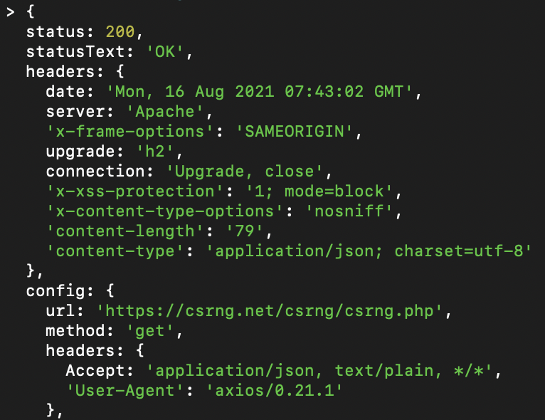
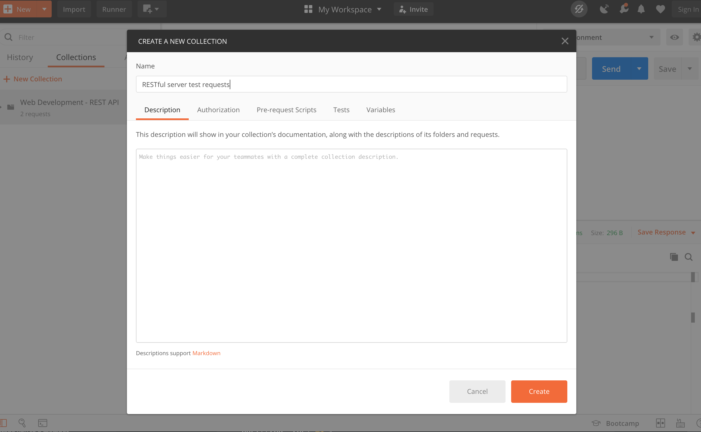
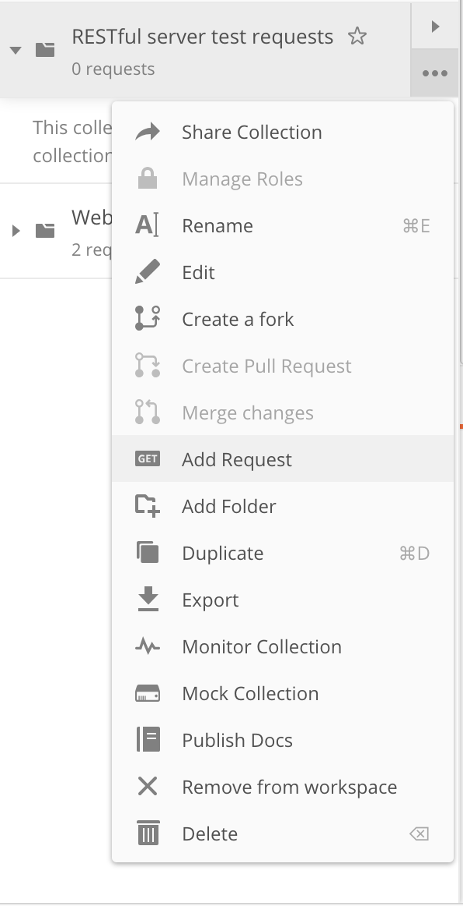
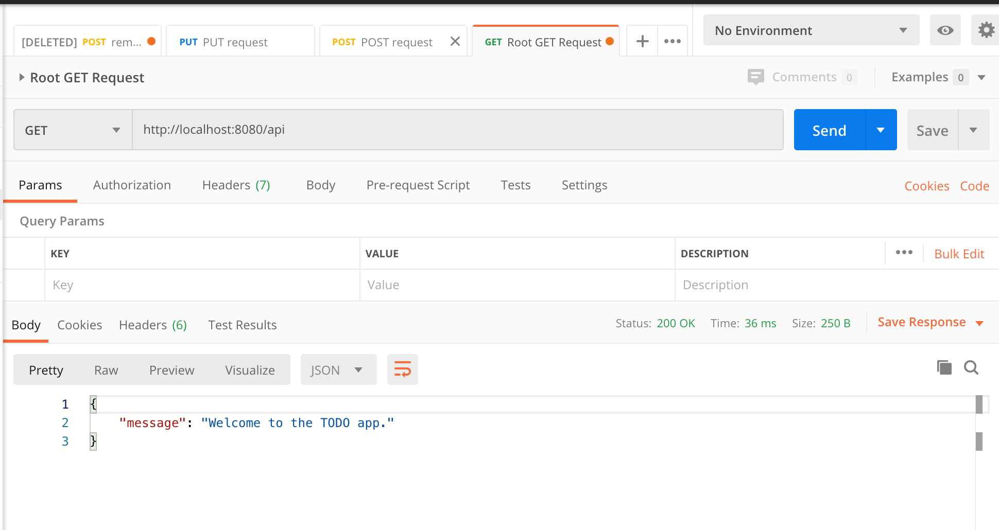
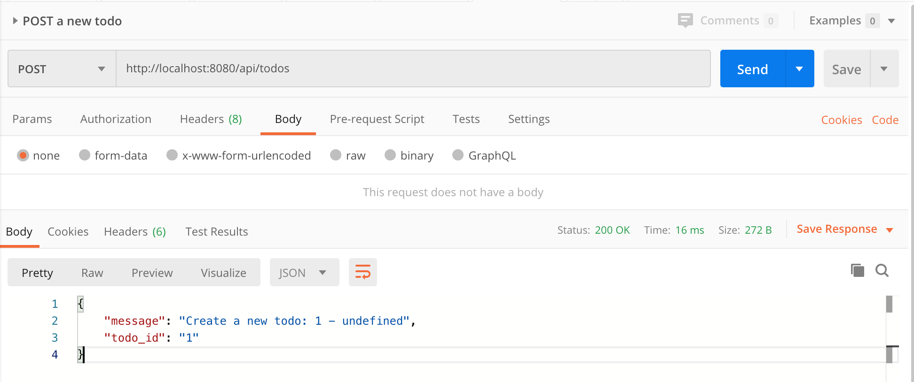
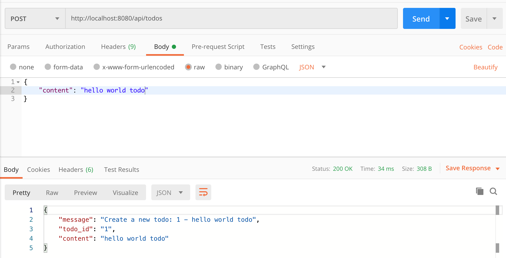

# Client-side rendering

import {
  Accordion,
  AccordionButton,
  AccordionIcon,
  AccordionItem,
  AccordionPanel,
  Box,
} from '@chakra-ui/react';
import Admonition from '@theme/Admonition';


## Introduction

So far, when presented with the question "How can we allow a server to have a say on what is rendered on a website?",
you answer should be server-side rendering! We spin up a server that changes the HTML we send. This way, we can add
global view counts, or even personalize the experience with cookies and a database!

However, an increasingly more common way to do this is actually to send the same HTML file to the browser every time,
but then to have some JavaScript (in that HTML) which makes requests back to the server for more information (like global
view count) to then add to the HTML.

This is called client-side rendering, and it is the basis for many modern web applications. While it means that the user
will have to wait for the JavaScript to finish making all its requests and then update the HTML, it also means that
the server doesn't have to do any work to render the HTML. All that works occurs on the client's computer!

It also plays really nicely with React. You may have been wondering this whole time how React can be server-side rendered,
and the answer is it's hard! Instead, we send the same React HTML to the client every time, and then React
takes over and renders the page on the client's computer by making even more requests!

Samarth likes to use the restaurant analogy to visualize the difference. SSR is like a traditional
restaurant consists of two main parts: a dining room and a kitchen. When we
order, we only ever see the nicely-furnished, well-decorated dining room. But
when we give our order to the waiter, they must relay that order to the kitchen.
A complicated set of instructions is then executed to produce our order and our
waiter, like magic, returns with our food.

CSR is like a buffet. The waiters come only once to show us to the table, but then it's up to us to get our own food
and bring it to our table. We can pick whatever we want from the small pre-prepared food items the kitchen has laid out.
More work for us, but less work for the servers!

## HTTP

So how can JavaScript in the client's browser communicate back with our server? The answer is HTTP!

In today's internet, HTTP is the most widely used protocol. It's simple, efficient, and easy to use.
There is an extension of HTTP called REST, which is at this point synonymous with HTTP. REST is a set of
guidelines for how to use HTTP, and it is the basis for most modern web applications.

We've actually already used HTTP / REST. When you set up a server to do SSR, you were actually listening for HTTP requests.
This is because when you type in a URL into your browser, Chrome (or whatever browser you use) makes an HTTP request!
We then responded with an HTML document.

But this time, the JavaScript that then concequently runs on your browser will start making MORE requests back to the server
to get more info! This time we will send back other kinds of information (not HTML), like a number (say for total view count).

Note that the requests the JavaScript makes need not be to the same server. In fact, usually they are to many different servers.
A common set-up in CSR is to have one server that serves the initial HTML file (we call this the "static server") since it
literally just responds to every request with the same HTML file. Then, we have another server that serves the data that the
JavaScript needs (we call this the "API server").

### REST

So what is REST? REST breaks down HTTP requests into several kinds:
  1. GET: get some data from the server
  2. POST: send some data to the server
  3. PUT: update some data on the server
  4. DELETE: delete some data on the server

That's some more we will instroduce later. So when we say that an API Server is "RESTful", we mean that it respects the difference between these four kinds
of requests. So now, not only do we get to pick the path we make a request to (like `/views`), but we also get to pick the
kind of request we make (like `GET` or `POST`).

However, it us up to you, the designer of the "API" (the server that serves the data), to also mantain the difference between
these four kinds of requests. For example, if you make a `GET` request to `/views`, you should expect to get back the number
of views. If you make a `POST` request to `/views`, you should expect to increment the number of views. If you make a `PUT`
request to `/views`, you should expect to set the number of views to a certain number. If you make a `DELETE` request to
`/views`, you should expect to delete the number of views (this one is a little weird, but it's just an example).

### Example

Let's make the same "total views" app we made in SSR, but with CSR. First we set up a 
static server that will host this HTML:
```html
<!-- Import Axios (lets us make HTTP / REST requests easily) -->
<script src="https://unpkg.com/axios/dist/axios.min.js"></script>

<h1>Welcome to my website!</h1> Total views: <span id="views">Loading...</span>

<script>
let myViewsSpan = document.getElementById("views");

// Tell server to increment the views by making a POST request to /increment
axios.post("https://myapi.com/views/increment").then((response) => {
  console.log("Incremented views!");

  // Get the views from server (after incrementing) by making a GET request to /views
  axios.get("https://myapi.com/views").then((response) => {
    myViewsSpan.innerText = response.data.views;
  });
});
</script>
```

Then, we spin up a server with the domain `myapi.com` that will serve the data. This server will have the following "endpoints":
  1. `GET /views`: get the number of views
  2. `POST /views/increment`: increment the number of views

```js
// GET /views
const express = require('express');
const port = 3000;

const app = express();

let views = 0;

app.get('/views', (req, res) => {
  res.send({ totalViews: views });
});

app.post('/views/increment', (req, res) => {
  views++;
});

app.listen(port, () => {
  console.log(`Example app listening at http://localhost:${port}`);
});
```
Note that this server should have a way to persist the number of views (this will reset every time we restart the server).

Also, do you see how we pick the REST method type? We used `app.post` instead of `app.get`.

### Inside a HTTP Requests

For the curious ones, here is a more in-depth look at what is inside a HTTP request. This will help you understand
what is going on when you make a request to a server.

All requests are in the end just long strings of text. The server and the client (browser) agree on a format for
these strings of text, and then they can communicate with each other. This format is called HTTP.

HTTP requests consist of two parts: the header and the body. The header has a strict format:
```plaintext
GET /home.html HTTP/1.1
Host: developer.mozilla.org
User-Agent: Mozilla/5.0 (Macintosh; Intel Mac OS X 10.9; rv:50.0) Gecko/20100101 Firefox/50.0
Accept: text/html,application/xhtml+xml,application/xml;q=0.9,*/*;q=0.8
Accept-Language: en-US,en;q=0.5
Accept-Encoding: gzip, deflate, br
Referer: https://developer.mozilla.org/testpage.html
Connection: keep-alive
Upgrade-Insecure-Requests: 1
If-Modified-Since: Mon, 18 Jul 2016 02:36:04 GMT
If-None-Match: "c561c68d0ba92bbeb8b0fff2a9199f722e3a621a"
Cache-Control: max-age=0
```

You start with the HTTP method (like `GET` or `POST`), then the path (like `/home.html`), then the HTTP version (like `HTTP/1.1`).
Then, you have a bunch of key-value pairs that are called "headers". These are just extra information that the client sends
to the server. You may remember we used headers to send cookies to the server. The server can also send headers back to the
client, since the response to an HTTP request is also just another HTTP request (technically a HTTP response, but it follows
the same format).

The remaining headers are used to specify information about the request. This
includes potential authorization, cacheing, handling, etc. At this level, we
won't be using these too much, but as your applications become more complicated,
taking advantage of these headers may allow for significantly more
functionality.

After the header comes the body (separated by a blank line). Only certain kinds of HTTP requests can have bodies (like `POST` and `PUT`). The body
is just a string of text that you can pick! It can be in any format you want, but is up to you to interpret.

### Methods

Here's a full list of methods available to you:

1. **[`GET`](https://developer.mozilla.org/en-US/docs/Web/HTTP/Methods/GET):**
   The `GET` method requests a representation of the specified resource.
   Requests using `GET` should only retrieve data.
2. **[`HEAD`](https://developer.mozilla.org/en-US/docs/Web/HTTP/Methods/HEAD):**
   The `HEAD` method asks for a response identical to that of a `GET` request,
   but without the response body.
3. **[`POST`](https://developer.mozilla.org/en-US/docs/Web/HTTP/Methods/POST):**
   The `POST` method is used to submit an entity (a form) to the specified
   resource, often causing a change in state or side effects on the server.
4. **[`PUT`](https://developer.mozilla.org/en-US/docs/Web/HTTP/Methods/PUT):**
   The `PUT` method replaces all current representations of the target resource
   with the request payload. In other words, you can use `PUT` to update a
   resource.
5. **[`DELETE`](https://developer.mozilla.org/en-US/docs/Web/HTTP/Methods/DELETE):**
   The`DELETE` method deletes the specified resource.
6. **[`CONNECT`](https://developer.mozilla.org/en-US/docs/Web/HTTP/Methods/CONNECT):**
   The`CONNECT` method establishes a tunnel to the server identified by the
   target resource.
7. **[`OPTIONS`](https://developer.mozilla.org/en-US/docs/Web/HTTP/Methods/OPTIONS):**
   The `OPTIONS` method is used to describe the communication options for the
   target resource.
8. **[`TRACE`](https://developer.mozilla.org/en-US/docs/Web/HTTP/Methods/TRACE):**
   The `TRACE` method performs a message loop-back test along the path to the
   target resource.
9. **[`PATCH`](https://developer.mozilla.org/en-US/docs/Web/HTTP/Methods/PATCH):**
   The `PATCH` method is used to apply partial modifications to a resource.

You don't need to know all of them, the most commonly used ones are `GET`,
`POST`, `PUT`, and `DELETE`.

### HTTP Responses

Just as we make requests to a server for information, we also expect a response.
Even if we do not expect data in return, the server always sends a response
indiciating that it received the request.

Based on the digit in the hundreths
place, we can determine if the request was successful or not.

- `1XX`: Informational
- `2XX`: Successful
- `3XX`: Redirection
- `4XX`: Client Error
- `5XX`: Server Error

Here are some of the most common response codes.

- `200`: OK. Meaning that the request of a specific resource (list of TODOs) are
  successful.
- `201`: Created. Meaning that a resource is created / updated successfully.
- `401`: Unauthorized. Meaning that the request is unauthorized, the client
  needs to be logged in.
- `403`: Forbidden. Meaning that the resource is not available for the client.
- `404`: Not found. Meaning that the resource accessing is not served.
- `418`: I'm a teapot. Meaning that the server refuses the attempt to brew
  coffee with a teapot.
- `500`: Server error.

## Making a request

### Browser

The easiest way to make a request is to simply type in a URL into your browser.

You can also create an HTML file with JavaScript to send a request, but this is
not an easy way of doing it.

### Postman

If you want to making a REST HTTP request to a server without having to execute some code, Postman is a desktop app
with a great UI that will allow you to do this. You can download it [here](https://www.postman.com/downloads/).  

### curl

curl is your machine's built in way of making requests to external websites.
Here, we will use curl to show that an HTTP request is nothing but two computers
talking to each other.

Open your terminal and type the following:

```bash
curl https://pokeapi.co/api/v2/pokemon/ditto
```

You should see a response that looks absolutely enormous, but something like
this:
[https://pokeapi.co/api/v2/pokemon/ditto](https://pokeapi.co/api/v2/pokemon/ditto).
**THIS IS THE KEY INTUITION:** Notice, that entering a URL into your browser is
exactly the same thing as making a GET request to that URL. Now you understand
how we navigate the Internet! `curl` and your browser are just two of many, many
different ways to make a request, and the data returned is just one of many
types we _can_ return.

## Fancier requests

URL encoding is a fairly straightforward part of web development so we won't
dive too deeply into this, it is more of something you learn as you go, and a
lot of the packages that we use handle these kinds of things for you. If you
were curious, we can in fact add more information to our get request.

Instead of just telling the web server _where_ to get the data, we can, in some
cases specify the type of data that we want to get. Where as the previous
request returned exactly the data item that we need, think of this as more like
a search. We can give the website some query parameters to return the data we
want. This is done with the `/?key1=value1&key2=value2` syntax. The `?`
specifies that we are encoding query parameters, and the `&` key allows for
encoding of multiple parameters.

The following API returns a random number when called.

```bash
https://csrng.net/csrng/csrng.php
```

Let us try calling it with no parameters.

```bash
curl 'https://csrng.net/csrng/csrng.php'
```

You should see something like this:

```bash
[
	{
		"status":"success",
		"min":0,
		"max":9007199254740991,
		"random":1462051404510535
	}
]
```

Now let's try calling it with some encoded parameters. Type in the following to
your terminal.

```bash
curl 'https://csrng.net/csrng/csrng.php?min=1&max=100'
```

You should now see something like this:

```bash
[
	{
		"status":"success",
		"min":1,
		"max":100,
		"random":44
	}
]
```

Notice that now, the API is only returning random numbers between the parameters
that we specified! In fact, we can clearly see that the API received our
parameters and set the min and max accordingly. This becomes important in
applications like search and efficient design (querying instead of constantly
subdividing resources). For example, type something into Google and look at the
URL! What might this tell you? Think on it.

## JSON

Look at our last example. You may be wondering, why does the response look like
that? When we make requests to an API, if we get a status `200` code we can
expect that the server will return some data. What kind of data it returns
depends on what kind of data we are seeking. In some cases, it might return
entire HTML pages, that is what your browser will render into a "website". In
other cases, we simply want a snippet of data from our server, not an entire
page. In order to the server to return this kind of data in a standardized and
easily accessible way, we use JSON to send the data. JavaScript Object Notation
is an open standard file format and data interchange format. While it does say
JavaScript in the name, think of JSON as _completely language agnostic._ It is
fair to say that JSON is one of the backbones of the Internet. Much of the data
that is exchanged between servers and clients is sent in JSON. Here is an
example of JSON:

```jsx
	{
		"status":"success",
		"min":1,
		"max":100,
		"random":[44, 20, 30],
		"extra": {
			"hello": "goodbye",
			"goodday": "goodnight"
		}
	}
```

**NOTE: I've added the "extra" field to demonstrate that JSON can nest JSON,
this would not have been in your response from the previous example.**

JSON is much like a dictionary in Python or a Map in Java. Contained within the
object are several keys which map to values. These values can be strings
(wrapped in quotes), numbers, lists, or even more objects.

JSON is critical to understanding how we exchange data. It not only defines how
we receive data from the server (`GET` for example), but it also defines how we
send data to the server (`POST`, `PUT`, `DELETE`).

Here is an example of a GET request with the fields in JSON.




You do not need to worry about what all these fields mean, just notice the way
that necessary information is organized and easily accessible. Status Code:
`200`, url, method: `GET` , and data, are all incredibly important pieces of
information, and JSON makes them significantly easier to access in a
standardized way.

## REST API principles

REST API is an acronym for **RE**presentational **S**tate **T**ransfer. It is
simply a style for how API should be constructed and how data is transmitted.

Here are the six guiding principles of REST from
[https://restfulapi.net/](https://restfulapi.net/):

1. **Client-server** – By separating the user interface concerns from the data
   storage concerns, we improve the portability of the user interface across
   multiple platforms and improve scalability by simplifying the server
   components.
2. **Stateless** – Each request from client to server must contain all of the
   information necessary to understand the request, and cannot take advantage of
   any stored context on the server. Session state is therefore kept entirely on
   the client.
3. **Cacheable** – Cache constraints require that the data within a response to
   a request be implicitly or explicitly labeled as cacheable or non-cacheable.
   If a response is cacheable, then a client cache is given the right to reuse
   that response data for later, equivalent requests.
4. **Uniform interface** – By applying the software engineering principle of
   generality to the component interface, the overall system architecture is
   simplified and the visibility of interactions is improved. In order to obtain
   a uniform interface, multiple architectural constraints are needed to guide
   the behavior of components. REST is defined by four interface constraints:
   identification of resources; manipulation of resources through
   representations; self-descriptive messages; and, hypermedia as the engine of
   application state.
5. **Layered system** – The layered system style allows an architecture to be
   composed of hierarchical layers by constraining component behavior such that
   each component cannot “see” beyond the immediate layer with which they are
   interacting.
6. **Code on demand (optional)** – REST allows client functionality to be
   extended by downloading and executing code in the form of applets or scripts.
   This simplifies clients by reducing the number of features required to be
   pre-implemented.

A server application that offers a REST API is also called a **RESTful** server.

## Advanced example

To understand REST API and HTTP methods a step further, let us take a look at a
RESTful server in action.

Let's say we are building a TODO app. Take a look at the following code. Pay
close attention to what the comments address.

```jsx
const express = require('express');

const app = express();

var port = process.env.PORT || 8080;

var router = express.Router();

const bodyParser = require('body-parser');

app.use(bodyParser.urlencoded({ extended: false }));
app.use(bodyParser.json());

// The method of the root url. Be friendly and welcome our user :)
router.get('/', function (req, res) {
  res.json({ message: 'Welcome to the TODO app.' });
});

// All HTTP methods under the /todos URL.
router
  .route('/todos')
  // This GET method is in charge of returnning all the todos.
  .get((req, res) => {
    res.json({ message: 'Return all todos.' });
  })
  // This POST methods is used to create a new todo.
  // Its request will have a body, containing the content of the new todo.
  .post((req, res) => {
    res.json({
      message: 'Create a new todo: ' + '1' + ' - ' + req.body.content,
      todo_id: '1',
      content: req.body.content,
    });
  });

// All HTTP methods under the /todos/:todo_id URL.
// The /:todo_id is a parameter within the URL that specifies a particular todo.
router
  .route('/todos/:todo_id')
  // This GET method is used to get the content from a specific todo.
  .get((req, res) => {
    res.json({ message: 'Get the content from a todo.' });
  })
  // We use PUT method to update a todo's content.
  .put((req, res) => {
    res.json({
      message:
        'Update the todo: ' + req.params.todo_id + ' - ' + req.body.content,
      todo_id: req.params.todo_id,
      content: req.body.content,
    });
  })
  // DELETE method is used to delete a todo.
  .delete((req, res) => {
    res.json({ message: 'Delete a todo.' });
  });

app.use('/api', router); // API Root url at: http://localhost:8080/api

app.listen(port);
console.log('Server listenning on port ' + port);
```

Now with the dummy server ready, how should we send all the HTTP requests?
Introduce a new tool in our workflow —— postman.

Let's start the server with `npm run start` and see how can we interact with the
server.

### Testing with Postman

Once you download and install postman, click `new collection` on the left side
bar to create a new collection of API requests. Let's call it
`RESTful server test requests`.



Then, click on the more button and add a request. Let's first test out the API
for the root URL:

```jsx
// The method of the root url. Be friendly and welcome our user :)
router.get('/', function (req, res) {
  res.json({ message: 'Welcome to the TODO app.' });
});
```

Create a request and make sure its HTTP method is GET. Our root API url is at
[`http://localhost:8080/api`](http://localhost:8080/api). After you click send,
you should be seeing a JSON response body, which consists of a message with the
content of "Welcome to the TODO app."





### Create API requests using POSTMAN

Postman is a very powerful tool as it can save your API request and resend it
again and again at your will. Let's save this and create mroe API requests to
test the `GET` request that fetch all todos and `POST` that create a new todo.

```jsx
// All HTTP methods under the /todos URL.
router
  .route('/todos')
  // This GET method is in charge of returnning all the todos.
  .get((req, res) => {
    res.json({ message: 'Return all todos.' });
  })
  // This POST methods is used to create a new todo.
  // Its request will have a body, containing the content of the new todo.
  .post((req, res) => {
    res.json({
      message: 'Create a new todo: ' + '1' + ' - ' + req.body.content,
      todo_id: '1',
      content: req.body.content,
    });
  });
```

Let's first create a new request, and use
[`http://localhost:8080/api/todos`](http://localhost:8080/api/todos) as the
request URL. We start by testing out the `GET` request, and after clicking send,
you should see the following JSON as a response:

```jsx
{
    "message": "Return all todos."
}
```

Now let's try out the `POST` request, unlike the `GET` request, the `POST`
request contains a **request body**. If the post request does not contain any
body, you would receive something like this:



This `undefined` in the message means that the server does not receive the
content of the todo, which should be included in the request body.

To add a request body, click on **Body** and then select `raw`. Change the
format from `TEXT` to `JSON`, and you are ready to write your first request
body.

Let's say I want to create a todo with content "hello world todo". Then, we
create a JSON like this:



You should be receiving the message with the content you just created in the
body.

## Resources

[Build a RESTful API Using Node and Express 4](https://scotch.io/tutorials/build-a-restful-api-using-node-and-express-4)

[What is REST](https://restfulapi.net/)

---

**Contributors**

- [Sebastiaan Szafir](https://sebiszafir.com)
- [Alex Wu](https://www.linkedin.com/in/jialin-wu-658929185/)