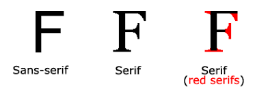
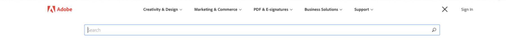
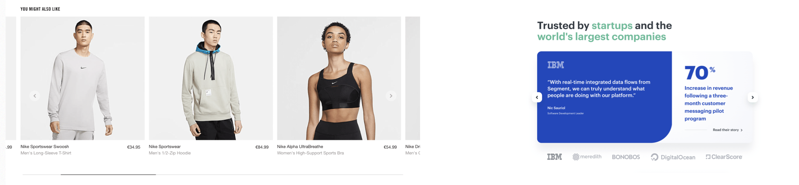

# Lesson 12 - Basic UI/UX

## Intro to Design

Design is the foundation to products and solutions all around us. It is the instruction manual for developers and it is the roadmap that allows us to achieve the goals of our site. 

> “Design is not just what it looks like and feels like. Design is how it works.” –Steve Jobs
> 

Where is design? Everywhere. From the keyboard you type on to the shoes you wear to this page you’re looking at now, design hides in plain sight in our every day lives.

### Importance of Design

Design is the first impression, the face of your product. Your design represents your product in the most easily judged ways: visually and usability. Design is also how your user interacts with your product. Good design ensures your users will have the intended experience with your product. Without good design, the user experience of your product will be negatively impacted greatly.

### What is Good Design?

Good design is **user centered**. By keeping your designs user centered, your products/solutions will be designed specifically for your user needs. This will create a more targeted and effective solution. Good design is also **accessible**. There are many different kinds of people in the world. Good design targets user groups but also understands that even within user groups, there are many different kinds of people with different needs. Finally, good design is **intuitive and seamless**. Users should interact with your designs easily. There should be absolutely no confusion as to how to use or navigate your product.

:::tip

Attractiveness ≠ good design! Good design is a marriage of usefulness and beauty.

:::

> “Just because something looks good doesn’t mean it’s useful. And just because something is useful does not make it beautiful.” — Joshua Brewer, Co-founder and CEO of [Abstract](https://www.goabstract.com/)
> 

### Norman’s Door: A Case of Bad Design

Many times, it’s easier to spot bad design than good design. Good design allows you to flow seamlessly through the experience while bad design creates bumps in your experience. 

Norman’s Door is a door that is difficult or confusing to use. For any door, it should be apparent how you should interact with it. You should easily tell whether to push or pull and which side the hinges are on. A Norman door brings about confusion and self doubt over how you interact with it. With even the most creative and artistic door, a plain door with a doorknob wins in goal completion. In design, usability always wins over creativity.

Feel free to read more about Norman’s Door [here](https://uxdesign.cc/intro-to-ux-the-norman-door-61f8120b6086). 

## UI/UX

### UI: User Interface

UI design concerns the visual experience of a product. With good UI, you create a visually appealing product. Examples of UI include:

- Typography and Color Palettes
- Images
- Buttons

### UX: User Experience

UX design focuses on the customer experience with a product. It mainly concerns how it feels to use a product. UX is user centered. With good UX, you create a useful and user targeted product.

**UX Research**: research often aimed to further understand your users

:::tip

UI and UX go hand in hand. Your UX research should determine how your UI should be designed. Similarly, the way the UI is designed heavily influences the experience of your product.

:::

## UI Elements

Choose/design all your UI elements with intention and your users in mind! Make sure to be consistent with your choices as well. This list is also not completely comprehensive. There are many UI Elements, too many to go over in one lesson. For a more comprehensive list check out [this site](https://designvault.io/patterns/).

### Fonts/Typography

**Typeface**

- Definition: the design of lettering; a particular set of glyphs that share a common design

**Sans Serif vs Serif**

- Serifs = embellished
- Sans Serif = without embellishments
- When choosing fonts for your site, typically designers pick one serif and one sans serif.

**Hierarchy**

- Role: keep the website organized so users can easily identify which category of information they are viewing
- Heading 1, heading 2, text etc.

**Weights**

- Bold, italics, condensed etc.

**Size**

- Desktop: > 15px
- Mobile: > 12px

This is a very simple breakdown of fonts and typography. For more information, feel free to check out [this medium article](https://medium.com/gravitdesigner/typography-elements-everyone-needs-to-understand-5fdea82f470d).

### Colors

You can ensure your colors go together by utilizing the color wheel. Here are some additional resources to help you choose your colors

[Adobe Color](https://color.adobe.com/create/color-wheel)

[Coolors](https://coolors.co/)

:::tip

"Less is more" - the more colors you have to work with, the harder it is to get them all to work together

:::

**Contrast**

Make sure your colors are contrasting with each other. Also, make sure the color of your text contrasts the color of the background. Here is a good use of colors and contrast:

**Accessibility**

Color blindness is a common visual impairment that designers must consider when choosing their colors. Here are some tips in designing with accessibility in mind with colors:

- Use icons and colors
- Keep it minimal
- Use textures
- Use contrasting hues
- Avoid bad color combos popular with color blindness

For a more detailed breakdown of how to choose colors with accessibility in mind, check out [this article](https://www.getfeedback.com/resources/ux/how-to-design-for-color-blindness/). 

Again, this is a very simple breakdown of colors. For additional information on choosing your colors, check out [this youtube video](https://www.youtube.com/watch?v=C1rQQ_YpgcI).

### Cards

As content has become more compartmentalized and personalized over the last few years, cards have been proven to be a great way to aggregate individual pieces of information in one place.

### Nav Bar

The Nav Bar is your user’s directory. It gives easy access to the main pages and simplifies flows.

### Carousels

Carousels optimize screen space by allowing multiple pieces of content to occupy a single rotatable space.

### Buttons

Pressing a button allows a user to perform some sort of action designated by the designer.

### States

States communicate the status of a UI element.

### Forms

Forms allow the product to collect a set of information from the user.

## Role of the Designer

Every user who interacts with your product will have some need: buying something, acquiring information, signing up, logging in, or using a certain feature. **It’s up to the designer to ensure the smoothest and most attractive way for the user to accomplish their goal.**

Here are some typical responsibilities of a web designer:
- Create graphics and features
    - Designing the UI of the website
    - Deciding what is the best way to implement (or not implement) a certain feature
- Design the user flow
    - Where does this button lead to? How do we get to a certain page?
- Conduct UX research
    - Conduct interviews, develop surveys etc
    - Define user personas and storyboard to identify target users and their pain points/needs
- Communicate with developers and clients
    - Visualize and put to paper the needs and visions of clients
    - Ensure their designs are feasible for developers to build
    - Relay intended behaviors of features and designs to developers

## Tools of the Trade

### Adobe Illustrator

- Typically used for graphic design
- Very powerful tool that allows you to create complex and intricate graphics
- Not a tool specifically for web or interface design
- Examples of designs you can make in Illustrator:

### Figma

- A tool for prototyping and designing entire interfaces
    - simulating clicks, buttons, swipes, animations
- Live updates and collaboration
- Not as good for complex graphics
- Targeted towards UI/UX and Product Designers
- Examples of work done on Figma:

[Barra Labs](https://www.figma.com/proto/5V6vxbrBIjTiboGlLeaE33/BarraLabs-Drafts?node-id=308%3A4&scaling=min-zoom)

[Best Path Transport](https://www.figma.com/proto/XyvI8u5I8NvhFey7gkUrnN/Table-Pages?node-id=257%3A1506&scaling=contain)

### Other Tools

- **Framer**: for prototyping interfaces specifically, integration with Figma
- **Sketch**: not a web application, similar to Figma though
- **Adobe *XD***: An Adobe product, not for teams. Interface design tool.

## Industry Jobs

The ability to design is a hard skill that can be applied to many different industry careers. Here are some popular design jobs you can further explore: 

- UI/UX Designer: Designing the user interface and user experience of a digital product
- Product Designer: Designing and evaluating the features of a product
- UX Researcher: Conducting research that will be the backbone of the product’s design
- Graphic Designer: Designing graphics and visuals

---

**Contributors**

- [Isabel Zheng](https://www.linkedin.com/in/isabel-zheng-24003b1b2/)
- [Vicky Li](https://www.linkedin.com/in/victoriayli/)
- [Tijmen Sep](https://www.linkedin.com/in/tijmen-sep-582469175/)
- [Jasmine Chen](https://www.linkedin.com/in/jasmine-chen-8894901b6/)
