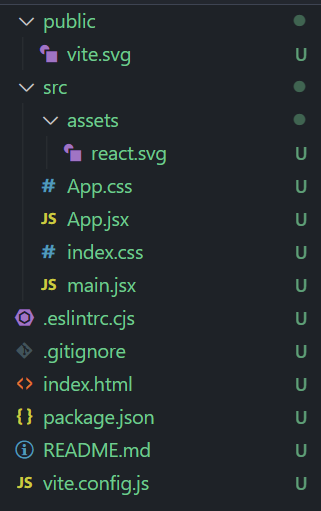

# Lesson 12 - React 3: Axios, Project Structure, and Ecosystem

## Introduction

Welcome to the course's 4th and final react lesson. In the previous lesson, you
were introduced to key parts of the React ecosystem in the form of package
managers, routing, CSS solutions, and component libraries. In this lesson, we'll
continue delving into the react ecosystem, the frontend ecosystem as a whole,
and talk about some general software development principles as well.

We'll start by introducing axios, a package in react which helps us connect our
frontend to our backend. Through axios we can send data to the backend, and
receive data from the backend, helping us create truly full-stack and powerful
applications.

We'll then introduce basic architecture and file design principles to help
delineate efficient organization practices and gear everyone up for how to
structure a large front-end project.

Lastly, we'll touch upon a number of more advanced frontend technologies such as
Server-Side Rendering (SSR), Typescript, and Redux. We won't be going in-depth
into these technologies, but we feel like they're good to know about at a
surface level at the very least. Once you know what these technologies mean
you'll be able to keep up with conversations about frontend technologies, as
well as have a couple of points to dive deeper into frontend technologies after
we finish the react section of the course's frontend curriculum.

## Axios

**Axios** **is how we connect the frontend to the backend.** In technical speak,
Axios is a promise-based HTTP client for the browser and Node.js. Informally,
Axios is a way to make API calls to the backend (GET requests, POST requests,
etc...) and how we send data to and receive data from the backend.

:::note

Axios is how we connect the frontend to the backend. Other libraries, like the
native fetch() JS API and jQuery's AJAX, can also be used for web service
requests, but Axios is the preferred library for this course.

:::

Once again: Axios is how we connect the frontend to the backend. Please remember
this point, for it will be important when trying to create almost any functional
web project.

:::note

In class-based components, we would tie our API calls to lifecycle methods to be
invoked at a particular point in a component's lifecycle. As you know, the
functional equivalent of lifecycle methods are React Hooks, so we can simulate
the same process by tying our calls to the useEffect() hook.

:::

####Documentation

[Axios](https://axios-http.com/)

[GitHub - axios/axios: Promise based HTTP client for the browser and node.js](https://github.com/axios/axios)

#### Installation

```bash
yarn add axios
```

### Using Axios

Don't forget to replace your username in the place of `{#your github name}`.

```jsx
import axios from "axios";
...
axios.get('https://api.github.com/users/{#your github name}')
  .then(function (response) {
    console.log(response);
  })
  .catch(function (error) {
    console.log(error);
  })
```

Let's dissect this piece of code into two parts: the API call, and everything
else.

```jsx
axios.get('https://api.github.com/users/{#your github name}');
```

This piece of code is where the magic happens. Here we use axios to make a GET
request to `https://api.github.com/users/{#your github name}`.

If you're unfamiliar with what GET and POST requests are:

1. **`[GET](https://developer.mozilla.org/en-US/docs/Web/HTTP/Methods/GET)`:**
   The `GET` method requests a representation of the specified resource.
   Requests using `GET` should only retrieve data.
2. **`[POST](https://developer.mozilla.org/en-US/docs/Web/HTTP/Methods/POST)`:**
   The `POST` method is used to submit an entity (a form) to the specified
   resource, often causing a change in state or side effects on the server.
3. **`[PUT](https://developer.mozilla.org/en-US/docs/Web/HTTP/Methods/PUT)`:**
   The `PUT` method replaces all current representations of the target resource
   with the request payload. In other words, you can use `PUT` to update a
   resource.
4. **`[DELETE](https://developer.mozilla.org/en-US/docs/Web/HTTP/Methods/DELETE)`:**
   The `DELETE` method deletes the specified resource.
5. **`[PATCH](https://developer.mozilla.org/en-US/docs/Web/HTTP/Methods/PATCH)`:**
   The `PATCH` method is used to apply partial modifications to a resource.

You should be familiar with the most commonly used ones, which are `GET`,
`POST`, `PUT`, and `DELETE` requests.

This GET request returns a promise, which is why we follow up the above line of
code with

```jsx
.then(function (response) {
   console.log(response);
 })
 .catch(function (error) {
   console.log(error);
 })
```

This piece of code, however, isn't specific to axios, and we can choose to deal
with the promise returned by our axios method any way we want.

### Using Axios Inside React

```jsx
import React, {useState} from 'react';

import axios from 'axios';

//As a functional component

const App = () => {
	const [person, setPerson] = useState("");

	useEffect( () => {
			axios.get(`https://api.github.com/users/{#your github name}`)
				.then( res => {
					const fetchedPerson = res.name;
					setPerson(fetchedPerson);
				})
		}, []);

	return (
		<h1>{person}</h1>
	);
}

export default App

//or, as a class component...

export default class App extends React.Component {
	constructor(props) {
		this.state = {
	    person: ""
	  }
	}

  componentDidMount() {
    axios.get(`https://api.github.com/users/{#your github name}`)
      .then(res => {
        const personName = res.name;
        this.setState({ person: personName });
      })
  }

  render() {
    return (
      <h1>{this.state.person}</h1>
    )
  }
}
```

## The Anatomy of a React App



A React app is composed of many different files and filetypes - what do each of
them do and why do we need them? Knowing the answer to this question isn't
knowledge that applies just to frontend engineering, but crucial to becoming a
full-fledged software engineer.

#### `README.md`

Essentially a back-of-the-book summary of your code. Your `README.md` should
describe what your code is for, what it does, and if applicable, it should
provide a detailed overview of each file and its functions. Think about your
`README.md` as a guide to your code.

#### `package.json` and `package-lock.json`

package.json is essentially a list of the dependencies of your app!

package-lock.json is a version-locked version of package.json, so that each new
device that downloads the code downloads the correct dependencies. This is to
prevent new updates to dependencies breaking your code.

#### `node_modules`

Where all your dependencies live! You should never ship out node_modules because
its YUGE (try opening it up and you'll see). Always include node_modules in your
.gitignore.

#### `build`

A minified build version of your app - All your code is transformed into an
extremely compact version of itself, and this version is what is meant to be
served to the public, since you get a huge speedup from using the build version!
Run `npm run build` in the root directory of your app in the terminal to create
the build folder!

## Architecture and Design Methodologies

#### Read These First

[Thinking in React - React](https://reactjs.org/docs/thinking-in-react.html)

[Design Principles - React](https://reactjs.org/docs/design-principles.html)

#### Extra Reading

[React Architecture Best Practices and Tips from Community Experts](https://www.simform.com/react-architecture-best-practices/)

[Atomic Design Methodology | Atomic Design by Brad Frost](https://atomicdesign.bradfrost.com/chapter-2/)

## Server-Side Rendering

:::note

Server-Side Rendering (SSR) is a more advanced tool in the react ecosystem so
while we've decided not to teach it in-depth, it's still useful to know what it
is and what its use case might be.

:::

Performance is a central concern for frontend developers. We should always be
striving to serve the leanest web apps that perform faster than humans can
think. This is as much a game of psychology as it is a technological challenge.
It's a challenge of loading the correct content first so a user can see a site
and begin to make a decision of what they want to do (scroll down, click a
button, log in, etc.) and then be prepared for that action before they make that
decision.

Enter server-side rendering. This is a technique where you run React on your
Node.js server _before_ you serve the request to the user and send down the
first rendering of your website already done. This saves precious milliseconds+
on your site because otherwise, the user has to download the HTML, then download
the JavaScript, then execute the JS to get the app. In this case, they'll just
download the HTML and see the first rendered page while React is loading in the
background.

While the total time to when the page is actually interactive is comparable, if
a bit slower, the time to when the user _sees_ something for the first time
should be much faster, hence why this is a popular technique.

A popular framework built on top of React that comes with server-side rendering
is Next.js.

[Next.js by Vercel - The React Framework](https://nextjs.org/)

**TLDR:** Server Side Rendering makes websites go faster (usually).

## Redux

:::note

Redux is a more advanced tool in the react ecosystem so while we've decided not
to teach it in-depth, it's still useful to know what it is and what its use case
might be.

:::

Redux is a well-known library that does state management for you, similar to
[context in react](https://reactjs.org/docs/context.html). With context, you use
the provider and consumer as a sort of portal to skip passing parameters through
every component. With Redux, we're taking the state management _out_ of React
entirely and moving it to a separate store.

Why do we have Redux?

1. Context used to be a lot worse to use and less useful. This made Redux (or
   Redux-like) management tools the only option
2. Redux code is _extremely testable_. This is probably the most compelling
   reason to use it. Having your state mutation be broken up in such a way to
   make it easy to test is fantastic. This is also mitigated because we have
   `useReducer` now.
3. The debugging story is pretty good.

How often will we use Redux? Never, I anticipate. I rarely had problems that
Redux solved (they exist; I just didn't have them) and in the few cases now
where I would see myself using Redux I think React's context hook would cover
it. But if Redux speaks to you, do it! Don't let me stop you. It's a great
library. Just be cautious. And there are reasons to use it: if you have complex
orchestrations of async data, Redux can be immensely useful and I _would_ use it
for that.

[Redux - A predictable state container for JavaScript apps. | Redux](https://redux.js.org/)

**TLDR:** Redux is used to manage global state in React, but is being phased out
by React's Context hook.

## TypeScript

:::note

Typescript is a more advanced tool in the react ecosystem so while we've decided
not to teach it in-depth, it's still useful to know what it is and what its use
case might be.

:::

Typescript is a static type object-oriented programming language maintained by
Microsoft. It can be seen as a superset of JavaScript. With the help of
Typescript Compiler (TSC), we can convert typescript code to JavaScript, and
then it would be made understandable to the browser and to Node.

So, why do we use Typescript if we can directly write in JavaScript? There are
scenarios where JavaScript may not function that well.

- Since Typescript is a statically typed language, meaning that all the types
  can be checked during compile time, it can limit the number of mistakes during
  the run time. Thus easier to debug.
- Static typing also provides highly productive development tools for JavaScript
  IDEs and practices, like static type checking.

As a result, Typescript is rapidly gaining in popularity nowadays.

:::note

We used to teach a lesson on TypeScript. You can find the
[old reading for it here.](/docs/Guides/Typescript)

:::

**Full-Stack DeCal Typescript Lesson:**

[Typescript](https://www.notion.so/Typescript-693b0785d1e648a7a91cf4301ebd91fd)

**TLDR:** Typescript = type-checked Javascript.

## Conclusion

After this lesson, you hopefully have all the tools you'd need to build robust,
large-scale web applications, and if not then you know where to look to learn
about the information you'd need to do so. Frontend development is a vast
landscape and is always changing, so make sure to keep that in mind while
developing. We've introduced you to the core tools and ideas you'll need, but
these tools and methodologies are constantly being updated. Software engineering
is a constant learning cycle, so never be afraid to look into a new solution or
an alternative method of implementing your ideas!

---

**Contributors**

- [Samarth Goel](https://berkeley.zoom.us/my/samarthgoel)
- [Alex Wu](https://www.linkedin.com/in/jialin-wu-alex/)
- [Arushi Somani](https://www.linkedin.com/in/arushisomani/)
- [Brian Holt](https://www.linkedin.com/in/btholt/)
