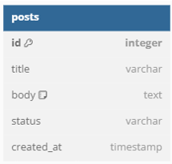
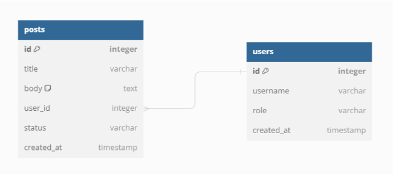
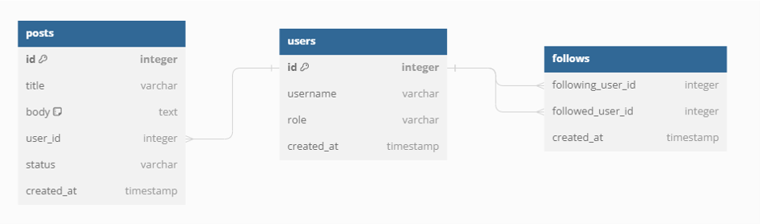
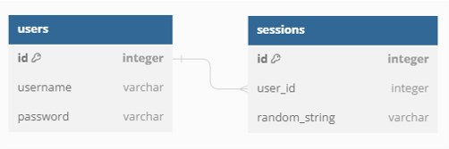

# Databases & Authentication

## Context

Remember when we implemented a global view-count counter with SSR? We had a server that kept some state in a random `views.txt` file so that even if the server / computer
restarted, the total view count would not be reset.

When what you're storing goes from a simple number to far more data (e.g. thousands of users and millions of posts) a simple `.txt` file is not enough for various reasons:
 1. Speed: Reading and finding specific data in one huge `.txt` file is slow (imagine finding a user's "score" if there's a list of a million users)
 2. Reliability: If someone deletes the text file, or if even one byte is corrupted, all your data may be gone!
 3. ACID: Atomicity, Consistency, Isolation & Durability. If you've taken a databases course you will appreciate this more, but essentially it allows the database to behave well when there are many servers all making requests to it. 

So what do we use instead of a `.txt` file? There are many options, but we will cover MySQL.

## MySQL

MySQL is a database service. If you were to download it and run it, it would start listening on port `3306`. You can then send it requests to store or retrieve data. The
requests you send it are written in a special language called SQL (Structured query language.) The pronounciation of SQL is subject to much debate, with most people opting
for "S.Q.L" or "Sequel". Some specially special people have opted for "Skewl".

In SQL, data is stored in tables that you create. Each table has a set of predefined (and unchanging) columns (e.g. name, age) and a bunch of rows that you can add. If you have taken cs61a
you are likely familiar with these concepts.

Here's how you make a table:
```sql
CREATE TABLE Users (
    ID INT PRIMARY KEY AUTO_INCREMENT,
    Name VARCHAR(50),
    Age INT,
    Email VARCHAR(100)
);
```
You just have to send this SQL command to the MySQL server and it will make the table for you.

Then you can add some users:
```sql
INSERT INTO Users (Name, Age, Email) VALUES 
    ('John', 28, 'john@example.com'),
    ('Jane', 25, 'jane@example.com'),
    ('Doe', 30, 'doe@example.com');
```

Retrieve some data:
```sql
SELECT Age FROM Users WHERE Name = 'John';
```
And finally, **delete John**:
```sql
DELETE FROM Users WHERE Name = 'John';
```

John will never know what hit him.

If you want to understand how these commands work at a deeper level, and why they are how they are, we recommend taking `cs186` (although this class goes *really* deep).
For now we just want to drill the concept of a database more broadly, so you can just ask ChatGPT to generate these SQL statements for you :) although they are pretty
self-explanatory.

## SQLite

SQLite is a begginner-friendly SQL database implementation. It allows us to prevent spinning up a whole new server just to act as a SQL server. Instead we augment our existing Node.js express
server with the ability to also be a SQL database.

### Simple server

After installing `sqlite3` with `npm install sqlite3` in a Node project:
```js
const sqlite3 = require('sqlite3').verbose();
const db = new sqlite3.Database('myDatabaseFile.db');

db.serialize(() => {
  db.run(`CREATE TABLE Users (
    Id INT PRIMARY KEY,
    Name VARCHAR(50),
    Age INT,
    Email VARCHAR(100)
  )`);

  db.run(`INSERT INTO Users (Id, Name, Age, Email) VALUES (1, 'Charlie', 55, 'charlie@yahoo.com')`);

  db.each("SELECT * FROM Users", (err, row) => {
      console.log(row);
  });
});

db.close();
```

This will create a new file called `myDatabaseFile.db` in the same folder as the code, and will store all the tables in there in a compressed format. Then, you can run
commands which will make modifications to the file. Basically, this is like a glorified `.txt` file that's way more efficient and programmatic.

In a real setup with MySQL instead of SQLite, you would have a seperate server listening on port `3306` that your server would send the SQL statements to. This server's whole
responsibility is to ensure the data can be read fast, is secure and consistent. With SQLite, there is only one server. Keep this distinction in mind.

## SQL injection

What if you want to insert something into the database that comes from the user? Say for example a username? This is wrong:
```js
let username = "John123"; // imagine this comes from the user
db.run(`INSERT INTO Users (Id, Name, Age, Email) VALUES (1, '${username}', 55, 'charlie@yahoo.com')`);
```
Not only does this give John Charlie's email address and age, but this also lets John hack our entire database! 
If John sets his username to `John123'; DROP TABLE Users; --` then the query becomes 
```sql
INSERT INTO Users (Id, Name, Age, Email) VALUES (1, 'John123'; DROP TABLE Users; --', 55, 'charlie@yahoo.com')
```
The `;` ends the previous statement and the `--` starts a comment (ignoring the rest). This deletes the `Users` table! (`DROP` is the instruction to delete a table).

Instead, we do this:
```js
let username = "John123"; // imagine this comes from the user
const stmt = db.prepare(`INSERT INTO Users (Id, Name, Age, Email) VALUES (?, ?, ?, ?)`);
stmt.run(1, username, 28, "john@example.com");
stmt.finalize();
```
Each argument to `stmt.run` goes into each `?` in the original `db.prepare` call. Since SQLite now knows the actual values you want to insert separated from the query
itself, it can ensure that John's username becomes `John123'; DROP TABLE Users; --` exactly as he wishes :)

The name of this attack is called "SQL Injection" and it is a very popular kind of attack. If you want to learn more about computer security, we recommend taking `cs161`.

## Relational database models

### The "id" column

Consider the following table `posts` with 4 columns `title`, `body`, `status` and `created_at`.


If we want to allow users to share specific posts to others via URL, we need to be able to generate a unique URL for each post. However, here we run into a problem: posts
are not unique. That is, if two people both post the same thing at the same time, the rows will be identical! We fix this by adding an `id` column:



The SQL statement to create this table would look like:
```sql
CREATE TABLE posts (
    id INT PRIMARY KEY AUTO_INCREMENT,
    title VARCHAR(50),
    body TEXT,
    status VARCHAR(100)
    created_at TIMESTAMP
);
```

We tell MySQL that the `id` column is the `PRIMARY KEY`, which enforces that it is unique (MySQL will refuse to allow us to add two posts with the same id). Furthermore,
if we don't specify the `id` column when inserting a post, the `AUTO_INCREMENT` option will automatically give each post the next id.

### Many-to-one

Next, we create a `users` table, also each with their own `id`. And we also add a `user_id` column to the `posts` table so we can track each post back to the author. Since
there are **many** posts that all come back to **one** user we call this a **many-to-one** relationship.



### Many-to-many

Next, we want users to be able to follow each other. However, since each user can follow many users and also be followed by many users, this is a **many-to-many** relationship.
To structure this nicely using tables, we have to create an entirely new table:



For every "follow", we create a row in the `follows` table with the following user and the followed user. This is how we achieve **many-to-many** relationships in general.

## Authentication

We often want to store data about our users, like their posts or anything else. To do this, we allow users to create accounts, and then log in to prove us that it
is them. When they register, we store their username and password in a database, and then when they log in we can just check the password.


However, once they log in, we want them to stay logged in. That is, even if they refresh the page, they should still be logged in. Naively, we could just have a cookie
that contains the username and password the user logged in with, which will be sent to the server every time. As such, the server can always verify on every request
that the user is indeed logged in.

However, this is very insecure. Cookies are stored in the browser's memory in a completely unencrypted manner. Furthermore, we want the ability to automatically log out
users after a period of time for their security, which is not possible to achieve this way.

Instead, we create "session cookies". Every time the user logs in, we create a new random string of characters to identify this new session. That string of characters
is called a session token. We store that as a cookie, and also in our database associated to that user.



That way, the user can still prove he is logged in on every request, and if we want to log the user out we can just remove the session token from our database!

---

**Contributors**

- [Sebastiaan Szafir](https://sebiszafir.com/)
