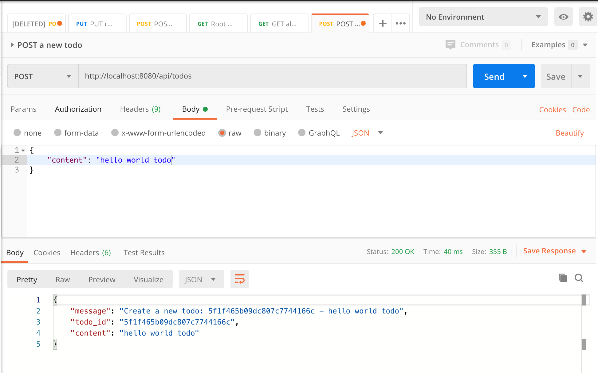
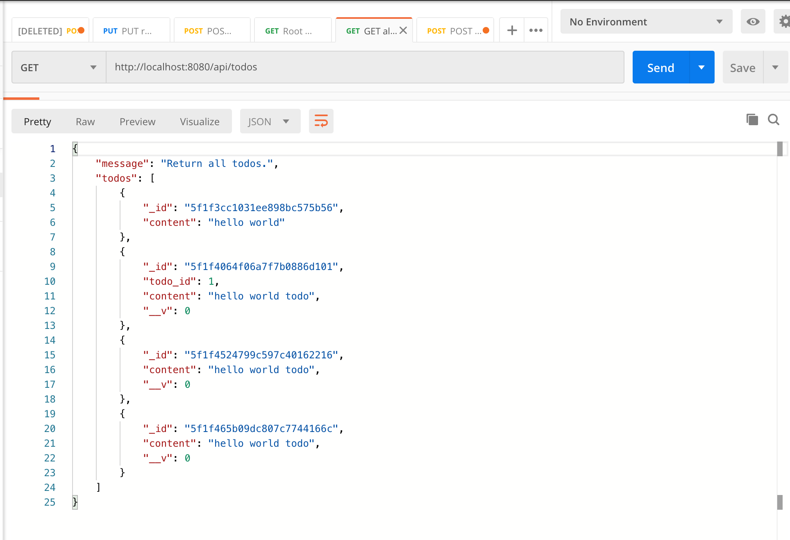
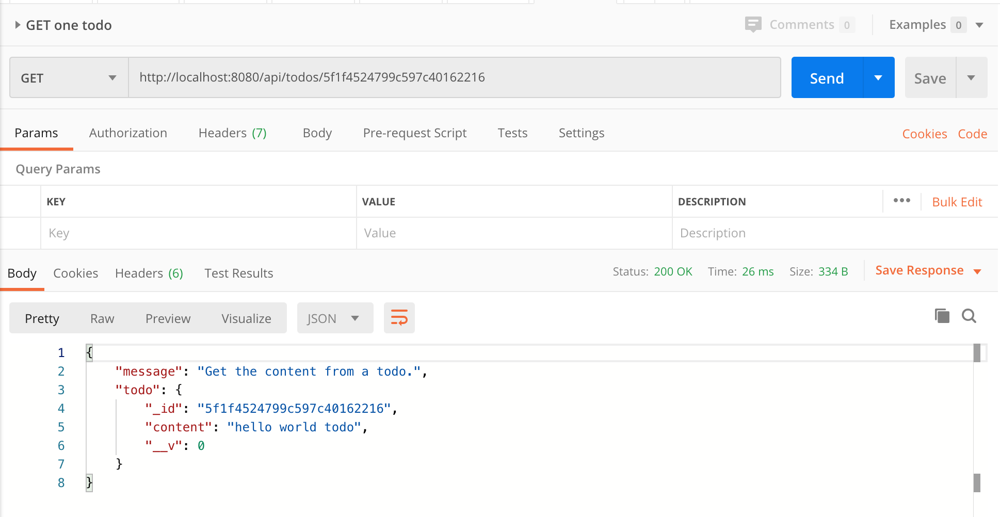
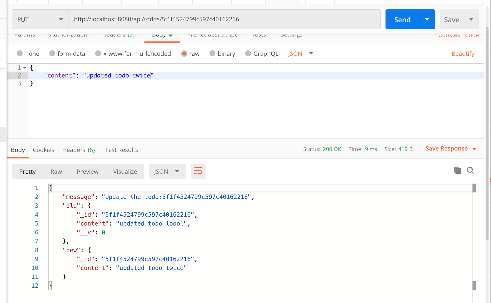
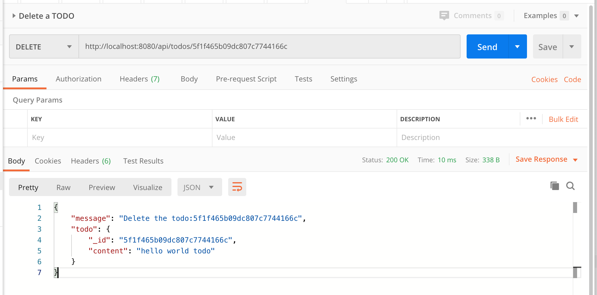

# Lesson 13 - Express and MongoDB

## Preparation

### Setup

```jsx
const express = require("express");
const port = process.env.PORT || 3000;
const app = express();

var router = express.Router()

app.use(express.json()); // Utilities for request bodies
app.use(express.urlencoded({ extended: true })); // Utilities for query params

// GET Requests

router.get("/", (req, res) => {
  // homepage
  res.send("stupidDB API");
});

router.get("/info/index", (req, res) => {
  // get the current index
  res.send({ counter: counter });
});

router.get("/info/capacity", (req, res) => {
  // get the capacity
  res.send({ capacity: Object.keys(stupidDB).length });
});

router.get("/db/all", (req, res) => {
  // get all items from the db
  res.send(stupidDB);
});

// Combining endpoints into a single "route"

router.route("/db/:id")
	.get((req, res) => {
	  // get a certain item from the db
	  const id = req.params.id;
	  if (id in stupidDB) {
	    res.send(stupidDB[id]);
	  } else {
	    res.send({ error: "no object found with this id" });
	  }
	}).
	.put("/db/:id", (req, res) => {
	  const id = req.params.id;   // get the index of the data to update
	  const item = req.body.item; // access the body of the request which holds new data
	  if (id in stupidDB) {
	    stupidDB[id] = item;      // insert destructively
	    res.send({ newItem: item });
	  } else {
	    res.send({ error: "no object found with this id" });
	  }
	});
	.delete("/db/:id", (req, res) => {})

// POST Requests

router.post("/db", (req, res) => {
  console.log(req);
  const item = req.body.item; // access our request body
  stupidDB[counter] = item;   // add body item at index
  counter += 1;               // increment counter
  res.send(`POST Request Successful. Item placed: ${item}`); // Send HTTP response
});

// Server Setup

app.use('/', router)

app.listen(port, () => {
  console.log(`Example app listening at http://localhost:${port}`);
});
```

Let us first setup the MongoDB. Use homebrew to install mongoDB. Here are the macOS instructions. Here is the link to the instructions in general for other systems (Linux and Windows) [https://docs.mongodb.com/manual/administration/install-community/](https://docs.mongodb.com/manual/administration/install-community/) .

`brew install mongodb-community`

```bash
$ brew tap mongodb/brew
$ brew install mongodb-community
$ brew services start mongodb-community
```

Now type `mongo` to start the mongo shell to interact with the database.

Let's create a database called `database-tutorial`. Use the `use` keyword in the mongo shell.

```bash
$ use database-tutorial
```

Now, we have the database ready in our computer. To connect with mongoDB, let's install mongoose, a library that helps mongoDB easier to use in express.

```bash
$ npm install mongoose --save
```

Now add the following lines to the server.js file, it serves to connect with the mongoDB database that we just set up.

```jsx
const mongoose = require('mongoose')
const url = 'mongodb://127.0.0.1:27017/database-tutorial'

mongoose.connect(url, { useNewUrlParser: true })

const db = mongoose.connection

db.once('open', _ => {
  console.log('Database connected:', url)
})

db.on('error', err => {
  console.error('connection error:', err)
})
```

When you rerun the server.js script, you can see the following message: `Database connected: mongodb://127.0.0.1:27017/database-tutorial`, which means you have successfully connected to the database.

# Create MongoDB Model

Let's first create a model for our mongoDB database. We first need to create a schema. MongoDB will automatically add a `_id` field to schema. Thus, we only need to create a content field. 

After creating the schema, use `mongoose.model` to create a TODO model.

```jsx
const Schema = mongoose.Schema

const item = new Schema({
  title: String
	task: String,
	date: String,
	urgency: Number,
})

const TODO = mongoose.model("TODO", item)
```

# CURD Operations for MongoDB & Express

## Create

Let's first implement the endpoint for creating a new TODO.

To create a new TODO, we call `new TODO()`, and by passing in an object that corresponds to the schema, we can successfully create a todo object. To save this todo object into the database, use `todo.save()`.

After we create and save the todo, we can access the `todo._id` field that mongoDB automatically provides.

```jsx
router.post("/db", (req, res) => {
    const todo = new TODO({        // Create TODO item with the appropriate fields
        title: req.body.title,
        task: req.body.task,
        date: req.body.date,
        urgency: req.body.urgency,
    });
    todo.save((error, document) => {
        if (error) {
            res.json({ status: "failure" });
        } else {
            res.json({               // Save TODO item to the database
                status: "success",
                id: todo._id,
                content: req.body
            });
        }
    })
});
```

Try it out in the postman, you can see that the new todo is created successfully.



## Retrieve

Let's continue to build upon the existing APIs!

We can use `.find()` to retrieve all todos.

```jsx
router.get("/db/all", (req, res) => {
		TODO.find().then((todos) => {
      res.json({ message: 'Return all todos.', todos: todos});
    })
});
```

Test it out in the postman api request, you would get something like this.



Let's see whether we can retrieve the content of only one todo. `.findById()` method allows you to find the object in the database given an ID. 

```jsx
router.route("/db/:id")
	.get((req, res) => {
	  // get a certain item from the db
		TODO.findById(req.params.id, (error, todo) => {
			if (error) {
					res.json({ status: "failure" })
			} else {
					res.json(todo)
	  }
	}).
	.put("/db/:id", (req, res) => {
	  const id = req.params.id;   // get the index of the data to update
	  const item = req.body.item; // access the body of the request which holds new data
	  if (id in stupidDB) {
	    stupidDB[id] = item;      // insert destructively
	    res.send({ newItem: item });
	  } else {
	    res.send({ error: "no object found with this id" });
	  }
	});
	.delete("/db/:id", (req, res) => {})
```

Test it out using Postman by adding one of your todo id. You should receive this from the API.



## Update

To update a TODO, we use the method called `findByIdAndUpdate()`.

```jsx
router.route("/db/:id")
	.get((req, res) => {
	  // get a certain item from the db
	  const id = req.params.id;
		TODO.findById(req.params.id, (error, todo) => {
			if (error) {
					res.json({ status: "failure" })
			} else {
					res.json(todo)
	  }
	}).
	.put("/db/:id", (req, res) => {
	  TODO.findByIdAndUpdate(req.params.id, req.body, (error, todo) => {
			if (error) {
				res.json({ status: "failure" })
			else {
				res.json(todo)
			}
	});
	.delete("/db/:id", (req, res) => {})

```



## Delete

To delete a TODO, we use the method called `findByIdAndDelete()`.

```jsx
router.route("/db/:id")
	.get((req, res) => {
		TODO.findById(req.params.id, (error, todo) => {
			if (error) {
					res.json({ status: "failure" })
			} else {
					res.json(todo)
	  }
	}).
	.put("/db/:id", (req, res) => {
	  TODO.findByIdAndUpdate(req.params.id, req.body, (error, todo) => {
			if (error) {
				res.json({ status: "failure" })
			else {
				res.json(todo)
			}
	});
	.delete("/db/:id", (req, res) => {
		TODO.findByIdAndDelete(req.params.id, (error, todo) => {
			if (error) {
				res.json({ status: "failure"})
			} else {
				res.json(todo)
			}
	})
```



# Final Product

```jsx
const express = require("express");
const port = process.env.PORT || 3000;
const app = express();

var router = express.Router()

app.use(express.json());                         // Utilities for request bodies
app.use(express.urlencoded({ extended: true })); // Utilities for query params

// begin mongoose setup
const mongoose = require('mongoose')
const url = 'mongodb://127.0.0.1:27017/database-tutorial'

mongoose.connect(url, { useNewUrlParser: true })

const db = mongoose.connection
db.once('open', _ => {
  console.log('Database connected:', url)
})

db.on('error', err => {
  console.error('connection error:', err)
})
// end setup

// define mongoose schema
const Schema = mongoose.Schema

const item = new Schema({
  title: String
	task: String,
	date: String,
	urgency: Integer,
})

const TODO = mongoose.model("TODO", item)

// begin router
router.get("/", (req, res) => {
  // homepage
  res.send("smartDB API");
});

router.get("/db/all", (req, res) => {
		TODO.find().then((todos) => {
      res.json({ message: 'Return all todos.', todos: todos});
    })
});

// Combining endpoints into a single "route"

router.route("/db/:id")
	.get((req, res) => {
		TODO.findById(req.params.id, (error, todo) => {
			if (error) {
					res.status(500).json({ status: "failure" })
			} else {
					res.json(todo)
	  }
	}).
	.put("/db/:id", (req, res) => {
	  TODO.findByIdAndUpdate(req.params.id, req.body, (error, todo) => {
			if (error) {
				res.status(500).json({ status: "failure" })
			else {
				res.status(200).json(todo)
			}
	});
	.delete("/db/:id", (req, res) => {
		TODO.findByIdAndDelete(req.params.id, (error, todo) => {
			if (error) {
				res.status(500).json({ status: "failure"})
			} else {
				res.json(todo)
			}
	})

// POST Requests

router.post("/db", (req, res) => {
  const todo = TODO({        // Create TODO item with the appropriate fields
		title: req.body.title,
		task: req.body.task,
		date: req.body.date,
		urgency: req.body.urgency,
	})
	todo.save((error, document) => {
		res.json({               // Save TODO item to the database
			status: "success",
			id: todo._id,
			content: req.body
		)
	)
});

// Server Setup

app.use('/', router)

app.listen(port, () => {
  console.log(`Example app listening at http://localhost:${port}`);
});
```

## Errors

Part of proper programming practice is enforcing our REST API design principles. Part of that API design is ensuring that we are following the HTTPS best practices, and that includes sending error codes whenever 

# Resources

[Build a RESTful API Using Node and Express 4](https://scotch.io/tutorials/build-a-restful-api-using-node-and-express-4)

[What is REST](https://restfulapi.net/)

---

**Contributors**

- [Alex Wu](https://www.linkedin.com/in/jialin-wu-658929185/)
- Dhruv Vaish

## EXTRA:

```jsx
const express = require('express');
const bodyParser = require('body-parser');

const app = express();
app.use(bodyParser.urlencoded({ extended: true }));
app.use(bodyParser.json());

var port = process.env.PORT || 8080;

var router = express.Router();

// The method of the root url. Be friendly and welcome our user :)
router.get('/', function(req, res) {
    res.json({ message: 'Welcome to the TODO app.' });   
});

// /api/todos
// All HTTP methods under the /todos URL.
router.route('/todos')
  // This GET method is in charge of returnning all the todos.
  .get((req, res) => {
    res.json({ message: 'Return all todos.'});   
  })
  // This POST methods is used to create a new todo. 
  // Its request will have a body, containing the content of the new todo.
  .post((req, res) => {
    res.json({ 
      message: ('Create a new todo: ' + "1" + " - " + req.body.content),
      todo_id:  "1",
      content: req.body.content,
    }); 
  })

// All HTTP methods under the /todos/:todo_id URL.
// The /:todo_id is a parameter within the URL that specifies a particular todo.
router.route('/todos/:todo_id')
  // This GET method is used to get the content from a specific todo.
  .get((req, res) => {
    res.json({ message: 'Get the content from a todo.'});   
  })
  // We use PUT method to update a todo's content.
  .put((req, res) => {
    res.json({ 
              message: ('Update the todo: ' + req.params.todo_id + " - " + req.body.content),
              todo_id: req.params.todo_id,
              content: req.body.content,
            });   
  })
  // DELETE method is used to delete a todo.
  .delete((req, res) => {
    res.json({ message: 'Delete a todo.' }); 
  })

app.use('/api', router); // API Root url at: http://localhost:8080/api

app.listen(port);
console.log('Server listenning on port ' + port);
```

```bash
// All HTTP methods under the /todos URL.
router.route('/todos')
  // ...
  // This POST methods is used to create a new todo. 
  // Its request will have a body, containing the content of the new todo.
	.post((req, res) => {
    const todo = new TODO({
      content: req.body.content
    })
    todo.save((error, document) => {
      res.json({ 
        message: ('Create a new todo: ' + todo._id + " - " + req.body.content),
        todo_id:  todo._id,
        content: req.body.content,
      }); 
    })
  })

// All HTTP methods under the /todos/:todo_id URL.
// The /:todo_id is a parameter within the URL that specifies a particular todo.
router.route('/todos/:todo_id')
  // This GET method is used to get the content from a specific todo.
 .get((req, res) => {
    TODO.findById(req.params.todo_id, (err, todo) => {
	      if (err) {
        res.json({ message: 'Error when getting the content of the todo.'});
      }
      res.json({ message: 'Get the content from a todo.', todo});
    })
  })

// All HTTP methods under the /todos/:todo_id URL.
// The /:todo_id is a parameter within the URL that specifies a particular todo.
router.route('/todos/:todo_id')
  // ...
  // We use PUT method to update a todo's content.
  .put((req, res) => {
    TODO.findByIdAndUpdate(req.params.todo_id, {content: req.body.content}, (err, todo) => {
      if (err) {
        res.json({ message: 'Error when updating todo.'});
      }
      res.json({ message: 'Update the todo: ' + req.params.todo_id, old: todo, new: {_id: req.params.todo_id, content: req.body.content}});
    });
  })

// All HTTP methods under the /todos/:todo_id URL.
// The /:todo_id is a parameter within the URL that specifies a particular todo.
router.route('/todos/:todo_id')
	// ...
  // DELETE method is used to delete a todo.
  .delete((req, res) => {
    TODO.findByIdAndDelete(req.params.todo_id, (err, todo) => {
      if (err) {
        res.json({ message: 'Error when deleting todo.'});
      }
      res.json({ message: 'Delete the todo: ' + todo._id, todo: {_id: todo._id, content: todo.content}});
    });
  })
```