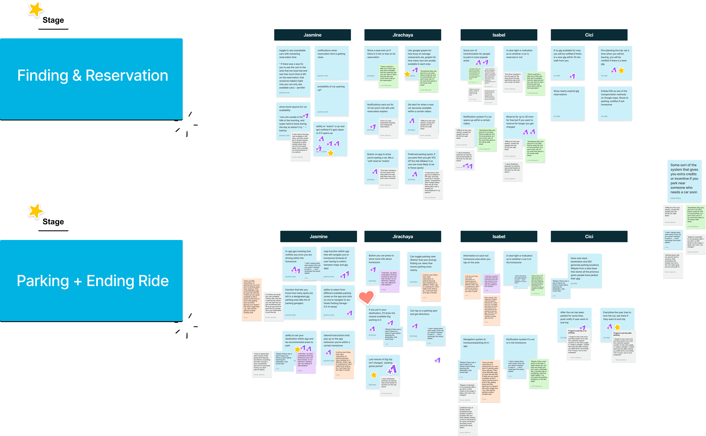
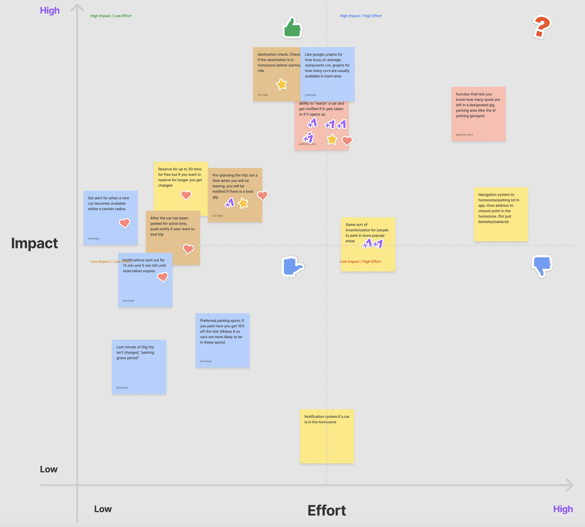
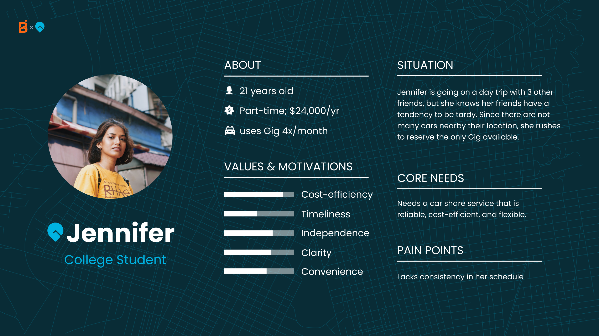
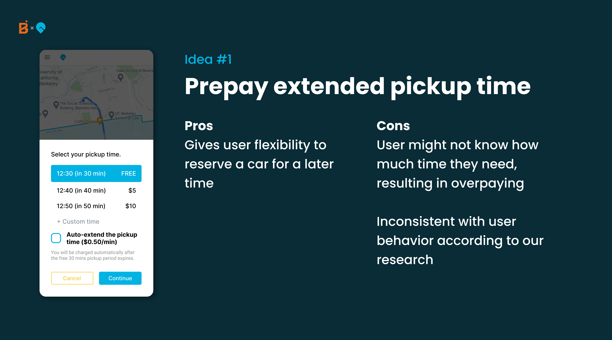
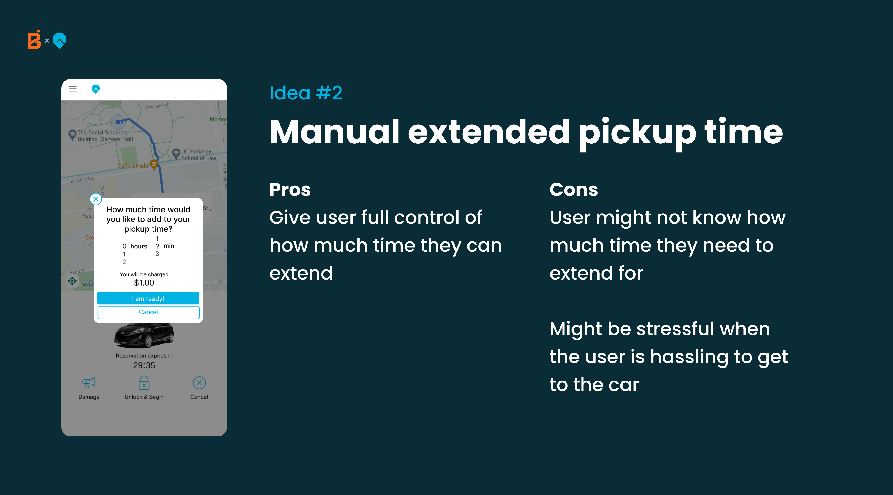
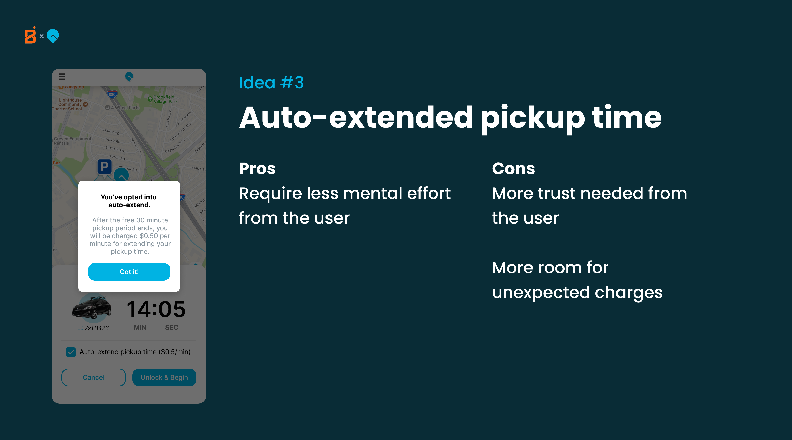
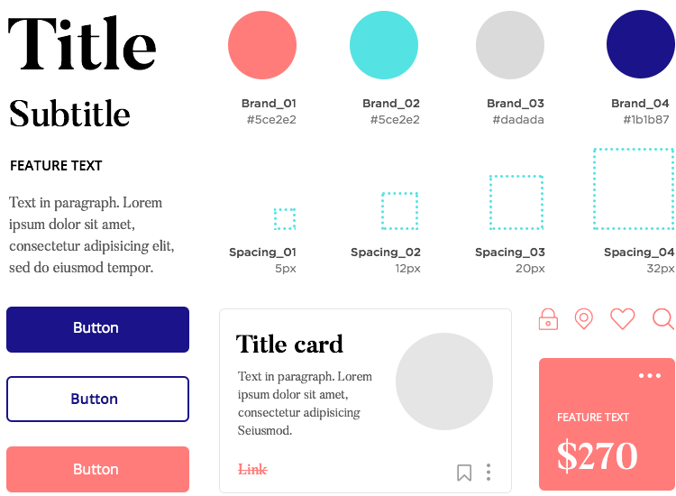

# Lesson 15 - UI/UX 2: HCD Principles

IDEO defines human centered design as a “creative approach to problem-solving
that starts with people and ends with innovative solutions that are tailor-made
to suit their needs”.

## The Human Centered Design Process

The HCD process can be summed up in a cycle of converging and diverging. In
order to be intentional with all your decisions make sure at every step you step
concrete goals and relate them to how they will relate to the solution for your
users. No design process is the exact same. Many times, you may jump from one
stage to another or even go back and iterate between two stages. That being
said, here is the skeleton to the HCD process:

### 0. Define Your Problem Scope

Before launching into the HCD process, it is important to understand your
problem scope. Ultimately, you are creating a product that is attempting to
solve a problem, improve a process, or provide aid in some area. You must be
clear of what the current problem is. To clearly define your problem scope, many
designers use a “how might we” question to guide their designing. Here are some
examples:

- “HMW support users in their tax filing journey to create a seamless experience
  to reduce confusion and frustration?”
- “HMW improve food packaging that will reduce waste but also be feasible for
  mass production?”
- “HMW educate incoming college freshmen about Berkeley culture in a virtual
  setting so they will be included and integrated into the school?”

To read more about “how might we” questions, I suggest reading
[this article](https://dscout.com/people-nerds/how-might-we-statements).

### 1. Research: Diverging

The general goal of the first stage is all about understanding your user group
and their pain points/needs as well as keeping an open mind to all possibilities
and solutions. Research is considered diverging because you are to collect as
much research as possible about your user group. Here are some methods in
conducting research:

- Interviews
- Surveys
- Diary Study
- Competitive Analysis
- Secondary Research
- Field Study

### 2. Synthesis: Converging

In the second stage, the data of research gets broken down and visualized in
more digestable pieces. The goal of synthesis is to consolidate and personify
the research and identify commonality between users. Synthesis is considered
converging as you are consolidating your data. Here are some methods of research
synthesis:

- Affinity Mapping
- User Personas
- Journey Maps
- Empathy Maps

### 3. Ideation: Diverging

In the ideation phase, ideas are first churned out quickly using rapid ideation.
By diverging through throwing all the ideas onto the table, you can maintain an
open and creative mind as a designer. The goal of ideation is to come up with as
many solutions as possible. As you’re ideating, make sure all your solutions
stay centered around the user and their needs.

### 4. Prototyping: Converging

The goal of the prototyping phase is to design your final product. Within web
development, this would mean your final high fidelity UI design. Here, you weigh
the different solutions that were ideated in the last stage and consider their
advantages and disadvantages, slowly eliminating them. Once a solution has been
decided upon, you are launched into low fidelity prototypes then high fidelity
prototypes along with user flows. Here are some common tools used to prototype
in web development:

- Figma
- Sketch
- Illustrator

### 5. User Testing

Depending on your project, you will want to conduct user testing at some point
during your prototyping. During user testing, you give your users your current
prototype and ask for feedback through the form of questions, walk throughs, and
more. You can then use this feedback to adjust your designs to be further
tailored towards your users.

:::tip

This is a simple outline of the HCD process. It is not rigid or linear at all.
In fact, you will likely loop back to different stages multiple times. Don’t be
afraid of taking a few steps back!

:::

To learn more about the HCD Process, I suggest reading
[this article](https://www.usertesting.com/blog/how-ideo-uses-customer-insights-to-design-innovative-products-users-love).

## HCD Process Example: Gig Car Share

Gig is a car-sharing service operating in the Bay Area, Sacramento, and Seattle.
Gig’s main service is their car rentals with the flexibility to pick up and drop
off cars in different locations.

### The Problem Scope

Though Gig has many member support resources, Gig members often call member
support for issues for non-urgent issues, backlogging urgent issues. This proves
to be unsafe and inefficient for both users and Gig. My team followed this
problem statement through our process:

<aside>
❓ “How might we create a seamless and intuitive Gig vehicle experience to help Gig Members during their trip so they don’t need to look at their phone for the FAQ or call support for general questions to reduce Member frustration and call volume for non-urgent issues?”

</aside>

### The Process

#### 1. Research: Diverging

In order to understand our user base (Bay Area students who are also Gig users),
we conducted surveys, interviews, and competitive analysis.

Surveys

- Goal: Understand reasons behind user preferences and current behavior

- Outcome: Understood users’ most common pain points and what they value when
  troubleshooting

Interviews

- Goal: Gain a deeper visualization of the user journey and how they approach
  troubleshooting; understand user needs and how we can design our solution to
  prevent current pain points

- Outcome: Pivot project focus on problem prevention instead of call diversion;
  gained a greater understanding of user values and progressed towards narrowing
  down project scope

Competitive Analysis

- Goal: Find potential competitors and learn about the pros and cons of their
  features and solutions

- Outcome: Learned about user needs and how different competitors address their
  needs; gained inspiration for solution ideation

#### 2. Synthesis: Converging

After conducting research, we ended up with a lot of raw data that was hard to
consolidate. To make the data more readable, we created multiple affinity maps
and sorted all our key findings and quotes into different categories.

#### 3. Synthesis: Converging

The affinity map made it clear that there were two main areas of the user
journey that needed improvement: finding/reserving a car and parking/ending the
trip. To narrow the scope even further, we further affinity mapped and sorted
our ideas into those two areas.

#### 4. Ideation: Diverging

Though the affinity mapping consolidated our ideas, we still were unsure which
route to take. To make that decision, we conducted rapid ideation for each route
then plotted them on an impact effort chart.

#### 5. Prototyping: Converging

To further visualize some of our top solutions, we created low fidelity
prototypes.

Our visualizations along with our impact effort graph made it clear
parking/ending the ride was too high of an engineering lift. Because of this
along with a few other business related reasons, we went with the stage of
finding cars/reservations.

#### 6. Synthesis: Converging

Now that we’ve chosen a route, we needed to focus on the research gathered
specifically for the reservation stage. In order to personify our data and focus
on a human centered approach, we created a persona of a Gig user, Jennifer, who
would later interact with our solution. We also developed a journey map to
further showcase the pain points of the current Gig user flow.

#### 7. Ideation: Diverging

Once our problem was chosen, we settled upon three main solutions that were high
impact and low effort. We dove deeper into each one and listed out their pros
and cons.

We reviewed our maps, research, and insights and ended up going with idea #3,
auto extended pickup time.

#### 8. Prototyping + User Testing: Converging

In order to visualize our solution, we created a user flow map that showcased
every possible user interaction with our product.

Once we laid out the user flow, we continued onto iterating through our designs
and conducting user testing between iterations. Here are some examples of our
final prototype:

:::tip

Notice how the process isn’t linear. We were not afraid of going back to
synthesis or ideating multiple times. As long as you ensure your product is user
centered a messy process is ok.

:::

_Credits to the project team:
[Me (Isabel Zheng)](https://www.linkedin.com/in/isabel-zheng-24003b1b2/),
[Jasmine Chen](https://www.linkedin.com/in/jasminewschen/),
[Jirachaya Kiriruangchai](https://www.linkedin.com/in/jirachaya-kiriruangchai/), [Cici Wei](https://www.linkedin.com/in/ciciwei/), [Etheline Nguyen](https://www.linkedin.com/in/ethelinen/)_

## Design Systems

As defined by the
[Nielsen Norman Group](https://www.nngroup.com/articles/design-systems-101/),
design systems are “a set of standards to manage design at scale by reducing
redundancy while creating a shared language and visual consistency across
different pages and channels”.

> “Design systems are always evolving, and the way you share and encourage
> adoption of new iterations will evolve along the way as well.” –Diana Mounter,
> design systems manager at GitHub

Often, a design systems includes:

- Color Palette
- Typography
- Sizing and spacing
- Imagery
- Components
- Icons

Here are some great examples of design systems:

- [Google](https://material.io/)
- [Apple](https://developer.apple.com/design/)
- [Shopify](https://polaris.shopify.com/)

When building your own sites or working with smaller companies, your design
system will likely be a lot smaller as there wouldn’t be a need to create a
system so comprehensive. Here are a few examples:

Clicked Co’s Design System (developed through a WDB industry project)

A design system built by
[justinmind.com](https://www.justinmind.com/blog/create-and-manage-a-design-system-with-justinmind/)

---

**Contributors**

- [Isabel Zheng](https://www.linkedin.com/in/isabel-zheng-24003b1b2/)
