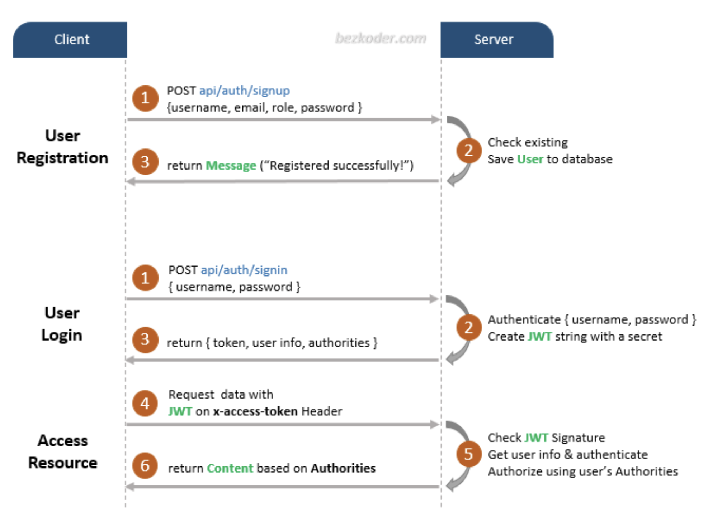
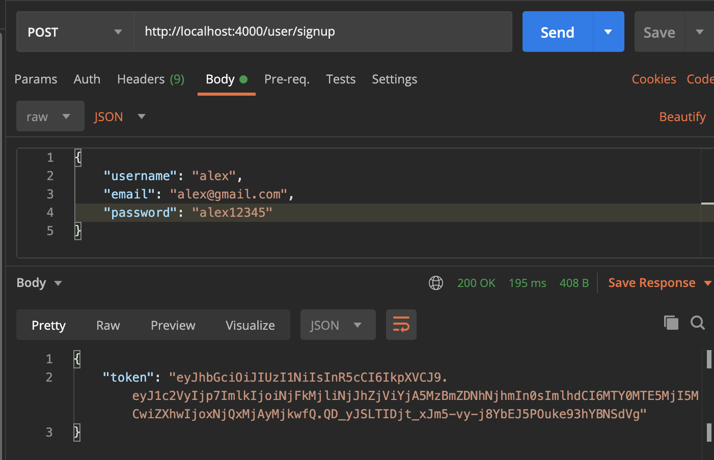
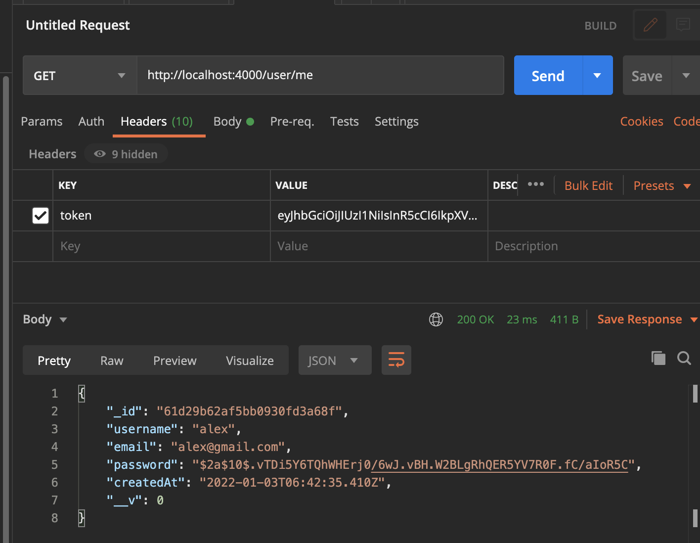

# Lecture 16 - User Authentication with MongoDB

## Authentication

Many of our modern webservers use authentication to control access to
information. Think about any account you might have on social media. Think about
your bank account. These are all mediums which hold your private information
tied to your account, and it is therefore necessary to control access to this
information. So how do we use a database to implement controlled access? This is
called authentication. We must authenticate a user when they wish to use a
particular endpoint in our API. Our API cannot simply give information to anyone
without compromising privacy and security.

## Token-based Authentication Explained



- We use JSON Web Token (JWT) to help with authentication!
- The users, instead of keeping sending their login data, will be sent a JWT
  token once they successfully logged in.
- Then, in the future login attempts and until the JWT expires, the users can
  simply send the server the JWT token, and the server will verify the user’s
  identity based on that JWT token.

### Accessing Resources using JWT


## Prerequisites

Create a new folder

```bash
mkdir auth_example
```

and initialize npm in that folder.

```bash
cd auth_example
npm init
```

Now, we must install the requisite packages. This example will begin without
validating the sent data, and then we will add that into the end.

```bash
npm install --save express cors mongoose express bcryptjs jsonwebtoken
```

## Setting up the web server

First, let’s create a `index.js` file:

```jsx
const express = require('express');
const bodyParser = require('body-parser');
// const InitiateMongoServer = require("./config/db");

// Initiate Mongo Server
// InitiateMongoServer();

const app = express();

// PORT
const PORT = process.env.PORT || 4000;

// Middleware
app.use(bodyParser.json());

app.get('/', (req, res) => {
  res.json({ message: 'API Working' });
});

app.listen(PORT, (req, res) => {
  console.log(`Server Started at PORT ${PORT}`);
});
```

The above code should already be pretty familiar to you, and now let’s run the
app with command:

```
node index.js
```

You should see a success message.

- Notice here there are two lines that we have commented out, namely
  `const InitiateMongoServer = require("./config/db");` and
  `InitiateMongoServer();`
  - We will uncomment these two lines after we setup our database!

## Setting up the database

Create a mongodb database by first, opening up the mongo shell by `mongo`
command. After you typed mongo, you should see the following in the terminal:

```jsx
MongoDB shell version v4.2.8
connecting to: mongodb://127.0.0.1:27017/?compressors=disabled&gssapiServiceName=mongodb
...
```

- We will use the first half of the URI in after the “connecting to”, aka,
  `mongodb://127.0.0.1:27017/` as our URI to the database.
- Then, type `use example-auth-db` to create a database with name
  `example-auth-db`, and the database URI would be at:
  "mongodb://127.0.0.1:27017/example-auth-db”

Now, create a `config` folder and a `db.js` file there:

```jsx
const mongoose = require('mongoose');

// Replace this with your MONGOURI.
const MONGOURI = 'mongodb://127.0.0.1:27017/example-auth-db';
const InitiateMongoServer = async () => {
  try {
    await mongoose.connect(MONGOURI, {
      useNewUrlParser: true,
    });
    console.log('Connected to DB !!');
  } catch (e) {
    console.log(e);
    throw e;
  }
};

module.exports = InitiateMongoServer;
```

- this uses mongoose and will help keep the connection with our database.

### Configuring the User Model

Create a `models` folder and then create a `User.js` file, this file will define
our database schema.

```jsx
const mongoose = require('mongoose');

const UserSchema = mongoose.Schema({
  username: {
    type: String,
    required: true,
  },
  email: {
    type: String,
    required: true,
  },
  password: {
    type: String,
    required: true,
  },
  createdAt: {
    type: Date,
    default: Date.now(),
  },
});

// export model user with UserSchema
module.exports = mongoose.model('user', UserSchema);
```

Finally, uncomment the two lines inside `index.js`, and run `node index.js`
again, you should see this if you have successfully connected with the db:


## User Signup

Now, it's time to implement the Signup router which will be mounted on
`/user/signup`. Create a folder called `routes`, and inside, create a file
called `user.js`:

```jsx
const express = require('express');
const { check, validationResult } = require('express-validator');
const bcrypt = require('bcryptjs');
const jwt = require('jsonwebtoken');
const router = express.Router();

const User = require('../model/User');

/**
 * @method - POST
 * @param - /signup
 * @description - User SignUp
 */

router.post(
  '/signup',
  [
    check('username', 'Please Enter a Valid Username').not().isEmpty(),
    check('email', 'Please enter a valid email').isEmail(),
    check('password', 'Please enter a valid password').isLength({
      min: 6,
    }),
  ],
  async (req, res) => {
    const errors = validationResult(req);
    if (!errors.isEmpty()) {
      return res.status(400).json({
        errors: errors.array(),
      });
    }

    const { username, email, password } = req.body;
    try {
      let user = await User.findOne({
        email,
      });
      if (user) {
        return res.status(400).json({
          msg: 'User Already Exists',
        });
      }

      user = new User({
        username,
        email,
        password,
      });

      const salt = await bcrypt.genSalt(10);
      user.password = await bcrypt.hash(password, salt);

      await user.save();

      const payload = {
        user: {
          id: user.id,
        },
      };

      jwt.sign(
        payload,
        'randomString',
        {
          expiresIn: 10000,
        },
        (err, token) => {
          if (err) throw err;
          res.status(200).json({
            token,
          });
        }
      );
    } catch (err) {
      console.log(err.message);
      res.status(500).send('Error in Saving');
    }
  }
);

module.exports = router;
```

- We will go through the above code line by line during lectures, but here are a
  few interesting lines of code:
  - `const errors = validationResult(req);` is a function that the validator
    includes, it checks whether the JWT is a valid token.
  - `const salt = await bcrypt.genSalt(10); user.password = await bcrypt.hash(password, salt);`
    these two lines generate a “salt”, which is a random string of length 10,
    and use it to hash the password. This way, even if the database is breached,
    the hacker will not be able to see the actual password used by the users.

Also remember to import the user route and update it inside `index.js`:

```jsx
const express = require('express');
const bodyParser = require('body-parser');
const user = require('./routes/user'); //new addition
const InitiateMongoServer = require('./config/db');

// Initiate Mongo Server
InitiateMongoServer();

const app = express();

// PORT
const PORT = process.env.PORT || 4000;

// Middleware
app.use(bodyParser.json());

app.get('/', (req, res) => {
  res.json({ message: 'API Working' });
});

/**
 * Router Middleware
 * Router - /user/*
 * Method - *
 */
app.use('/user', user);

app.listen(PORT, (req, res) => {
  console.log(`Server Started at PORT ${PORT}`);
});
```

Now we are ready to go! Re-run the server, and using Postman, we can send a POST
request and test the route:



- as you can see, we’ve received a token back. This is our JWT token, where the
  browser is going to store it in local storage and reuse it for the next login.

## User Login

Add the following code to `user.js` to support login:

```jsx
router.post(
  '/login',
  [
    check('email', 'Please enter a valid email').isEmail(),
    check('password', 'Please enter a valid password').isLength({
      min: 6,
    }),
  ],
  async (req, res) => {
    const errors = validationResult(req);

    if (!errors.isEmpty()) {
      return res.status(400).json({
        errors: errors.array(),
      });
    }

    const { email, password } = req.body;
    try {
      let user = await User.findOne({
        email,
      });
      if (!user)
        return res.status(400).json({
          message: 'User Not Exist',
        });

      const isMatch = await bcrypt.compare(password, user.password);
      if (!isMatch)
        return res.status(400).json({
          message: 'Incorrect Password !',
        });

      const payload = {
        user: {
          id: user.id,
        },
      };

      jwt.sign(
        payload,
        'randomString',
        {
          expiresIn: 3600,
        },
        (err, token) => {
          if (err) throw err;
          res.status(200).json({
            token,
          });
        }
      );
    } catch (e) {
      console.error(e);
      res.status(500).json({
        message: 'Server Error',
      });
    }
  }
);
```

- note that
  `const isMatch = await [bcrypt.compare](http://bcrypt.compare)(password, user.password);`
  we use the `bcrypt.compare` method to compare the two passwords. Remember that
  all the password is hashed, and as a result, the usual == will not work!


## Get LoggedIn User

So, our next task will be to Retrieve the LoggedIn user using the **token**.
Let's go and add this functionality.

The `/user/me` route will return your user if you pass the token in the header.
In the file **route.js**, add the below code snippet.

```jsx
/**
 * @method - GET
 * @description - Get LoggedIn User
 * @param - /user/me
 */

router.get('/me', auth, async (req, res) => {
  try {
    // request.user is getting fetched from Middleware after token authentication
    const user = await User.findById(req.user.id);
    res.json(user);
  } catch (e) {
    res.send({ message: 'Error in Fetching user' });
  }
});
```

As you can see, we added the auth middleware as a parameter in the **/user/me**
GET route, so let's define **auth** function.

Go ahead and create a new folder named **middleware**. Inside this folder,
create a file named **auth.js**

> This auth middleware will be used to verify the token, retrieve user based on
> the token payload.

```jsx
const jwt = require('jsonwebtoken');

module.exports = function (req, res, next) {
  const token = req.header('token');
  if (!token) return res.status(401).json({ message: 'Auth Error' });

  try {
    const decoded = jwt.verify(token, 'randomString');
    req.user = decoded.user;
    next();
  } catch (e) {
    console.error(e);
    res.status(500).send({ message: 'Invalid Token' });
  }
};
```

- Remember to import the auth middleware inside user.js!
  - `const auth = require("./../middleware/auth");`

### How to Test the application?

PostMan is required for Testing the API. If you don't have PostMan installed
first, install it.

1. First, register the user or login if you are already registered.
2. From step 1, you will get a token. Copy that token and put in the **header**.
3. Hit Submit



---

**Contributors**

- Alex Wu

**Resources:**

[Authentication in NodeJS With Express and Mongo - CodeLab #1](https://dev.to/dipakkr/implementing-authentication-in-nodejs-with-express-and-jwt-codelab-1-j5i)
