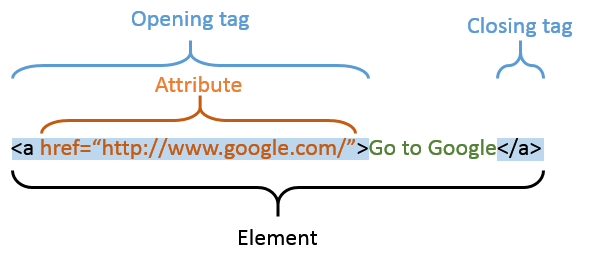

# Lesson 1 - HTML

## Introduction

A basic website is just a set of `.html`, `.css` and `.js` files stored somewhere. The `.html` file is the most important, laying the foundation of the website,
with `.css` and `.js` files adding extra visuals and functionality. In this lesson, you'll learn the HTML language, which is
what `.html` files are written with. Be prepared for your website to look like it's from the 90s!

HTML isn't actually a programming language since it's not composed of computer _instructions_ like "if" or "while". It's like how English isn't a
programming language either: you can't "run" English. Same idea with HTML: you
can't "run" HTML. Instead, you can "view" an HTML file, you like you "view" an essay. HTML is simply the language and pictures on the page. It's the
static (which is another word for unchanging) content.

### Learning Objectives

1. Understand what is HTML
2. What are tags and how to use different HTML tags
3. What is metadata
4. How to write comments

## Basics of HTML

### Elements and tags

Here's an example `.html` file:
```html
Welcome to my website!
```

That's right, plain text is valid HTML! But that's not very useful. If you viewed this file on a browser, you'd just see
the words "Welcome to my website!" in tiny font on the top left. HTML stands for **H**yper**t**ext **M**arkup **L**anguage. Essentially it lets you 
do cooler things than just plain text.

For example, you can make text **bold** or *italicized*.

```html
<b>This text is bold!</b>
<i>This text is italicized!</i>
```

HTML's base building block is the **element**. Above you can see the `<b>` and `<i>` elements. An element is a building block, acting
on what's inside it. Every element has an opening and a closing **tag**. For example, `<b>` is the opening tag for the bold element, and `</b>` is the closing tag.
Everything in between the opening and closing tag is affected by the element. In this case, the text is bolded.

If you opened this `.html` file, you would see this:
> **This text is bold!**
> *This text is italicized!*

### Self-closing tags

See how both the bold and italicized text are on the same line? If you want to put them on separate lines, you can use the `<br>` element, which stands for **b**reak **r**ule.

```html
<b>This text is bold!</b><br/>
<i>This text is italicized!</i>
```

Note that the choice to put multiple elements on the same line or to seperate them out is entirely irrelevant. You could write your HTML file all in one line if you wanted to.

Now, if you opened this `.html` file, you would see this:
> **This text is bold!**
>
> *This text is italicized!*

Note that the break rule element is a "self-closing tag" or "void
tag" that open and close themselves. This is because it doesn't have allow any content.

Since it's obvious all `<br>` tags are self-closing, you can omit the closing tag and just write `<br>` instead of `<br/>`. 
You don't need to close this tag with `</br>` since it's self-closing'.

### Attributes

Some elements have extra things you can configure about them. For example:
```html
<a href="https://webatberkeley.org">This is a link!</a>
```

The `<a>` makes whatever is inside of it into a link! But to where? It needs extra information!
Here, we give the `<a>` element the `href` attribute, and set the value of the attribute to the URL of the desired destination.

Now, if you opened this `.html` file, you would see this:
> [This is a link!](https://webatberkeley.org)

So, putting it all together, HTML is composed of elements, which have opening and closing tags (or self-closing tags), and optionally can take attributes:



### Nesting

You can also put elements inside of other elements. For example:
```html
<b>This text is bold and <i>italicized!</i></b>
```

Now, if you opened this `.html` file, you would see this:
> **This text is bold and *italicized*!**

### File Layout

All HTML files must have the following elements:

1. `<!DOCTYPE html>` ⇒ Declares the document as being of type html
2. `<html>` ⇒ anything within this tag is to be interpreted as html
3. `<head>` ⇒ holds the metadata for the document
4. `<body>` ⇒ contains all the actual html that will be displayed on the site

For example:

```html
<!DOCTYPE html>
<html>
  <head>
    <!-- *Metadata goes in here -->
  </head>

  <body>
    <!-- *Actual Content Goes in Here -->*
    <b>Hello World!</b>
  </body>
</html>
```

This will look exactly the same as just `<b>Hello World!<b>` when you open it because the browser realizes you forgot to add the four required elements and adds them for you.
However, it is good practice to add them yourself.

The green text are comments. They start with `<!--` and end with `-->`. Comments are ignored by the browser, so you can write whatever you want in them.

### Metadata

Everything we've learned so far would go in the `<body>` element. However, there's some data that you may want to specify about the website that isn't necessarily
visible in the page. These options go in the `<head>`. For example, you can specify the title of the page:

```html
<!DOCTYPE html>
<html>
  <head>
    <title>My Website</title>
  </head>

  <body>
    <b>Hello World!</b>
  </body>
</html>
```

Now, if you opened this `.html` file, the **tab** that the page is on would say `My Website`.

### What does Google.com look like?

You can **Inspect Element** on any webpage to see the HTML code that is actually being run.

Right click anywhere (even right here!), and choose **Inspect Element**. You can even edit it!

This is super useful for understanding why a website you may be making looks the way it does.

## Common HTML Tags

Alright, so let's learn all the tags, right? No. Depending on who you ask, there's up to 142 tags,
some of which have been deprecated (phased out) since before the turn of the century.

Not even the most experienced web developers know all the tags. Instead, whenever you need to do something, you can just google it.

To get some familiarity for what's out there, we'll cover the most common tags.

### `<p>` tag → **Just regular text**

```html live
<p>Text!</p>
```

Sounds useless? It's not! It adds a line-break (equivalent to `<br>`) before and after the text.
So why not just use `<br>`? Because it's bad practice to use `<br>` to separate paragraphs. `<p>` is the correct way to do it.
A lot of HTML comes down to good and bad practice. You can do a lot of things in a lot of ways, but some ways are better than others.

### `<h1>` - `<h6>` tags → **Headers**

```html live
<div>
  <h1>I'm a big header!</h1>
  <h3>I'm a slightly smaller header.</h3>
  <h5>I'm a small header.</h5>
</div>
```

`<h1>` makes the text super big. `<h2>` makes it a little smaller. `<h3>` makes it a little smaller than that. `<h4>` makes it a little smaller than that. `<h5>` makes it a little smaller than that. `<h6>` makes it a little smaller than that.

Furthermore, header types are used for SEO (Search Engine Optimization). Google uses header tags to divide up a website. 
`<h1>` tags are seen as main subjects for a website, while `<h3>` tags are seen as subsections.

`<h1>`-`<h6>` tags also add a line-break before and after the text. How do you know which elements add a line break (e.g. `<p>`) and which don't (e.g. `<i>`)?
You don't! You either know or you don't. Because of this and so many more reasons, you'll be googling (or binging) a lot.

### `<a>` tag → **Link**

```html live
<a href="https://webatberkeley.org">This is a link!</a>
```

We covered these above, but basically they are just links. They've got a couple more attributes you can configure, you should google them!

### `<button>` tag → **Buttons**

  - Creates a clickable button
  - Put elements inside and around the button to make it functional and pretty

```html live
<a href="https://webatberkeley.org/">
  <button>
    <p>Go to Web Dev at Berkeley's site</p>
  </button>
</a>
```

This would look like
<a href="https://webatberkeley.org/" style={{all: "revert"}}>
  <button style={{all: "revert"}}>
    <p style={{all: "revert"}}>Go to Web Dev at Berkeley's site</p>
  </button>
</a>

Awesome? Yes.

### `<span>` tag (optional) → **Spans**
  - A container for small pieces of text
  - Will be more useful when we learn about CSS

### `` tag → **Image**
 Displays images
  - `src` attribute points to the image
  - `alt` attribute is displayed as text if the photo is unavailable or cannot
    be used
  - `` is a **self closing tag**
    - This makes sense because an image tag doesn't contain anything - it simply
      displays an image
  - `width` and `height` set the dimensions of the image

```html

```

### Inputs → `<input>` tag
  - Inputs can have different types, such as text (default), password, email, file, and
    many more that all come with their own unique validation and behavior

```html live
<div>
  <input />
  <input type="color" />
  <input type="file" />
  <input type="number" />
  <input type="datetime-local" />
  <input type="radio" />
  <input type="checkbox" />
</div>
```

:::info

[Here's a short Article on the difference between radio buttons and checkbox buttons.](https://www.geeksforgeeks.org/radio-button-vs-checkbox-in-html/)

:::

### `<select>`, `<option>` tags → **Selects and Option**

```html live
<div>
  <select id="farm-animals">
    <option class="animal" value="pig">Pig</option>
    <option class="animal" value="cow">Cow</option>
    <option class="animal" value="rooster">Rooster</option>
  </select>
</div>
```

Allows the user to pick one of the options.

### `<div>` tag → **Divs** 
  - Short for division
  - Generic container tag
  - They don't do anything on their own, but they are used to group elements
    together

For example, somewhere on your page you may have some sign-up page:
```html live
<div id="signupPage">
  <h1>Sign up for our newsletter!</h1>
  <p>Enter your email below to receive updates on our latest products.</p>
  <input type="email" placeholder="Email" />
  <button>Sign up</button>
</div>
```

Notice we gave the `<div>` an `id` attribute. This is so we can reference it later. In this case, we set it to `signupPage`.

Now imagine the sign-up page is very far down, and you'd like to make a button to take the user down to it. Easy!
Since we wrapped the sign-up page in a `<div id="signupPage">`, we can just do this:

```html live
<a href="#signupPage">
  <button>Sign up for our newsletter!</button>
</a>
```

Here, the `href` attribute of the `<a>` tag is set to `#signupPage`. This is called a **hash**. It's a special type of link that takes you to a specific part of the page.

Note that you can give **any** element an `id` attribute, not just `<div>`s. You shouldn't give more than one element the same `id` though. For example, we could
have achieved the same effect by ommiting the div entirely:

```html live
<h1 id="signupPage">Sign up for our newsletter!</h1>
<p>Enter your email below to receive updates on our latest products.</p>
<input type="email" placeholder="Email" />
<button>Sign up</button>
```

But this is formatted worse, because the `<h1>` tag is just the beginning of the sign-up page. If you ever remove it or change it for something else, you could
accidentally break the link. You can think of `<div>`s as a way to organize your website.

### `<form>` tag → **Form** 
  - A group of html tags related to gathering data from a user
  - This will be some combination of `input`, `textarea`, and `select` tags
  - A form is just a container for the other tags

```html live
<form>
  <input type="text" />
  <textarea></textarea>
</form>
```

Sounds like just another `<div>` tag, right? Well, there's a key difference. Forms can contain information about _where the data should go_ once the user submits.
We'll learn this later in the course.

## More tags
These are tags you can just search up if you need them. They aren't required to build your intuition.

### `<ul>`, `<ol>`, `<li>` tags → **Lists**
  - `<ul>` stands for _unordered list_ (bullet points ⇒ Where order doesn't
    matter)
  - `<ol>` stands for _ordered list_ (1. 2. 3. ⇒ Where order matters)
  - `<li>` stands for _list item_

```html live
<ul>
  <li>This is an</li>
  <li>unordered list</li>
  <li>with 3 items</li>
</ul>
```

This would look like
> - This is an
> - unordered list
> - with 3 items

### `<textarea>` tag → **Textarea**
  - A larger input for text
  - The `placeholder` attribute specifies what shows up in the textarea when the
    user hasn't entered any input (Optional)
  - The `rows` attribute specifies how many rows of text the textarea offers
    initially - this can be increased if the user inputs more text than the
    number of rows given to the textarea (Optional)
  - Despite nothing going inside the textarea tags, it is not a self-closing tag
    (HTML is a really old language and so we have to live with some old quirks)

```html live
<textarea
  id="textarea-id"
  placeholder="this is temporary text"
  rows="4"
></textarea>
```

You can think of this as a very large `<input/>` tag (with no type attribute set).

### `<table>`,`<tr>`, `<td>` tags → **Table** 
  - `table` creates a table
  - `tr` stands for table row
  - `td` stands for table data, basically represents a cell in
    your table

```html live
<table id="coordinates">
  <tr class="top-row">
    <td>(0,0)</td>
    <td>(1,0)</td>
  </tr>
  <tr class="bottom-row">
    <td>(0,1)</td>
    <td>(1,1)</td>
  </tr>
</table>
```

There are many, many, many more tags. This is just a highlight of some of the
more useful, common ones.

## Comments, Naming, and Tags to Use

### Comments

We, as coders, forget what things do. We write things that are really
complicated or we know will be difficult to figure out later. Something to keep
in mind is that you are mostly writing code for yourself to read later, not for
the computer. The hardest part of writing code is having to maintain it later,
not writing it the first time. Writing code the first time is the easier part.
Going back and trying to remember what the hell you were thinking is the hard
part.

This is where comments can be useful. You can leave little notes in your code
that the computer won't read, it'll just ignore them. In HTML, the way you write
a comment is `<!-- your comments go here -->`. Leave whatever notes you need in
between the `<!--` and the `-->` so that later you can come back to your code
and remember what you were doing. Be careful of going overboard because comments
like `<h1>Title of the Article</h1><!-- the title -->` aren't useful because
it's pretty obvious that's the title. It's best to have code that describes
itself and doesn't need comments; however, when that falls apart comments can
help.

:::tip

In most IDEs, a comment can be made with `ctrl + /`

:::

## Meta HTML

Let's go back to our `Hello World` example and dissect the anatomy of an HTML
file, or document, more closely.

```html
<html>
  <head>
    <!-- *Metadata goes in here -->
    *
    <title>Page Title</title>
  </head>

  <body>
    <!-- *Actual Content Goes in Here -->*
    <p>Hello World!</p>
  </body>
</html>
```

### `<!DOCTYPE html>`

HTML is an old language. It was invented in 1993! While I'm sure the originators
and the early adopters of HTML did their best to make they could, there's no way
they could have anticipated that we'd still be using it 25 years and they needs
we'd have. As such, HTML has had to evolve in many unexpected ways and part of
that is removing bad parts and mistakes that used to HTML as we go along. When
they remove bad stuff and add good stuff, they make a new version of HTML. The
way we tell the browser that's reading the HTML what version of HTML we're using
is this first tag. This particular one is for HTML5, the latest (as of writing)
revision of HTML. HTML doesn't get revised very often so this will be the header
you'll use for a long time to come.

### `<html lang="en"></html>`

Everything (besides the doctype) goes into your `html` tag. You'll wrap
everything in here. You also should give it a language attribute to let the
browser know what language your document is in which is what the `lang="en"` is
communicating. This is useful to the browser to know for a number of reasons.

### **`<head></head>`**

First, there's `<head></head>` and also `<header></header>` and they are
different. Be careful about that. We're talking about `<head></head>`.

We'll first talk about `head`. Inside of `head` goes all of the meta-data to
help the browser understand how to read your document. In our case, the only
thing we're putting in `head` is the title of the document. What goes inside of
`title` is what will the name of the tab of the browser. It's also the name of
the Google or Bing search result. Basically, anywhere that's going to display
the title of the web page will use what's inside of here. This is the theme of
what goes in `head`: data that's useful for reasons other than displaying it. We
can put a tag in here that prevents pinch-to-zoom on mobile if we needed that
(don't do that!) We can put a tag that identifies the description and image that
Google would use for search results. We'll see some more later but for now we'll
stick with just a title.

### **`<body></body>`**

All of our "visual" HTML will go in here. All your `div`s, `span`s, `img`s, etc.

### Meta tags

Tags like `title` and `meta` go into the `<head></head>` of your HTML document.
These tags are responsible for telling search engines and the browser top-level
information about your site.

- `<title>` ⇒ Sets the title of the website
  - Is what shows up at the top of the tab
- `<meta>` ⇒ Sets the metadata of the site

  - **ex**. description, image preview, social media display, etc
  - Is used for SEO (Search Engine Optimization)
    - **i.e.** getting your site to show up at the top of Google
  - A common structure is `<meta name="____", description="____"/>`

    ```html
    <head>
      <meta
        name="description"
        content="Web Development at Berkeley aims to bring web 
        development education and technologies to the Berkeley 
        community, centralizing the scattered web education 
        opportunities and resources offered by current 
        campus organizations."
      />
    </head>
    ```

  - Common metadata involves the **page title**, **description**, **URL**, and
    **image preview.**
    [The Essential Meta Tags for Social Media | CSS-Tricks](https://css-tricks.com/essential-meta-tags-social-media/)

## Code Demo

```html live
<html>
  <head>
    <title>HTML Reddit</title>
  </head>
  <body>
    <h1>Reddit</h1>
    <div>
      <h2>Post Title</h2>
      <p>Post description</p>
    </div>
    <div>
      <h2>Create a new post</h2>
      <form>
        <p>Enter your post title:</p>
        <input />
        <p>Enter your post:</p>
        <input />
        <input type="submit" />
      </form>
    </div>
  </body>
</html>
```

---

**Contributors**

- [Samarth Goel](https://www.linkedin.com/in/samarth-goel-1047b8187/)
- [Sebastiaan Szafir](https://sebiszafir.com/)
- [Brian Holt](https://www.linkedin.com/in/btholt/)
- [Nitya Krishnakumar](https://www.linkedin.com/in/nitya-krish/)
