# Lesson 3 - Introduction to CSS

Okay, now we've begun putting HTML elements on a page. Using our house-building analogy, this is like we have all the materials now in a pile in front of our house. 

However, a pile of lumber ≠ a house. 

We're going to start reasoning about how to put together these things, how to create our blueprints, our plans and more with **Cascading Style Sheets (CSS)**

CSS is a **list of rules** that you give the browser: "all `h1`s will be colored red" or "all images will be 100 pixels wide". 

:::tip 

Like HTML, CSS is not a programming language!

:::

CSS is a way to take the HTML elements that you have on the page and style them to look nice.

Take for example, a site with no CSS styling. Doesn’t look great!

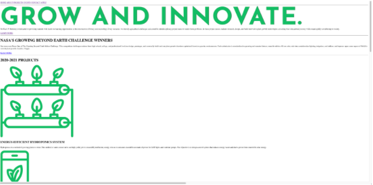

A site with no CSS styling.


A site with CSS styling.

---

## Implementing CSS

CSS searches for elements in your HTML to style. So we need a way to **tag/identify** certain elements so your CSS knows where to look and what to style.

**Here are the two ways to do this:**

### **Classes**

- `Classes` are used to distinguish specific tags and are used with CSS.
- Can be applied to **multiple elements** in an HTML Document

```html
<div class="container-yay">
  <p class="text">This paragraph tag is inside a div</p>
  <p class="text">This paragraph tag is also inside a div</p>
</div>
```

### **IDs**

- The `id` attribute is similar to the `class` attribute, but is more specific
- The `class` attribute can be used for multiple tags **VS** the `id` attribute should only be used  once in an HTML document

```html
<div id="container">
  <p id="top-text">This paragraph tag is inside a div</p>
  <p id="bottom-text">This paragraph tag is also inside a div</p>
</div>
```

:::tip 

Notice above that the id's must have different values!

:::

---

## Naming and Tags to Use

You generally want to give things useful names. 

There's a saying in computer science that there are two hard things in computer science: cache invalidation, naming things, and off-by-one errors. (Cache invalidation is another topic for another day.) 

So if you struggle to come up with names for things like classes and IDs, you're not alone. As a programmer you get to name *a lot* of things.

With classes, you want to name things ***semantically***. This is a fancy word that you want to name things as close to what thing **is** and **not** **what it looks like**.

**Example**: Imagine this is a blog post on my website.

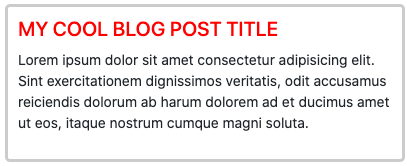

***For the blog post title, what should I call the class? What tag should I use?*** 

I really can use any tag and it'll mechanically work. Using CSS, you can make pretty much any tag look and act like any other. So if it doesn't matter mechanically, why should it matter to me? 

**For the reasons we layed out earlier:**

1. It makes the site accessible to everyone if you choose good tags. It's your responsibility to make sure the web remains accessible to everyone, including but not limited to: people with limited sight, limited motion of hands, arms or other limbs, limited hearing, and other permanent or temporary disabilities.
2. It'll make it easier for you to come back later and maintain your code or for someone else to understand what you did. Code is communication between you and future readers.
3. It makes it easier for Google, Bing, DuckDuckGo, etc. to crawl your website which means your site will rank higher in search results.

:::tip 

Screen readers and other accessibility tools *do not* read your class names or IDs; choosing good names here purely affects you and others working on this code

:::

Given that, it means we need to choose a tag that means that's a title. In this case, we can use an `h1` because that is the main header of that subsection. 

For the name of the class, how about `red-title`? It's a title and it's red; fits, right? 

While that may seem appropriate and fitting now, what if you need to change your blog's styling the following week and now that blog post looks like this:

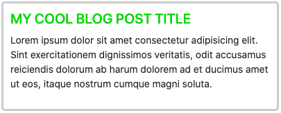

If your title is still called `red-title`, you have a bit of a problem! Now your class name is not only not descriptive of what the item is, it's actually wrong which will make it way more confusing to you and other laters. 

Now, you may say that you can just change the class name when you go to update but believe me that's not a good option either. If you've used that class 1,000 times throughout your website (not that farfetched) you'd have to update 1,000 different things. 

It's better if we give it a good name the first time, descriptive of not what it looks like but descriptive of what role it serves. 

In this case, we could call it something like `blog-post-title` or `post-head` or something of that nature. That class then always be descriptive of what the thing is and not what it looks like.

---

# Ways to Implement CSS

## style attribute

A way to write style directly into your HTML document is by using the `style` attribute.

```html
<h1 style="color: blue; text-align: center;">
  Header
</h1>

<!-- In this example, the h1 has color blue and center aligns itself -->
```

- The `style` attribute will **override** any style set globally, like styles specified in the style tag or in an external stylesheet.
- This will only style the element that it’s applied to.
- This is good for elements that do not follow a specific pattern

## style tag

Another way to use CSS is by inserting CSS classes directly into the HTML document at the very top.

```html
<html lang="en">
  <head>
   
	  <style>
		  h1 {
			  color:red;
		  }
		  p {
			  color:blue;
		  }
	  </style>
  </head>
</html>

<!-- This stylesheet lies within the HTML document and will affect the entire HTMl page -->
```

- This is usually not preferable for long CSS documents.
- Overrides external stylesheets

## link tag (external stylesheet)

The most common way to implement CSS is by using the `<link>` tag to link an external stylesheet. 

```html
<html lang="en">
  <head>
	  <link rel="stylesheet" href="../style/about.css"/>
  </head>
</html>

<!-- This tag usually goes in the head of the HTML document -->
```

- This is an organized way to keep track of code.
- Typically you will put these CSS files into a directory called "style"

---

## How to Style Specific Elements

There are different methods to select an HTML element. Here they are listed in order from least to most **specific**.

We will discuss the concept of **specificity** of selected elements more in depth later, so here is a brief overview. 

- Since there are so many ways to potentially style an element? What if two ways clash with each other?
- There is a specific hierarchy in which styling overrides one another. We will go in depth into this order later with examples.

## Universal selectors

- The `*` (universal) selector affects ALL the CSS classes in your document.
- One class that you should include on top of every CSS document that uses the universal selector is this:

```css
* {
  box-sizing: border-box;
}

/* We will get into why this is later. For now, consider this to be the 
informal “boilerplate” of your CSS file. It will make your life a lot easier! */
```

## Tag selectors

- Tag selectors select elements by tags
- For example, you can select all elements with the `<h1>` tag, or `<p>`, `<a>`, ``, etc…

```css
h2 {
  color: red;
  width: 20px;
  height: 40px;
}

/* All elements of type h2 in your HTML will be affected. */
```

## Class selectors

- Class selectors select elements by classes
- Offers you the flexibility of giving as many classes as needed within your document, but also classes can be shared by many elements.
- In your CSS, begin the class name with a `.` (period)

```css
.team-photo {
  color: red;
  width: 20px;
  height: 40px;
}

/* All elements of class "team-photo" in your HTML will be affected. */
```

## ID selectors

- These selectors select by the specified ID of an element.
- Try to avoid these as much as possible, usually not needed
- Typically used for elements that only appear once on a page.
- In your CSS, begin the ID name with a `#` (hashtag)

```css
#header-block {
  color: red;
  width: 20px;
  height: 40px;
}

/* The element of ID "header-block" in your HTML will be affected. */
```

## Style tag

- As mentioned earlier, this is a way to style specific elements inside of your HTML document
- No need to link external stylesheets!

```html
<html lang="en">
  <head>
	  <style>
		  h1 {color:red;}
		  p {color:blue;}
	  </style>
  </head>
</html>

<!-- This stylesheet lies within the HTML document and will affect the entire HTMl page -->
```

## Grouping Selectors

- If you want to apply some styling onto a few classes, IDs, or tags at a time, you can do so!
- This reduces code clutter and makes it less repetitive.

```css
h1, h2, p {
  text-align: center;
  color: red;
}

/* All h1, h2, p elements will be affected. */

.text h1 {
  color: blue;
}

/* All h1s inside of .text classes will be affected */

.text {
  width: 2rem;
}

.text .pretty {
 color: green;	
}

.text .ugly {
  width: 4rem;
}

/* 
".text" classes as a default are of width 2rem and color black.
".text.pretty" classes have width 2rem and color green.
".text.ugly" has width 4rem and color black.
*/

```

# Common CSS Properties

## Text

- `color`: changes color of the text

```css
.heading {
  color: blue;
}
```

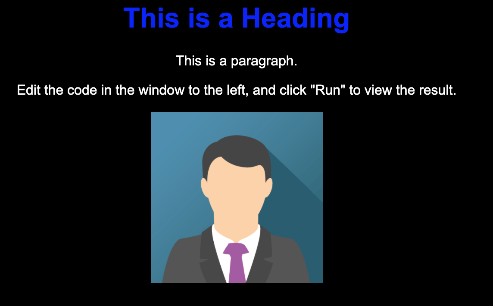

- `font-size`: changes size of the text

```css
.heading {
  font-size: 100px;
}
```
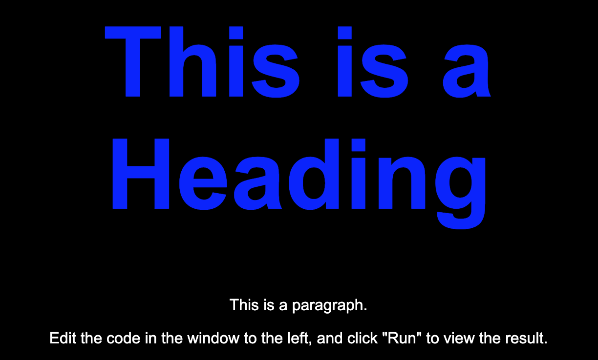

- `font-weight`: changes heaviness of font. **lower = lighter, higher = bolder**

```css
.heading {
  font-weight: 200;
}
```
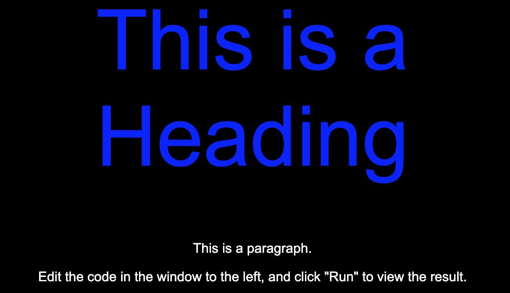

- `font-family`: type of font face being used

```css
.heading {
  font-family: monospace;
}
```

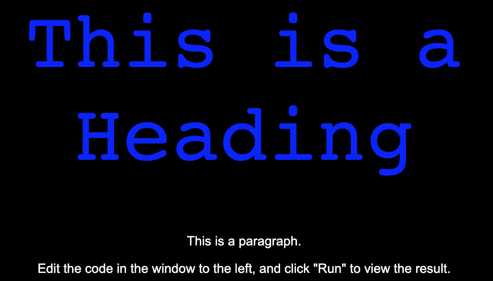

- `text-decoration`: allows you to modify lines on your text

```css
.heading {
  text-decoration: underline;
}
```

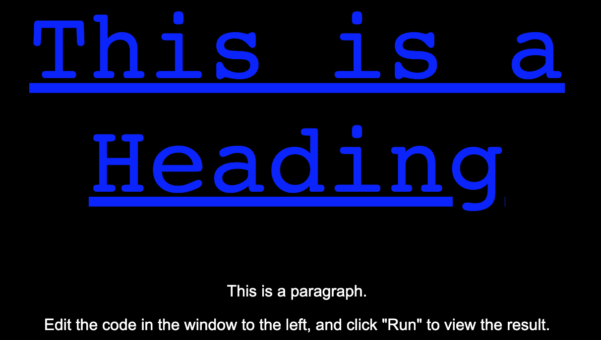

```css
.heading {
  text-decoration: overline underline green;
}
```

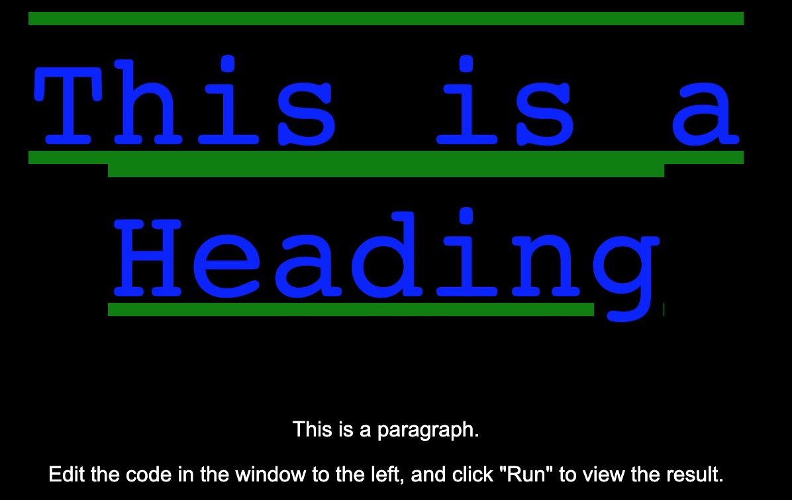

- `text-align`: change the alignment of your text

:::tip 

text-align defaults to center

:::

```css
.heading {
  text-align: right;
}
```

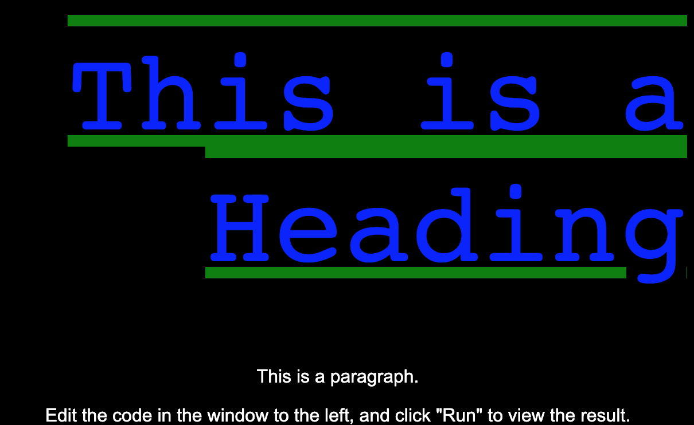

```css
.heading {
  text-align: left;
}
```

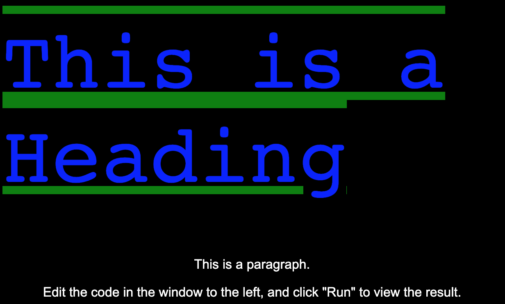

## Border

- `border-style` style of the border. there are many to explore!

```css
p {
  border-style: dotted;
}
```

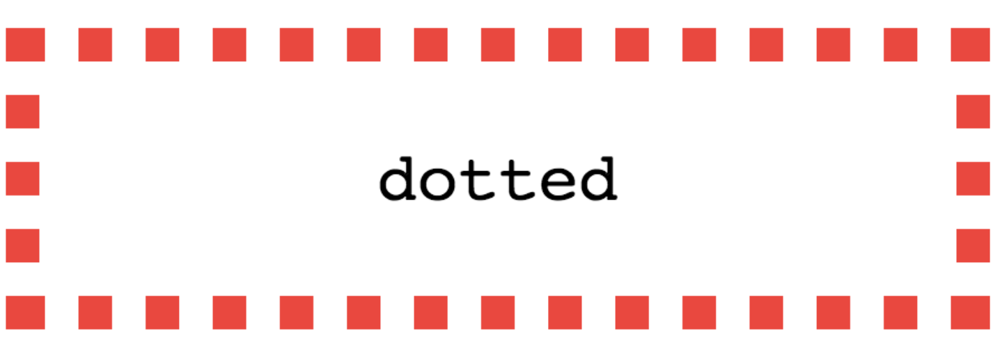

```css
p {
  border-style: solid;
}
```


- `border-weight` thickness of the border

```css
p {
  border-style: solid;
  border-weight: 20px;
}
```

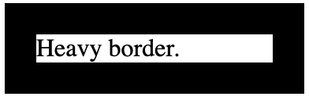

- `border-color` color of the border

```css
p {
  border-style: solid;
  border-weight: 20px;
  border-color: lavender;
}
```

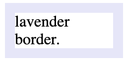

- `border-radius` roundedness of border corners

```css
p {
  border: 10px purple solid;
  border-radius: 10px
}
```


- `border-top-right-bottom-left`

```css
p {
  border-bottom-style: solid;
  border-bottom-weight: 6px;
  border-bottom-color: red;
}
```

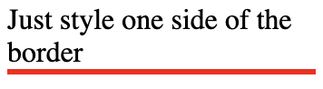

```css
p {
  border-bottom: 6px solid red;
}
```

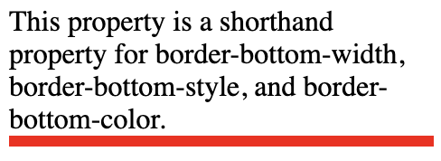

```css
p {
  border-bottom: 6px solid red;
  border-left: 2px dashed blue;
  border-top: 3px inset yellow;
}
```

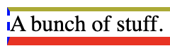

- `border` shorthand way to specify border width style, and color all at once.

```css
p {
  border: 5px dashed cyan;
}
```

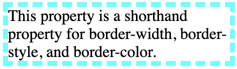

## Position and sizing

More in detail demos and descriptions in Lesson 4!

**Positions**:

- `static`
    - Static is the default positioning, where the elements will follow the normal flow of a web page.
- `fixed`
    - A fixed element is positioned relative to the **viewport**.
    - The element's position relative to the screen will **not** change even if the user scrolls.
- `relative`
    - An element with `position: relative;` is positioned relative to its default static position.
- `absolute`
    - An absolute element is positioned relative to the **nearest positioned ancestor** (instead of positioned relative to the viewport, like fixed).
    - Can use this to layer on top or under other elements
- `sticky`
    - Sticky is very similar to relative in terms of positioning.
    - However, when the user scroll to the element, the element will become `fixed` position and "stick" on the screen.

**Sizing**:

- `height/width`
    - size of the element itself.
- Units:
    - `px`
        - Standard pixel sizing
    - `%`
        - Percentage of the parent element
    - `rem/em`
        - rem: relative to the size of the root element's text
        - em: relative to the size of the element's text
    - `vh/vw`
        - Size relative to the viewport height (**vh**) or width (**vw**)
        - eg. 40vh = 40% of the height of the viewport

## Background

- `background-color` specifies color to use as the background
    
    ```css
    body {
      background-color: lightblue;
    }
    ```
    
    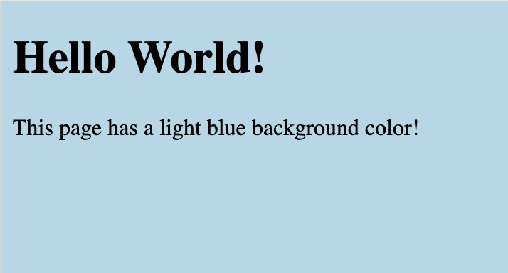
    
- `background-image` specify image url to use as background
    
    ```css
    body {
      background-image: url("paper.gif");
    }
    ```
    
    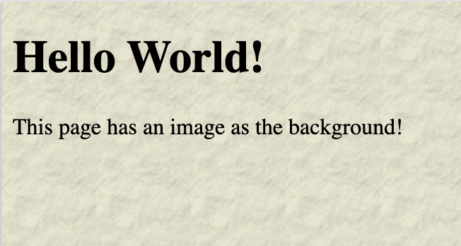
    
- `background-position` specify where the image goes relative to viewport
    
    ```css
    body {
      background-image: url("img_tree.png");
      background-position: left top;
    }
    ```
    
    
    
- `background-repeat` specifies if the background image repeats (defaults repeat)
    
    ```css
    body {
      background-image: url("img_tree.png");
      background-repeat: repeat;
      background-position: left top;
    }
    ```
    
    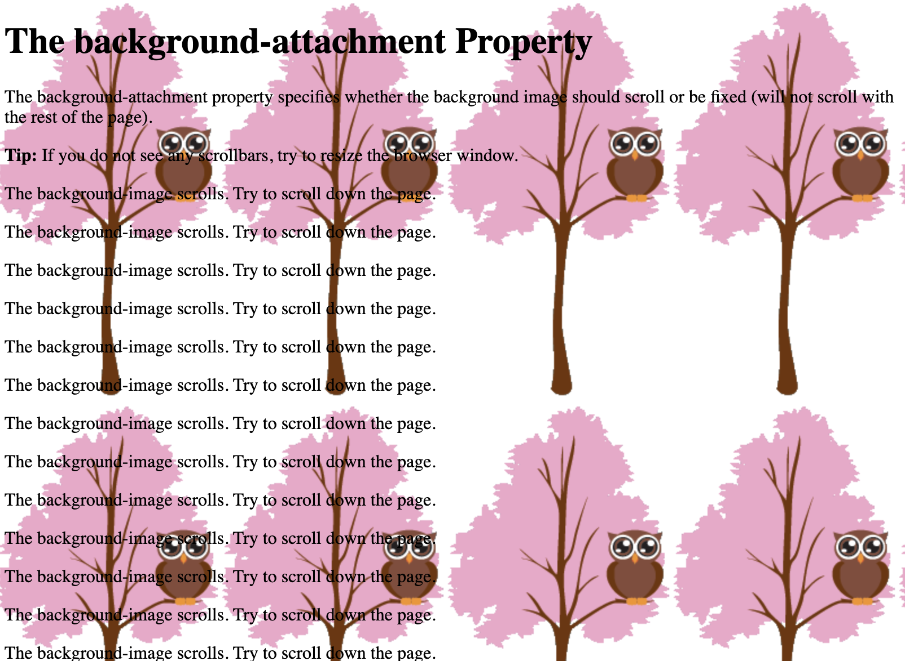
    
- `background-attachment` you can choose how the background image moves as the user scrolls (default scroll)
    
    ```css
    body {
      background-image: url("img_tree.png");
      background-attachment: fixed;
      background-position: right top;
    }
    ```
    
    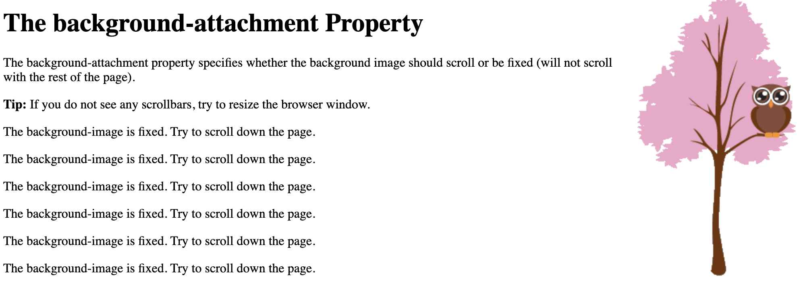
    
- `background` shorthand for all values in one line
    
    ```css
    body {
      background: #ffffff url("img_tree.png") no-repeat right top;
      margin-right: 200px;
    }
    
    Order of values
    background-color
    background-image
    background-repeat
    background-attachment
    background-position
    ```
    
    
    

## Colors

- `predefined colors` CSS comes with preset color values
    - eg. yellow, blue, pink, lavender, cyan, purple, etc...
- `rgba` Formatted as a list wrapped in parenthesis: (100, 200, 40, 50)
    - Max is 255 for the first three values
    - r: red value
    - g: green value
    - b: blue value
    - a: opacity
- `rgb` Formatted as a list wrapped in parenthesis: (100, 200, 40)
    - Max is 255 for all values
    - r: red value
    - g: green value
    - b: blue value
    - defaults to 100% opacity
- `hex` hexadecimal representation of color
    - starts with #
    - followed by a six digit string of numbers between **0-9** and letters between **a-f**
    - #000000 is black and #ffffff is white

## Box Model (Height, Width, Padding, Border, and Margin)

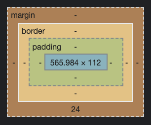

### Content

The width and height **directly affect** the size of the content in the box.

**Gift Box Analogy**: The size of the present inside of the box

### Padding

The padding affects how much space there is **between** the content and the container that holds it.

**Gift Box Analogy**: The packaging peanuts

### Border

The border **wraps** around the padding and the content.

**Gift Box Analogy**: Wrapping paper

### Margin

The margin is the amount of space **between** the container and elements around it.

**Gift Box Analogy**: Distance to another present

## Life Hack of the Century: Dev Tools!

**Developer tools** are the single most useful set of tools you will encounter in web development

They are built into your browser. To open, hit control/command + shift + c. Or right click and press **inspect**

These tools let you dig into your DOM and search through you code to see where things are and why things behave the way they do

From static sites to full-stack web applications, this will be your frontend best friend.

**What can you do with dev tools?**

- Click on divs and see their exact styling and where the styling is coming from.
- Run lighthouse testing to see how speedy and accessible your site is.
- Make updates to your code and see updates in real time before changing it in your real code.
- Check the network tab to see server responses and interactions.

**Enough talk, let's open up those dev tools!**

# Conclusion

- CSS is the furniture, the wallpaper, the vibes of the house.
- Without CSS, we would never want to visit the internet ever again.
- CSS can be finicky and annoying to grasp at first, but with dev tools, patience, and practice, you'll be able to handle any styling problem in an instant!

---

**Contributors**

- [Vicky Li](https://www.linkedin.com/in/victoriayli/)
