# Lesson 4 - Advanced CSS
# Positioning and Display

## Positioning

Positioning is how elements are placed on the screen relative to other elements around it

### Static

Static is the default positioning, where the elements will follow the normal flow of a web page.

**What's the normal flow?** There are two types of elements inside a webpage:

- **Block boxes** flow **vertically** **downward** starting at the top of their containing block and normally takes the full width of the containing “block level element” unless otherwise specified. One block element placed directly below the preceding block element. Block elements are DIV, P elements.
- **Inline elements** reside in a block level container or inside a block level element and they appear side by side in normal flow. If they reach the right most wall of container then the inline elements (i.e their box model) wraps to next line within the container and stays horizontally.

<aside>
💡 If an element is static, it's not affected by top, bottom, left, and right properties. It doesn't want to listen to you!

</aside>

### Relative

An element with `position: relative;` is positioned relative to its default static position.

By setting `top: 20px;`, the element will be adjusted away from its default static position and move upward for 20px.

### Fixed

A fixed element is positioned relative to the **viewport**. 

The element's position relative to the screen will **not** change even if the user scrolls.

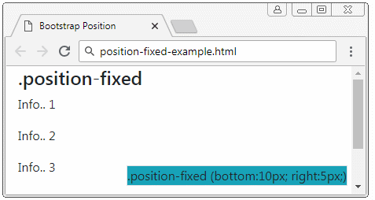

**Does not leave space** in the page where it would statically have been located.

Use **top**, **bottom**, **left**, and **right** to place.

### Absolute

An absolute element is positioned relative to the **nearest positioned ancestor** (instead of positioned relative to the viewport, like fixed).

Can use this to layer on top or under other elements

When there is no explicit positioned ancestor, it uses document body as the ancestor.

Use higher **z-index** to **layer on top of other elements**.

Use **top**, **bottom**, **left**, and **right** to place.

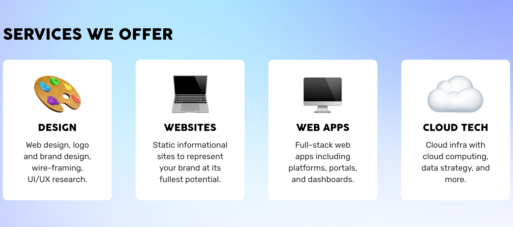

Gradient background is absolutely positioned.

### Sticky

Sticky is very similar to relative in terms of positioning. 

However, when the user scroll to the element, the element will become `fixed` position and "stick" on the screen.

Essentially toggles between relative and fixed.

Use **top**, **bottom**, **left**, and **right** to place.


Once it hits a position on scroll, it will stick to it.

### Diagram for Positioning
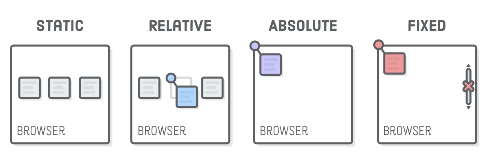

---

## Display properties

### Inline

Displays an element as an inline element (like span). Any height and width properties will have **no effect**.

```css
span {
  /* Span is default inline */
  color: blue;
  font-weight: 700;
  height: 40000px;
}
```

```html
<body>
  <h1>Hello World!</h1>
  <p>This next <span>word</span> here is going to be inline styled! Notice 
	how setting the height doesn't make it taller!
  </p>
</body>
```
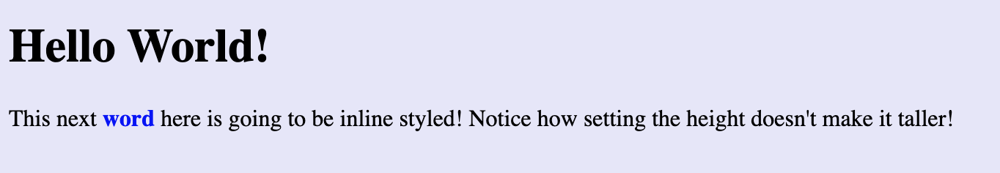

### Block

Displays an element as a block element (like p). It starts on a new line, and takes up the whole width. (**default**)

<aside>
💡 Notice how there is a gap under "word" due to the height property now being used! Compare to above example where height is ignored.

</aside>

```css
span {
  display: block;
  color: blue;
  font-weight: 700;
  height: 40px;
}
```

```html
<body>
  <h1>Hello World!</h1>
  <p>This next <span>word</span> here is going to be block styled!</p>
</body>
```

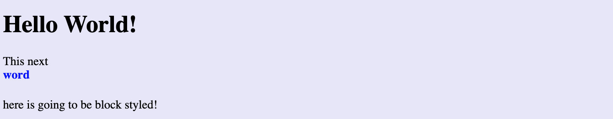

### Grid

This is an easy way to lay out your elements in a **grid**.

Not supported by all browsers yet so **not usable** in most production sites.

```css
.grid-container {
  display: grid;
  grid-template-columns: auto auto auto;
  background-color: #2196F3;
  padding: 10px;
}
.grid-item {
  background-color: rgba(255, 255, 255, 0.8);
  border: 1px solid rgba(0, 0, 0, 0.8);
  padding: 20px;
  font-size: 30px;
  text-align: center;
}
```

```html
<div class="grid-container">
  <div class="grid-item">1</div>
  <div class="grid-item">2</div>
  <div class="grid-item">3</div>  
  <div class="grid-item">4</div>
  <div class="grid-item">5</div>
  <div class="grid-item">6</div>  
</div>
```
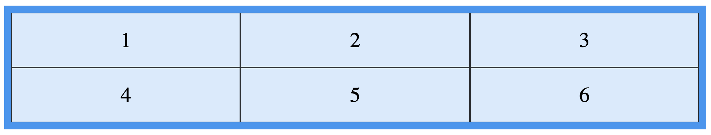

### Flex-box

This is our collective **favorite** display option.

Makes it easier to design **flexible responsive layout** structure without positioning

Can **specify** direction of flex, spacing, justifying, alignment, etc...

```css
.class {
  display: flex
  flex-direction: row | column | row-reverse | column-reverse
  align-items: flex-start | center | flex-end
  justify-content: flex-start | center | flex-end | space-between | space-around
}
```

[Flexbox Froggy](https://flexboxfroggy.com/)

# Cascade and Specificity

## Parents and the Cascade

- Classes inherit parent class properties!

```css
p {
  color: blue;
}

span {
  color: black;
}
```

```html
<p>As the body has been set to have a color of blue this 
is inherited through the descendants.</p>
<p>We can change the color by targeting the element with a selector, 
such as this <span>span</span>.</p>
```

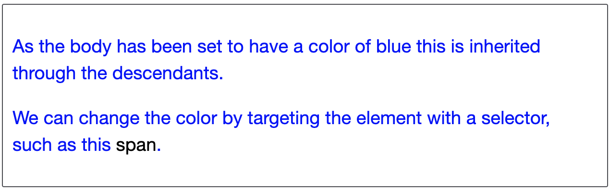

<aside>
💡 Order in CSS classes does matter! Whatever comes last in your CSS document is what stands. This is the concept of the cascade.

</aside>

## Specificity

We must be able to handle conflicts and troubleshoot our CSS in a logical way.

Specificity is how specific a certain CSS styling attribute is. To determine specificity, you can follow this system.

More selector specificity means that it will override the styling of an element also styled by a less specific CSS selector.

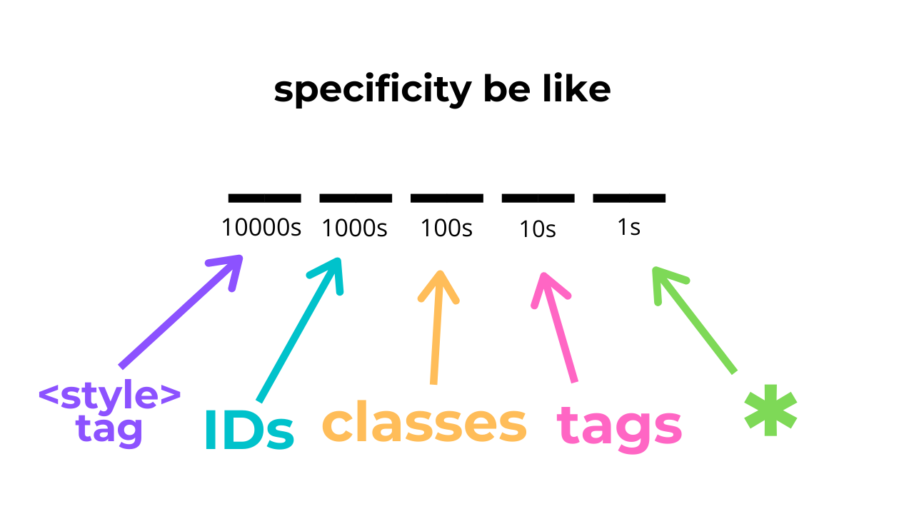

<aside>
💡 This convention is not a real CSS rule. It is just for the sake of remembering the hierarchy.

</aside>

Here are a few examples:

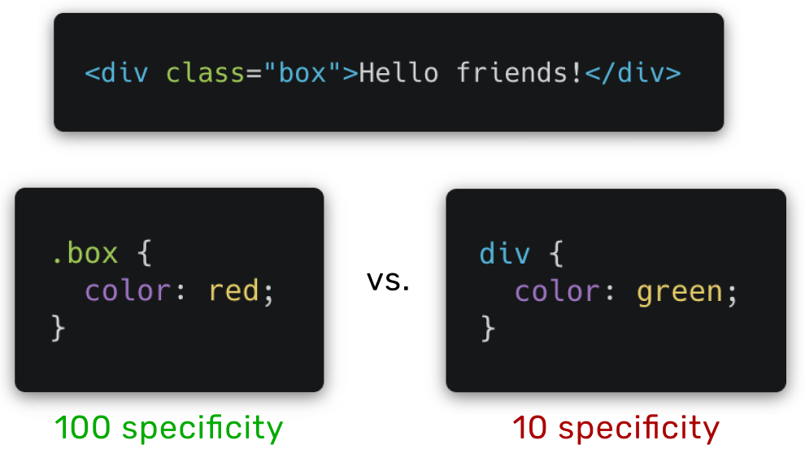

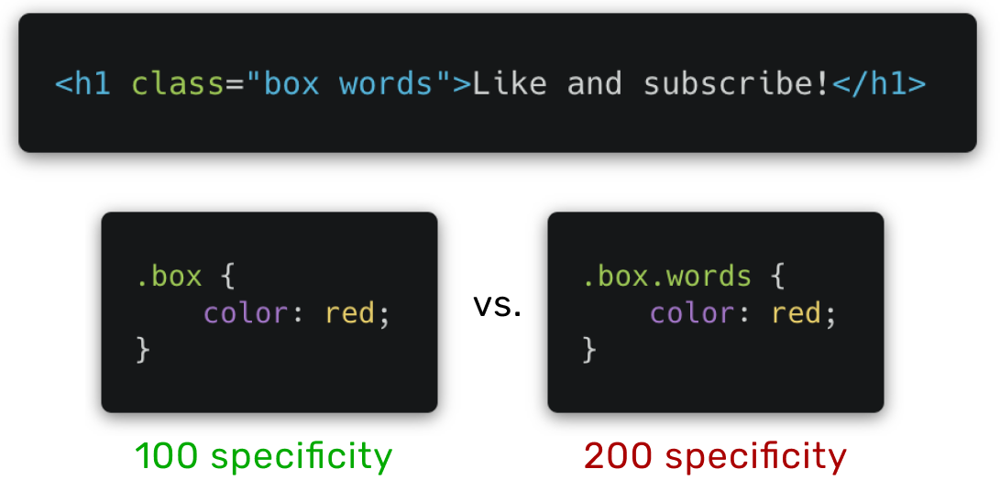

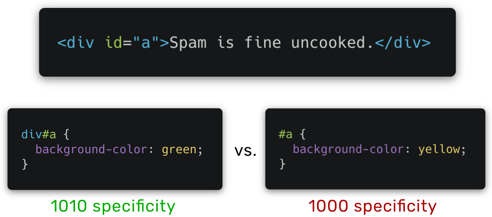

The **green specificity numbers indicate the styling selector that overrides the other**. 

Notice how the highest number ALWAYS overrides the lowest. 

<aside>
💡 Dev tools is great for when this gets confusing! Any overridden styling will appear with a ~~strikethrough~~.

</aside>

# Animation and Media Queries

## Pseudo-classes and Animations

A pseudo-class is used to define a **special state** of an element

- *Some examples*: :hover, :focus, :first-child
- *anchor specific tags*: :active, :link, :visited

### transform

One powerful use of pseudo-classes is its cooperation with the **transform** property

**Example**: size an element up when you hover over it

Other ways to animate are using JS. We will go over these later

### transform + transition

Here’s the syntax:

- In the original element, specify **transition**.
- In the pseudo-class, specify **transform**.

Can **specify** speed, delay, and style of transition.

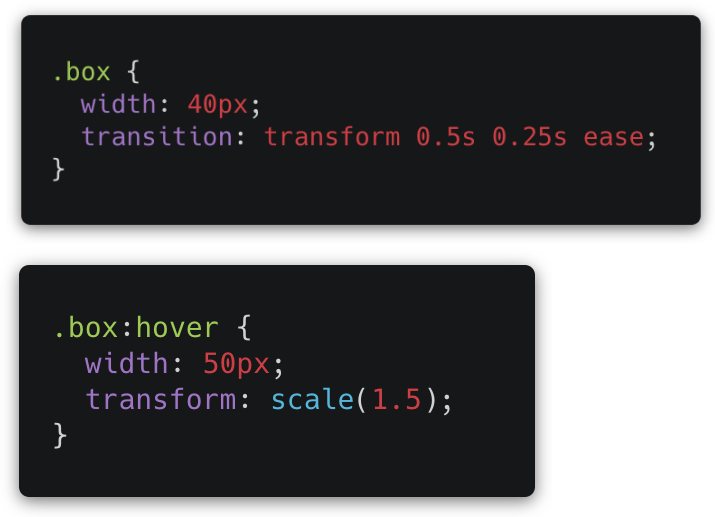

## Media Queries

Media queries allow you to change the CSS of the page based on **screen size**.

Change element sizes, change flex direction from row to column, etc...

Can add as many as needed at the **end** of your CSS file

Can check **width**, **height**, **resolution**, and **orientation** of device.


**Common breakpoints:**

- 320px — 480px: Mobile devices
- 481px — 768px: iPads, Tablets
- 769px — 1024px: Small screens, laptops
- 1025px — 1200px: Desktops, large screens
- 1201px and more — Extra large screens, TV

## Good Practice

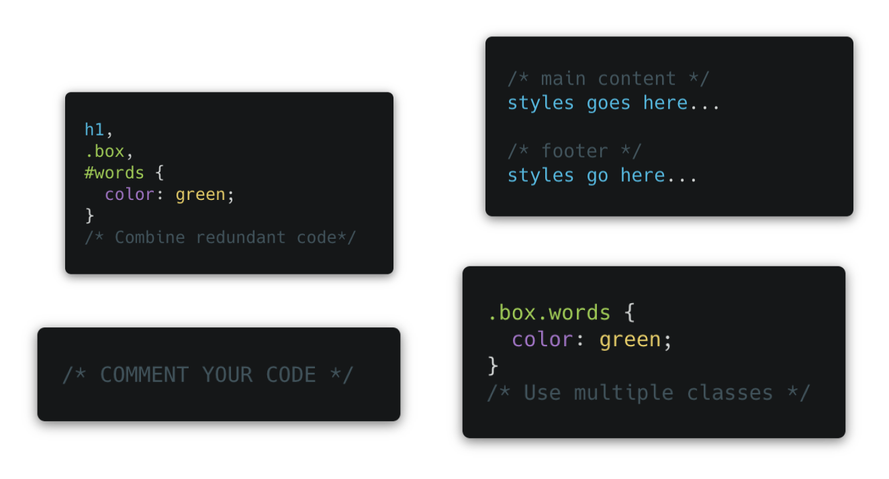

---

**Contributors**

- [Vicky Li](https://www.linkedin.com/in/victoriayli/)
