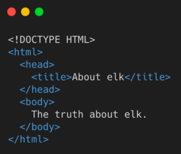
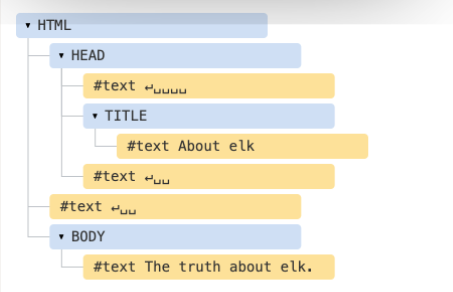
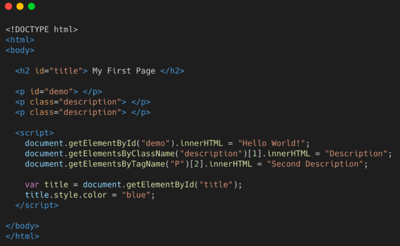
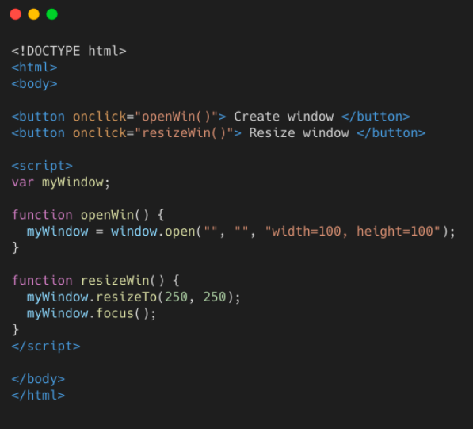
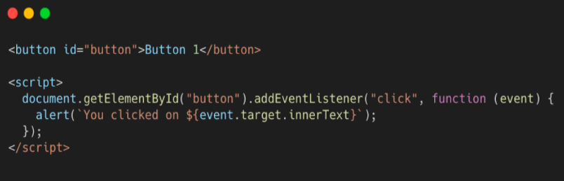
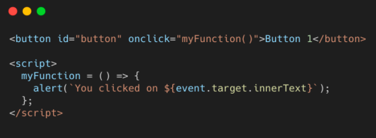
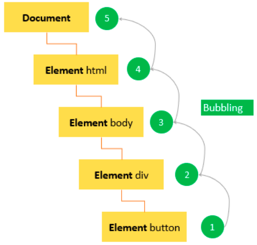

# Lesson 5 - JavaScript 2: DOM

## Introduction

So far we've been writing code pretty well in a vacuum. We've been
using `console.log` as the output mechanism. We haven't really done anything in
JavaScript that couldn't be done in any other language. Now we're going to start
using JavaScript to interact with your webpage.

Let's first chat about what a browser is and how your code gets from you writing
it to being on run in a browser.

In a typical circumstance.

1. You write code in your editor (like VSCode)
2. You put your code on a server so that other people can get it
3. Someone visits your website
   1. (Lots of stuff happens here. For now we're not going to talk about it)
   2. Their browser makes a request to your server for your index.html
   3. Your server sends them a copy of the html
   4. The browser reads the HTML, sees you have a `my-script.js` script tag on
      there
   5. Browsers makes another request for `my-script.js` from your server
   6. Your server sends them a copy of `my-script.js`
   7. The browser reads the JavaScript code and begins executing the code

Same process happens with CSS too.

Okay, so this is how it works if you have put your code on some server on the
cloud using something like [AWS (Amazon Web Services)](https://aws.amazon.com/)
or [GCP (Google Cloud Platform)](https://cloud.google.com/) or other places like
[GoDaddy](https://www.godaddy.com/) or [Vercel](https://vercel.com/). So how are
we doing it locally, without a server, just on our computers? Your computer is
basically faking this process. It's acting as both the server and the client so
that it's easier for you to write code. When you open a file in your browser
from your computer, your hard drive is the server. This was a point of confusion
for me when starting so I'm sharing it with you.

## The DOM

DOM or DOM Tree is the data structure that the browser will create when it is
loading up a page. It is based on all the html tags and contents and every tag
is a separate node.




## Use Javascript to update DOM

The way that JavaScript and HTML/CSS interact with each other is a thing called
the DOM, the document object model. The DOM is basically a bunch of objects and
methods that you can call from JavaScript to interact with the HTML/CSS of the
page.

## Document

`document` is a globally available variable in the browser that you use to
interact with the HTML and CSS (to access the DOM tree)**. It has a lot of
methods that you can use. **Visit
[https://developer.mozilla.org/en-US/docs/Web/API/Document](https://developer.mozilla.org/en-US/docs/Web/API/Document)
for a list of them**. In this case, we're using the `querySelector` in which you
pass in a CSS selector and it returns to you the **first\*\* one of that matches
selector that it finds (if you have many of them on the page, you get just the
first one.)

## querySelector()

Let's see an example that uses `querySelector` :

```html
<style>
  .red-square {
    width: 100px;
    height: 100px;
    background-color: crimson;
  }
</style>

<div class="red-square"></div>

<script>
  const redSquare = document.querySelector('.red-square');
  redSquare.style.backgroundColor = 'limegreen';
</script>
```

Notice that, despite the CSS class dicatating that the `div` should
be `crimson` colored, it's actually `limegreen`. This is because we used
JavaScript to change the color of it. So let's break it down.

- We called a method on `document`.
- From there, we have a JavaScript pointer to the `div.red-square` tag stored in
  the `redSquare` variable which means we can start manipulating it.
- We then use the `style` object which represents all the CSS styles that are
  being applied to that object at that time.
- We then set the `backgroundColor` of that element. Notice it
  is `backgroundColor` and not `background-color` (camelCasing vs kebab-casing).
  This is how you interact with CSS via JavaScript. Anything that's kebab-cased
  like `padding-right` becomes camelCased, like `paddingRight`. While annoying,
  it'd be even more annoying if they didn't switch it since everything in
  JavaScript is camelCased.
- We then just assign that to be whatever value we want. This works with any CSS
  property, eg: `tag.style.marginBottom = '50px'`.

There's a lot more you can do with an element than just modifying its style. You
can add more HTML into it, remove it, change the text, search for different
elements inside of it, get its position on the page, clone it, and a lot more.

## getElementByID()

Let's see another example that uses `getElementById()` :

Use the method `getElementById()` to reach specific tags within a DOM tree. It
will return the object containing that tag.

`.innerHTML` is the property of the `<p>` tag object.

Note: here we're going to use the `script` tag and put the JavaScript directly
inside of it so we can keep all the code together for these small examples. This
not something you'd typically do (just like you'd normally separate the CSS from
the HTML too.) It is possible but not recommended.

```html
<script>
  document.getElementById('demo').innerHTML = 'Hello World!';
</script>
```

**Result:** The HTML tag with the id “demo” now displays “Hello World”.

## Other Methods

We can’t go over all methods of document so be sure to be ready to search the
web for the documentation if you find yourself needing more than the ones we
teach!

Here are examples of other document methods being used:



## Modify Multiple Elements

Okay, so what if we had multiple elements we wanted to modify all at once. We
have the tools to do that too!

```html
<ul>
  <li class="js-target">Unchanged</li>
  <li class="js-target">Unchanged</li>
  <li>Won't Change</li>
  <li class="js-target">Unchanged</li>
  <li>Won't Change</li>
  <li class="js-target">Unchanged</li>
</ul>
<script>
  const elementsToChange = document.querySelectorAll('.js-target');
  for (let i = 0; i < elementsToChange.length; i++) {
    const currentElement = elementsToChange[i];
    currentElement.innerText = 'Modified by JavaScript!';
  }
</script>
```

## Window Object

- The “window” object represent the open window of a browser.
- It is the parent of the document object and the topmost object in the DOM!
- Can change the browser window using the window object.



## Events and Listeners

We've been able to modify HTML and CSS using JavaScript using `document`.
Awesome! We're going to go one step further and start involving the user. Web
sites are meant to be reactive to users. In order to be reactive to them, we
need to wait for them to do stuff, like click a button or type in an input. The
way we do that is we wait for **events** to happen. An event is created every
time certain events happens like when a user clicks something or when they type
something. We respond to these events by having what are called **event
listeners**. We give an event listener a function to run whenever an event
happens.

Let's try to create a popup alert when a user clicks on a button:



- **addEventListener:** attaches an event handler to the specified element
  without overriding existing event handlers. **T**his takes two parameters (no
  need to memorize this, you can always look it up): the name of the event you
  want respond to, which in this case is the `click` event, and a function that
  is called whenever that event happens. This function is often called
  a **callback** because it gets called back whenever the event happens.
- **event.target**: Target is the tag that the event originated from. Ie. a
  button

Let's take a look at responding to a click when a user clicks a button.

```html
<button class="event-button">Click me!</button>
<script>
  const button = document.querySelector('.event-button');
  button.addEventListener('click', function () {
    alert('Hey there!');
  });
</script>
```

Let's break it down.

- We grab the button via `querySelector` and store it in the JavaScript
  variable `button`.
- We then call the `addEventListener` method on the button.
- We then call a function called `alert`. `alert` is a super, super annoying
  function that pops up a dialog window with whatever you call it with.
- People often get confused seeing `});` on the last line. The first `}` is
  closing the function, the second `)` is closing the function call
  of `addEventListener`, and the `;` ends the statement.

Let's do another example with an `input` tag.

```html
<input placeholder="type into me!" class="input-to-copy" />
<p class="p-to-copy-to">Nothing has happened yet.</p>
<script>
  const input = document.querySelector('.input-to-copy');
  const paragraph = document.querySelector('.p-to-copy-to');

  input.addEventListener('keyup', function () {
    paragraph.innerText = input.value;
  });
</script>
```

Try typing into the input. You'll see whatever text you type into the input will
instantly be reflected in the `p` tag. Pretty cool, right?

- We're now using the `keyup` event. This event happens whenever you release a
  key after pressing it. As you may guess, there is a `keydown` event too that
  is fired whenever you press a key. We're
  using `keyup` because `keydown` happens *before* a key actually registers,
  which means we would always be one key behind.
- We reference `input.value`. The value property of an input reflects whatever
  the user has typed into the input.
- We're taking whatever is in `input.value` and passing that directly into
  the `paragraph.innerText`. Since that function is called every time a user
  types into the input, it keeps the two in sync!

One more example and then we'll move on.

```html
<style>
  .color-box {
    background-color: limegreen;
    width: 100px;
    height: 100px;
  }
</style>
<div class="color-box"></div>
<input class="color-input" placeholder="Type a color here!" />
<script>
  const input = document.querySelector('.color-input');
  const paragraph = document.querySelector('.color-box');

  input.addEventListener('change', function () {
    paragraph.style.backgroundColor = input.value;
  });
</script>
```

Similar to above. The key difference here is that we're listening for `change`
events. `change` events happen whenever a user types something in the input and
then unfocuses the input by clicking somewhere else or hitting tab to change the
focus. Try typing "red" and then clicking somewhere else. Also, try something
that isn't a color. Notice that if you give it an invalid color it just doesn't
change anything.

## Inline Event Handlers

- Inline Event Handlers
  - .onclick, .onchange, .onmouseover, etc.
  - Does same thing as addEventListener in this case
  - But with onclick you may only assign one event at a time. If you assign
    another event to onclick you will overwrite the first event.




Both do the same thing!

## Event Delegation

**Event Bubbling:** After firing click handler attached to a target, the browser
moves one level upward and executes any click handler attached if there is any.
Keeps moving one level upward until reaches root. You may have only clicked on
one element, but all the event handler with parent elements will be fired too.



If you have a bunch of elements that you need to listen for events on, you could
attach an event listener to each but that's a bit tedious to do. Instead what is
sometimes easier to do is event bubbling. When event fires on an element, after
that "bubbles" up to its parent, and then its parent, and its parent, etc. until
it's at the root element.

```html
<div class="button-container">
  <button>1</button>
  <button>2</button>
  <button>3</button>
  <button>4</button>
  <button>5</button>
</div>
<script>
  document
    .querySelector('.button-container')
    .addEventListener('click', function (event) {
      alert(`You clicked on button ${event.target.innerText}`);
    });
</script>
```

You can see that we only bound event listener, and that was the div above it.
Then, when we click the button, we're using the event parameter that is being
passed into the callback. You may be wondering where that came from. It was
always there, we were just ignoring it. An event listener's first parameter is
always an event object.

There's lots of information on the event object but we're most concerned
withevent.target . In this case it'll be the button that caused the event. And
we know that with tags you can use the innerText property to get the text inside
of them. That's how we able to alert the correct number. Cool, right?

## Cookies

Cookies are small pieces of data that are stored on your computer. Each website can store cookies on your computer and read them. Cookies are often used to store things like your login information so you don't have to log in every time you visit a website.

You can think of cookies as a large key-value pair dictionary. Each cookie has a name and a value. The name is a string and the value can be anything.

Unfortunately the way to read and write cookies is a bit of a pain. Let's take a look at how to do it.

```js
  document.cookie = 'name=Brian';
  console.log(document.cookie); // "name=Brian"
```

Now if we reload the page, we'll see that the cookie is still there:

```js
  console.log(document.cookie); // "name=Brian"
```

That's the magic of cookies! They persist even after you close the browser. Starting to understand why they're all the rage?

Things get a little messy when we add another cookie:

```js
  document.cookie = 'favoriteFood=ice cream';
  console.log(document.cookie); // "name=Brian; favoriteFood=ice cream"
```

You may say, surely we overrode the "name" cookie when we set the "favoriteFood" cookie. But no! We didn't. Welcome to Javascript, where the rules are made up and the points don't matter.

Alright, so we add new cookies by assigning `document.cookie`, and when we read `document.cookie` we get *all* the cookies, but as a long annoying string that we'd have to parse ourselves.

This is why most people just copy and paste cookie reading and writing code from StackOverflow. It's a pain to do it yourself.

Here's a handy `setCookie` and `getCookie` function:

```js
function setCookie(cname, cvalue, exdays) {
  const d = new Date();
  d.setTime(d.getTime() + (exdays*24*60*60*1000));
  let expires = "expires="+ d.toUTCString();
  document.cookie = cname + "=" + cvalue + ";" + expires + ";path=/";
}

function getCookie(cname) {
  let name = cname + "=";
  let decodedCookie = decodeURIComponent(document.cookie);
  let ca = decodedCookie.split(';');
  for(let i = 0; i <ca.length; i++) {
    let c = ca[i];
    while (c.charAt(0) == ' ') {
      c = c.substring(1);
    }
    if (c.indexOf(name) == 0) {
      return c.substring(name.length, c.length);
    }
  }
  return "";
}
```
[Source: w3schools](https://www.w3schools.com/js/js_cookies.asp)

You may say, aren't those a little long? Aren't these just key-value pairs? What's all this `expires` and `path` stuff?

Well... There's a lot of nuance to cookies. You can set cookies to expire after a certain amount of time. You can also set cookies to only be accessible on certain paths on your website. For example, you can set a cookie to only be accessible on `/login` and `/signup` and not on `/`. This is useful for things like authentication.

This is how you would set a cookie with an expiration date and a path:

```js
  document.cookie = 'name=Brian; expires=Fri, 21 Jul 2025 23:48:25 GMT; path=/';
```

The browser will automatically delete the cookie after the expiration date. You can also set the expiration date to be in the past to delete the cookie (yes, that's how you delete cookies).

And this is just the surface of the cookie world.

Why so complicated? Because when you log into your bank, it is one small piece of information stored as a cookie (called a `session token`) that allows you to send all your money to your friends. Cookies are powerful and dangerous. This is why apart from a `value`, `path` and `expiry`, cookies also have:
 - `HttpOnly`: This means that the cookie can only be read by the server and not by Javascript. This is to prevent malicious Javascript from stealing your cookies.
 - `Secure`: This means that the cookie can only be sent over HTTPS. This is to prevent malicious network sniffers from stealing your cookies.
 - `SameSite`: This means that the cookie can only be sent on requests that originate from the same domain. This is to prevent malicious websites from stealing your cookies.
 - `Partition Key`: This is a key that is used to separate cookies into different buckets. This is to prevent malicious websites from stealing your cookies.
 - `Domain`: This is the domain that the cookie is valid for. This is to prevent malicious websites from stealing your cookies.
 - `Priority`: This is the priority of the cookie. This is to prevent malicious websites from stealing your cookies.

You may ask why I reiterate "This is to prevent malicious websites from stealing your cookies" so many times. Well idk ChatGPT tends to repeat itself a lot. But it's also important! Security will be a recurring theme in web development.

Most of these won't make sense to you, but we will revisit cookies when we learn about servers.

## Note

Our javascript lessons teach what's known as "vanilla JavaScript". When you
learn a framework such as React, you won’t actually be needing to use the
vanilla JS DOM manipulation which we teach in this lesson that often since
frameworks like React simplify the DOM through a layer of abstraction. HOWEVER,
before jumping into a framework, we believe you should learn HTML CSS, and
vanilla javascript properly, so still be sure to learn the DOM thoroughly. It is
also super important in understanding the concept behind how Javascript, HTML,
and the browser interact and work. As a bonus, you might find job interviewers
asking you to code in 100% vanilla javascript often as well!

---

**Contributors**

- [Brian Holt](https://www.linkedin.com/in/btholt/)
- [Kimberley Fan](https://www.linkedin.com/in/kimberleyfan/)
