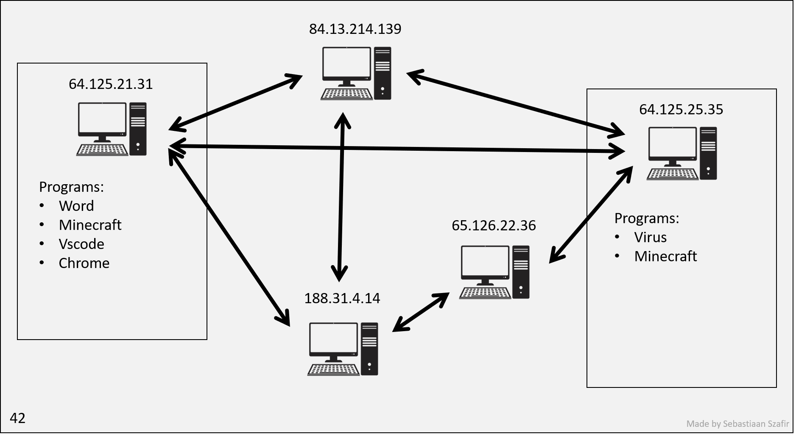
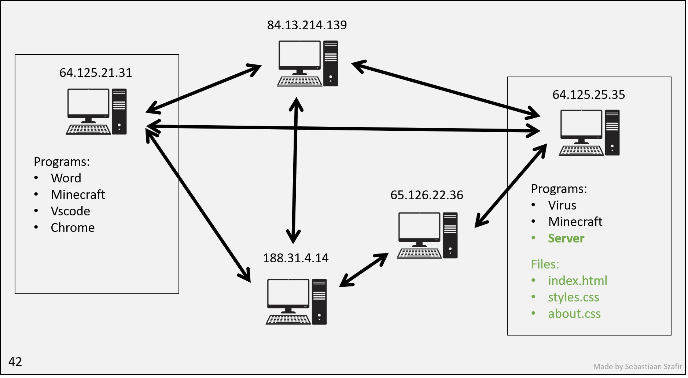
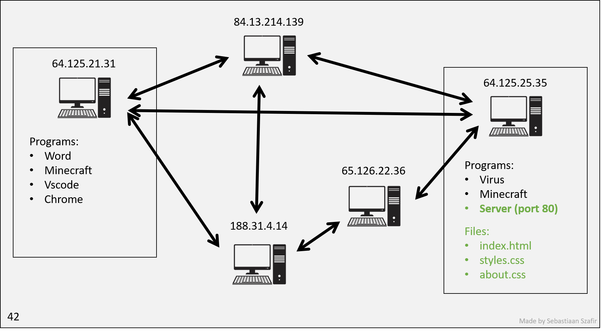
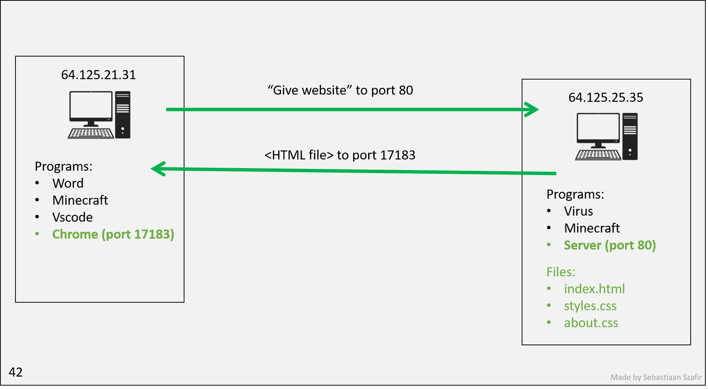

# Lesson 7 - Node.js, and SSR

## Introduction

You are very familiar with Javascript by now, and you may notice that we can
only run Javascript in our browser using the `<script>` tag. What if we want to
write scripts using Javascript and run them using the local machines, just like
how python is.

This is where Node comes into play. It is a JavaScript runtime engine built on
Chrome's V8 Javascript engine that allows you to run JavaScript even without a
browser. This means that you are able to do a lot more with JavaScript: managing
local files, connecting and setting up a server, and much more.

### Learning Objectives

1. How npm & node works
2. Create Backend APIs using Node & Express
3. How to make API calls using axios
4. File system with node & express
5. Understand cookies

### Getting Started

Let's start by creating a folder for us to put our code in. Let's call this
folder `example` and then let's cd` into it using the console.

```bash
mkdir example
cd example
```

## NPM

With the ability to run JavaScript locally on our machine (with the help of
Node) and the contribution of a rich number of packages from a large community,
the possibilities for JavaScript are endless!

To manage many of the packages that give Node its most powerful abilities, we
use NPM. Node package manager (NPM) is a place where you can find and download
node packages.

[npm](https://www.npmjs.com/)

## Installing Node

Go to [https://nodejs.org/en/](https://nodejs.org/en/) to install node.js for
free.

Let us confirm that you have correctly downloaded Node.js and npm.

In the terminal, type

```bash
node -v
npm -v
```

If both lines output the version number then we are good.

Now, let us install out first package. The remainder of this example we will be
using Axios to make HTTP requests as necessary, so let us install Axios.

Navigate to the folder where we are storing our project, in this case `example/`
while there, type the following command:

```bash
npm init -y
npm install axios
```

The `npm init` command is used to create a new npm package, essentially every
node script that we will write can be treated as a npm package. The `-y` flag
just skip all the configuration step and creates a most basic npm package with
all default settings.

Now when we list the files in our `example/` directory, we should see three
things:

- `node_modules` folder
- `package.json` file
- `package-lock.json` file (optional)

Essentially, each of these helps npm organize the packages we installed. In the
node_modules folder is where we can find our actual packages. Many times, our
node_modules file grows incredibly large and can take up quite a bit of space.
It is discouraged to go directly into the node_modules, instead, npm provides a
variety of utilities which we can use to keep our projects clean and efficient.
I won't go into them here, but as you develop, you will run across them or you
can read the docs [here](https://docs.npmjs.com/packages-and-modules). The other
file is the package.json file. The package.json file is the file which record
and defines the top-level packages and dependencies for our project.
package-lock.json is a similar idea but with some nuances, you do not need to
worry about those.

## Hello World

Now let's move back to Node for a second. Let's create a file called
`helloworld.js` in the `example/` folder. Enter `console.log("hello world.")` in
the file.

You can run any node file by using the Node command.

```bash
node helloworld.js
```

The console should print "hello world." and then exit.

## JS in Browser vs. Node.js

Node in browser and Node.js are technically the same form of JavaScript. Both
run on the browser's JavaScript engine, usually Chrome V8. However, there are
some fundamental difference which make Node.js just different enough to be
annoying. The most prominent difference is that Node.js uses the `require`
module to import other modules which define functionality. All Node projects are
organized into modules, and we use `require` to import them. For example, the
following code imports Axios, a package commonly used to make HTTP requests.

```jsx
const axios = require('axios');
```

Another difference is that since there is no web page to be manipulated, there
is no `document` object for Node.js, which means that DOM manipulation cannot be
carried out in Node.js (with the help of some packages, it can).

Since Node is a server side language, it can interact with the local file system
easily, it also provides ways to setup a server with ease.

If you are familiar with the `fetch` function in JS, there is no fetch function
in Node. You can use the http package or some other third party package to
handle sending a request.

# SSR - Server Side Rendering

So far we have just been double-clicking on our `index.html` file and letting our browser read the file from disk. This isn't how real websites work! This is just a handy feature browsers have. Just like they can read PDFs, they can read HTML files. But don't be confused, what you're seeing is not a website. For example, browsers will not respect cookies that you set from an HTML file that you are just viewing (they will not be persisted).

So how to websites really work? Basically, a compute has a special application running (called a `server`) which is constantly listening to incomming requests via the internet. When requests come in, it sends back the HTML file.

Alright, but what's the internet?

## The internet

The internet is simple. There are a bunch of computers, each with an IP, that send each other information. They refer to each other by IP address.

Here is a diagram of five computers connected to the internet. Each has it's own IP address that uniquely identifies it. You are on the left, playing Minecraft while writing your History essay. Those are the `processes` running on your machine. On the right is Vikhyath (Vik for short) on another computer. They are also playing Minecraft but you've never met them.



Vik would like to make a website, so he creates a bunch of HTML files and stores them somewhere on his compute.

However, only he can see them! So he spins up a new `process`. Processes that make websites public to the world are known as `servers`. Vik starts up a server, telling it where the HTML files are in his computer.



To visit Vik's website, you need to send a request to Vik's server. So you send an internet request to Vik's IP address. However, upon arrival his computer is scared it may have a virus, so it's designed not to tell all it's processes about all incoming requests. So it ignores your request.

Aw shucks! You have to be more specific, you have to tell Vik's computer you'd like to talk to the server. Luckily, operating systems let processes reserve `ports`. Then, when they get requests, the requests can specify what port they're looking for and whichever process has reserved that port will be able to see the request.

You ask Vik for help, and he tells you the server is listening on port 80.



So you go to your Chrome process and type `64.125.25.35:80` into the URL bar. When you hit enter, your computer sends an internet request to Vik's computer, specifying that it wants to talk to the process on port 80. The server receives this along with the port that you're listening to so that it can send the HTML page right to you!



Chrome reserves some random temporary port in an instant right as you press enter so that it can receive a response. The processes can now communicate securely without other processes on the respective machines ever finding out.

### Configuring your network

Sadly we ran out of IP addresses a while ago so we don't have enough for every device. Instead, your house has a router which has an IP address. Then each computer that conencts to it gets a fake IP address, which the router convinces your computer is real so that your computer never even has to deal with the fact that it's fake. When it sends or receives requests, the router deals with switching out the IP addresses every time.

However, for security reasons routers will NOT allow incoming internet requests into computers in its network :( So if you start up a server right now, your friends will not be able to see it unless you configure your router appropriately.

Furthermore, it's possible your computer itself has a firewall, which is a program that blocks incoming requests. You can configure your firewall to allow incoming requests to certain ports.

Luckily, you don't have to do any of this. Nowadays it is far more common to use a cloud service to rent out someone else's computer, and they will figure this all out for you and give you an IP address you can use.

### Domains

Alright now Vik has a website, but it's not very easy to remember his IP address. So he buys a domain name, which is just a string of characters that maps to an IP address. He buys `vikhyath.com` and sets it to map to his IP address.

Now Chrome has even more work to do... Every time you type in a domain name, it has to go to the DNS server (yes, another server, with an IP that ALL browsers come pre-loaded with), which will tell it the IP address of the domain name. Then it can send the request to the IP address.

For redundancy there are many DNS servers, and they all have the same information. So if one is down, Chrome can just go to another one. Chrome has a list of all the DNS servers, and it will try them in order until it gets a response.

If they all went down, we'd have to go back to memorizing IP addresses :(

### Default port

So, when you type `google.com`, it finds that the IP is `51.68.47.158`. But what port?

Browsers default to port `80`, so it will send the request to `51.68.47.158:80`.

Try it out! Go to `google.com:80`. You'll see your browser sneakily gets rid of the port. But if you try any other port, it won't work!

## Web Server with Node & Express

Let's make a server! (It's called a server because it `serves` files to people who request them).

### Install Express

Let's build a web server using Node! Since building a server can be very hard
using Node, a package called Express is often used to set up a web server in a
faster and simpler way.

Let's install it by `npm install express`.

After installing express, you would find it under the dependencies attribute in
the `package.json` file.

### Basic Web Server

```js
const axios = require('axios');
const express = require('express');
const port = 3000;

const app = express();

app.get('/', (req, res) => {
  res.send('Hello World');
});

app.listen(port, () => {
  console.log(`Example app listening at http://localhost:${port}`);
});
```

We tell express what port to listen to. Now, if a request comes to your IP address at port 3000, this Javascript process will be able to see it.

Luckily, instead of finding and memorizing your IP, you can use the shorthand `localhost`. This is a special domain name that always refers to your own computer.

So you can go to `localhost:3000` to see your website. It should say `Hello world`.

Lets look at this part more closely:
```js
app.get('/', (req, res) => {
  res.send('Hello World');
});
```

When you type out your website, you could have typed `localhost:3000/about`, and you'd expect a different page!

Luckily, we don't have to make any `if` statements to pick what site to send. Express will do that for us. We just have to tell it what to do for each site.

Let's analyze the rest line by line.

To import any npm packages that we download, we use the `require()` function
provided by Node. Thus, the `const express = require('express')`

`const app = express()` creates an app object that provides various useful
methods.

```jsx
app.get('/', (req, res) => {
  res.send('Hello World!');
});
```

The `get` method will return "Hello world!" once a web browser visits
[http://localhost:3000](http://localhost:3000) Essentially, we are telling node
that when the user makes a `GET` request to the `/` url (this is the root url),
define this response and send it.

```jsx
app.listen(port, () => {
  console.log(`Example app listening at http://localhost:${port}`);
});
```

The `listen` method will set up and start the server that listens for any
requests at a specific port.

Let's start our application by typing `node index.js` then visiting
[`http://localhost:3000`](http://localhost:3000/)

You would see a Hello World displayed on the screen, which means that our server
is up and running.

### Sending HTML

Let's send some HTML instead of just text.

```js
app.get('/', (req, res) => {
  res.send('<h1>Hello World</h1>');
});
```

You have to stop and restart your server to see the changes.

So if you were to paste your entire HTML file in there, it would work! But that's not very efficient. Let's make a separate file for our HTML.

```js
app.get('/', (req, res) => {
  res.sendFile(__dirname + '/index.html');
});
```

`__dirname` is a special variable that refers to the directory of the current file. So this will send the file `index.html` in the same directory as `index.js`.

What if your HTML file makes reference to other files, like CSS or JS files? You have to send those too!

```js
app.get('/styles.css', (req, res) => {
  res.sendFile(__dirname + '/styles.css');
});
```

Now you can go to `localhost:3000/styles.css` and see your CSS file. Or even better, you can add a `<link>` tag in your HTML file to link to the CSS file.

Your browser will then make another request to your server for the CSS file! If you wanted to have fun, you could return a random CSS file every time, and your website would look different every time you refresh!

### SSR (Server Side Rendering)

So what is the point of all this? Why not just make a static HTML file and send it to everyone?

We want to be able to send different HTML files to different people. For example, if you go to `youtube.com`, you'll see a different page than if I go to `youtube.com`.

## Adding routes and sending requests

Now let's define some more functionality for our server.

We will be implementing a "dumb" version of a database, meaning that we will be
emulating what a database would do with a very stupid implementation. We will
use a JSON object to store the items at a certain index and then return those
items as needed.

First, let's think about what types of data we will be interfacing with. There
are two main types: metadata and the actual database data. Our metadata is the
data that we use to define the state of our database and its characteristics,
and the actual database data will be the items we put.

Some examples of a metadata are the database capacity and current index. Let's
define two routes in our API: `/info` and `/db` . These are where we will make
our requests.

### GET Requests

```jsx
const axios = require('axios');
const express = require('express');
const port = 3000;
const app = express();

app.use(express.json()); // Utilities for request bodies
app.use(express.urlencoded({ extended: true })); // Utilities for query params

let counter = 0; // inner implmentation
stupidDB = {}; // initialize our dumb database

// GET Requests

app.get('/', (req, res) => {
  // homepage
  res.send('stupidDB API');
});

app.get('/info/index', (req, res) => {
  // get the current index
  res.send({ counter: counter });
});

app.get('/info/capacity', (req, res) => {
  // get the capacity
  res.send({ capacity: Object.keys(stupidDB).length });
});

app.get('/db/all', (req, res) => {
  // get all items from the db
  res.send(stupidDB);
});

app.get('/db/:id', (req, res) => {
  // get a certain item from the db
  const id = req.params.id;
  if (id in stupidDB) {
    res.send(stupidDB[id]);
  } else {
    res.send({ error: 'no object found with this id' });
  }
});

// Server Setup

app.listen(port, () => {
  console.log(`Example app listening at http://localhost:${port}`);
});
```

GET requests have a lot of flexibility and power in the way that we make them.
We can get information generically or we can encode the information that we want
into our API. Theoretically, we could also put that information into the body of
the request, but in general, that is not in line with our REST API principles.
GET returns information that we query to it.

### POST & PUT Requests

```jsx
const axios = require('axios');
const express = require('express');
const port = 3000;
const app = express();

app.use(express.json()); // Utilities for request bodies
app.use(express.urlencoded({ extended: true })); // Utilities for query params

let counter = 0; // inner implmentation
stupidDB = {}; // initialize our dumb database

// GET Requests

app.get('/', (req, res) => {
  // homepage
  res.send('stupidDB API');
});

app.get('/info/index', (req, res) => {
  // get the current index
  res.send({ counter: counter });
});

app.get('/info/capacity', (req, res) => {
  // get the capacity
  res.send({ capacity: Object.keys(stupidDB).length });
});

app.get('/db/all', (req, res) => {
  // get all items from the db
  res.send(stupidDB);
});

app.get('/db/:id', (req, res) => {
  // get a certain item from the db
  const id = req.params.id;
  if (id in stupidDB) {
    res.send(stupidDB[id]);
  } else {
    res.send({ error: 'no object found with this id' });
  }
});

// POST Requests

app.post('/db', (req, res) => {
  console.log(req);
  const item = req.body.item; // access our request body
  stupidDB[counter] = item; // add body item at index
  counter += 1; // increment counter
  res.send(`POST Request Successful. Item placed: ${item}`); // Send HTTP response
});

// PUT Requests

app.put('/db/:id', (req, res) => {
  const id = req.params.id; // get the index of the data to update
  const item = req.body.item; // access the body of the request which holds new data
  if (id in stupidDB) {
    stupidDB[id] = item; // insert destructively
    res.send({ newItem: item });
  } else {
    res.send({ error: 'no object found with this id' });
  }
});

// Server Setup

app.listen(port, () => {
  console.log(`Example app listening at http://localhost:${port}`);
});
```

POST and PUT are, in my opinion, what separate a static website from a true web
application. POST and PUT are how we actually collect and store relevant data
for the user. They are the methods which give our website **functionality** _for
the user._

Let's look at POST first. To pass data along a POST request, we place data in
the body. Because we don't know the "shape" and size of our data, we utilize the
body as a sort of empty container to hold the data that we want to send. (Note:
It would be overkill to put request parameters into this space for GET
requests).

Exercise: Go to Postman and set up a POST request. Go to body and look at all of
the potential options for request bodies. By and large, we will be using "raw"
in this class. Click on raw and view the options in the dropdown for data
formats. Lot's of options! In this class, we will largely stick to JSON but if
you are curious, you can always explore others. (Note: other formats may require
extra setup on the Express side).

Now let's look at PUT. PUT is an excellent example of how versatile a request
is. In our PUT request, we use both url encoding and the body to send relevant
data to our server. In the URL, we put where we want the data to go, and in our
body we define what data we want to go there. This is exactly aligned to the
design principles we laid our for our GET and POST requests! With smarter design
we can vastly simplify the complexity of our systems.

Let's get some pictures from NASA using this API that they are providing and
send the descriptions back.

- [https://api.nasa.gov/planetary/apod?api_key=DEMO_KEY](https://api.nasa.gov/planetary/apod?api_key=DEMO_KEY)

To send a request to a particular api, we use the package called Axios. Remember
that we have already npm installed `axios` so it should be available for us to
use.

```bash
const express = require('express')
const app = express()
const port = 3000

const axios = require('axios');

app.get('/nasa', (req, res) => {
  axios.get('https://api.nasa.gov/planetary/apod?api_key=DEMO_KEY')
  .then(response => {
    res.send(response.data);
  })
  .catch(error => {
    res.send(error);
  });
})
```

We will try to send an API request to NASA whenever a user visits the `/nasa`
route of our website.

Now to send an API request, we will use axios.get(). This will _send_ a `get`
request to the particular url provided.

Now go ahead and visit the
[`http://localhost:3000/nasa`](http://localhost:3000/nasa) url, you would find
this displaying on the screen.


We will learn more about API requests and web server in the future.

## Node and File System

Nodejs just like python, provides a very easy way to handle file system.

Let's build on top of the web server that we have. Say we want to build a API
where the user can input the name and type of a file and the server can create
it.

- [http://localhost:3000/create/?name=resume&type=txt](http://localhost:3000/create/?name=resume&type=txt)
- The API will look something like this, where the ? indicates parameters, and
  name=resume and type=txt are two of the parameters included in this API, they
  are connected by the & sign.

```jsx
app.get('/create', (req, res) => {
  let name = req.query.name;
  let type = req.query.type;
	...
})
```

In the `/create` route, we simply can access all the parameter like this.

Now, let us create a file using the file system package that node provides.

```jsx
const fs = require("fs");

...

app.get('/create', (req, res) => {
  let name = req.query.name;
  let type = req.query.type;
  let filename = name + '.' + type;
  fs.appendFile(filename, ' ', (err) => {
    if (err) res.send(err);
    res.send({
      "message": "File created!",
      "name": name,
      "type": type
    })
  })
})
```

The `fs.appendFile()` method creates a file with the given name in the current
folder that the server is in. Now try to visit
[`http://localhost:3000/create/?name=resume&type=txt`](http://localhost:3000/create/?name=resume&type=txt)
and see whether a file named resume.txt is created.

## Resources

[Express "Hello World" example](https://expressjs.com/en/starter/hello-world.html)

[NASA Open APIs](https://api.nasa.gov/)

[Get Query Strings and Parameters in Express.js](https://stackabuse.com/get-query-strings-and-parameters-in-express-js/)

---

**Contributors**

- [Alex Wu](https://www.linkedin.com/in/jialin-wu-658929185/)
