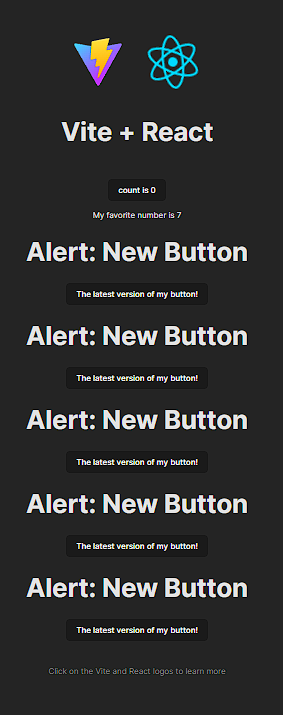

# Lesson 8 - React 1: Intro to React

## Introduction

Up to now you've learnt HTML, CSS, and JavaScript. These 3 technologies form the
basis of the web as we know it, and using just these 3 technologies, you can
build any web-based software product you could imagine! Given that, what else is
there to learn? Let me actually give you a list.

#### Frontend Technologies

- Frontend Frameworks
- Routers
- Component Libraries
- Package Managers
- Frontend/Backend Integration

#### Backend Technologies

- Databases
- Cloud Services
- REST APIs
- HTTP
- Postman
- Authentication

#### Misc.

- UI/UX
- HCD
- DevOps

Whew! That's a lot more than you probably expected, right? Well strap in,
because in the coming sections we'll be covering all of these technologies, and
prefacing even more. Let's get started by focusing on one of the coremost
frontend technologies: React.js.

### What is React?

React is a declarative, efficient, and flexible JavaScript library for building
user interfaces. It lets you compose complex UIs from small and isolated pieces
of code called “UI components”.

If that didn't make any sense, don't worry! I still don't even fully understand
what that means. The use cases of React, as well as what exactly React is, is
something you'll understand the answer to as we dive deeper into React and how
to use it. For now, all you need to know is that you use React to build
frontends, it's based on JavaScript, and that it makes our lives A LOT easier.

#### Why use frameworks and libraries at all?

The biggest reason to use frameworks like React is to make your life as a
developer easier. Frameworks tend to address a common set of concerns that
"vanilla" HTML/CSS/JavaScript has, but each framework addresses them in their
own unique way and has its own philosophy.

One of the biggest advantages to using a framework tends to be reusability. For
example, every time you create a new page in your website, you have to copy
paste in the same code for your navbar into each file, and if you want to make a
small tweak to it, it has be repeated many times, once in each of your files.
Frameworks help aleviate this problem, and many more related to data management,
rendering, and the logic associated with different parts of our website.

#### Why use React?

React is by far the most popular frontend framework used today. In my opinion,
it is also one of the easiest to work with and has a huge amount of online
support.

A little bit about React:

- It's Open-Source (open source refers to software for which the original source
  code is made freely available and may be redistributed and modified.)
- It was created by Facebook (and is thus consequently used by Facebook, and
  many more companies you've probably heard of).
- It's a very "heavy" framework, which means that it potentially slow down your
  app since it uses a lot of data. Keep in mind, however, that this decrease in
  speed tends to not matter whatsoever, so don't let this be a concern when
  using React in this class! On the contrary, a "light" package or framework
  doesn't add much data to your app, and they tend to perform faster than
  "heavier" counterparts.

Some other facts if you have some CS experience (these aren't important in this
course, but cool to know):

- React fits very cleanly into the MVC model of development
- React is incredibly good at scoping and components –– ie, it is object
  oriented and does separation of concerns well.
- It's similar to Bootstrap and Jquery in that it's unrestrictive –– you can use
  as much or as little of it as you desire.
- The biggest power of React, is its renderer. While Javascript is messy with
  how it handles dynamic re-render, React.JS is clean. Something that might take
  you 20 lines of code in JS takes you one in React.

Some last "technical" benefits to using React:

- Development Speed
- Combining HTML, CSS, and Javascript
- App Performance
- Testability
- Dynamic Rendering
- State

#### Cool Resources:

[React Developer Tools](https://chrome.google.com/webstore/detail/react-developer-tools/fmkadmapgofadopljbjfkapdkoienihi?hl=en)

[Why did we build React? - React Blog](https://reactjs.org/blog/2013/06/05/why-react.html)

---

## Installation

Let's start by making sure that node and npm are installed on your computer. You
should have installed Node and npm in the previous lesson. If you haven't, you
can jump to the relevant section of the last reading by
[clicking here](/docs/Lessons/Lesson8#installing-node). If you have Node and npm
installed, there are no extra downloads required to use React.

## Useful Tools

### Prettier

It's important to keep quality high when writing code. Or at least that's how I
sell ESLint and Prettier. In reality I'm super lazy and want the machine to do
as much work as possible so I can focus more on architecture and problem-solving
and less on syntax and style. While there are many tools that can help you keep
code quality high, these two I consider core to my workflow.

[Prettier](https://github.com/prettier/prettier) is an amazing tool from the
brain of [James Long](https://twitter.com/jlongster). James, like many of us,
was sick of having to constantly worry about the style of his code: where to
stick indents, how many, when to break lines, etc etc. Coming from languages
like Go, Reason, or Elm where all that is just taken care of by the tooling for
the language, this quickly wears. James did something about it and made a tool
to take care of it: Prettier.

Prettier is a really fancy pretty printer. It takes the code you write, breaks
it down, throws away all of your code style you made and prints it back out
using a predefined style. While this sounds a little scary, it's actually really
cool. Since you no longer have control of the style of your code, you no longer
have to think about it at all. Your code is always consistent, as is the code
from the rest of your team. No more bikeshedding!! As I like to put it: if your
brain is a processor, you get to free up the thread of your brain that worries
about code styles and readability: it just happens for you. Don't like
semicolons? Don't write them! It puts them in for you. I _love_ Prettier.

**Trust me.** Use Prettier. Don't write messy code. This is **MANDATORY**.

Let's go integrate this into our project.

Either install Prettier globally `npm install --global prettier`, or use the
[VSCode extension](https://marketplace.visualstudio.com/items?itemName=esbenp.prettier-vscode&WT.mc_id=reactintro-github-brholt).
I would reccomend using the VSCode extension if you are using Visual Studio Code
as your primary IDE (which I also highly, _highly_, reccomend).

If you're using the VSCode extension, set it to only run Prettier when it
detects a Prettier config file. Makes it so you never have to turn it off. In
order to do that, set `prettier.requireConfig` to `true` and
`editor.formatOnSave` to `true`. This can be done in the VSCode settings.

#### **How to access VSCode Settings**

- Windows Users `File > Preferences > **Settings**`
- Mac Users `Code > Preferences > **Settings**`

So that our IDE can know to use prettier, we're going to create a file called
`.prettierrc` in the root of our project and put `{}` in it. Your `.prettierrc`
file should be on the same level as package.json and your README file. This lets
everyone know this is a Prettier project that uses the default configuration.
You can put other configs here if you hold strong formatting opinions.

### ESLint

On top of Prettier which takes of all the formatting, you may want to enforce
some code styles which pertain more to usage: for example you may want to force
people to never use `with` which is valid JS but ill advised to use.
[ESLint](https://eslint.org/) comes into play here. It will lint for these
problems. Essentially, it will yell at you when you make mistakes like these by
underlining your code in red or yellow, depending on the severity of the
mistake.

First of all, run `npm install -D eslint eslint-config-prettier` in your console
while in your project directory to install eslint in your project development
dependencies. Then you may configure its functionalities.

There are dozens of preset configs for ESLint and you're welcome to use any one
of them. The [Airbnb config](https://github.com/airbnb/javascript) is very
popular, as is the standard config. I'm going to use a looser one for this
class: `eslint:recommended`. Let's create an `.eslintrc.json` file in the root
directory of our project to start linting our project.

```jsx
{
  "extends": ["eslint:recommended", "prettier"],
  "plugins": [],
  "parserOptions": {
    "ecmaVersion": 2021,
    "sourceType": "module",
    "ecmaFeatures": {
      "jsx": true
    }
  },
  "env": {
    "es6": true,
    "browser": true,
    "node": true
  }
}
```

ESLint is a cinch to get working with Visual Studio Code. Just down
[the extension](https://marketplace.visualstudio.com/items?itemName=dbaeumer.vscode-eslint).

## Getting started

That was a lot of setup work, but trust me when I say that downloading prettier
and ESLint will probably the best decision you'll make in your development
career. Second to taking this course of course! And of course, without Node and
npm installed you won't be able to get anything to work in the first place, so
make sure that those are good to go.

Lets get started by creating a basic "boilerplate" file structure for our React
App. To do so, we'll use a service called
[Create-React-App](https://create-react-app.dev/), sometimes abbreviated as CRA.

Let's get started by running the following.

```bash
npx create-react-app my-app
```

What this does is create a directory named `my-app` that contains the
boilerplate React code that's generated by Create React App. If you open up
`my-app`, you'll see the following:


That's a lot to take in! We'll explain exactly what each of these files and
folders represents in a typical React project soon, but first we'll dive into
basic React principles and aim to move towards the bigger picture as we explain
how React works.

Let's start by running

```bash
yarn start
```

in the root directory of your newly initialized React app. After some time, you
should see the following pop up in your browser. If nothing happens, navigate to
[localhost:3000](http://localhost:3000/) on your favorite browser. You should
see the following.


By running `yarn start`, we started up our React app, similarly to how we opened
up an HTML file to view our websites. Going forward, running a command in the
console will be how we run and view the output of our code.

### Making Changes

Navigate to `src/App.js`. You should see the following. We'll explain each part
of this file soon, but for now, pay attention to what is being returned by our
function `App`.

```jsx
import logo from './logo.svg';
import './App.css';

function App() {
  return (
    <div className="App">
      <header className="App-header">
        
        <p>
          Edit <code>src/App.js</code> and save to reload.
        </p>
        <a
          className="App-link"
          href="https://reactjs.org"
          target="_blank"
          rel="noopener noreferrer"
        >
          Learn React
        </a>
      </header>
    </div>
  );
}

export default App;
```

Hmmm. What's being returned looks exactly like what's being rendered on our
browser! Lets try changing the line that says
`Edit <code>src/App.js</code> and save to reload.` such that it reads
`Hello World!`. Now save the file and navigate back to your browser. Your screen
should now look like this. if it doesn't then give it a couple seconds and make
sure that you saved your changes to App.js.


We've just made a change to our website without having to reload it! This is a
pretty nifty feature of Create React App called _hot reloading_. This feature
already makes our lives much easier, and all we needed to do was start using
some of the cool tools at our disposal when working with React!

### Looking at `App.js`

As you've probably figured out, whatever is returned by our function `App` is
what will show up on our screen, and that our function has to return some form
of HTML. There are a few differences, but well go over them shortly. first, lets
start by defining some ground rules when using React.

All React files must return a function or a class. These are respectively called
functional components and class components. In this course we will exclusively
use functional components as class components are being phased out of the React
ecosystem and moving in the direction of functional components. As you can see
in `App.js`, we define a function `App` that returns some HTML. We then
`export default` our function at the bottom of our file, which is a common
practice with React components. We will get to what we mean by component shortly
as well. Don't worry too much about what `export default` means and `export` vs.
`export default`. We will cover that later. Just know that by having
`export default App` at the bottom of our file, we are exporting our function
`App` so that it may be used by other files in our application.

Now lets go to the top and look at the following.

```jsx
import logo from './logo.svg';
import './App.css';
```

This is how we import anything into our React component. Looking at our files,
we can see `App.css`. In order to use the CSS in `App.css`, we don't need to use
a style tag like we used to. Instead, we can simply import its
[relative path](https://desktop.arcgis.com/en/arcmap/10.3/tools/supplement/pathnames-explained-absolute-relative-unc-and-url.htm#:~:text=A%20relative%20path%20refers%20to,moving%20up%20in%20the%20hierarchy.)
into our component. As for images, we no longer put the path of the image into
the `src` attribute of our `img` tags. Instead, we import them using their
relative path and define their import as shown in `App.js` I understand that
this may be confusing now, but a lot of learning React is simply learning the
correct syntax, and learning why we use that syntax will come with time.

Looking downward, we see that our `img` tag looks like the following.

```jsx

```

Notice how we have curly brackets around the `src` attribute. Using curly
brackets, we can pass in variables to our HTML. More on this later.

Lastly, I'd like to point out the fact that our code uses `className` instead of
`class` when trying to use classes to specify the CSS that is being applied to
each HTML element. This is simply because `class` is a reserved word in
JavaScript, and since we are writing our HTML in a JavaScript file, we have to
make this small change in order for our code to work properly.

### Variables in Our Code

Lets dive deeper into `{logo}`. One powerful feature of React is that we can use
variables in our code simply by surrounding the variable name with curly
brackets! Lets take an example. Define the following in `App.js`, right above
our return statement.

```jsx
const myFavoriteNumber = 7;
```

And so we've defined a new variable that we can use in our `App` function. But
how can we display this data in our browser? Sure, we could replace our current
"Hello World!" with "My favorite number is 7", but what if we're really
indecisive and our favorite number changes daily? Alternatively, What if we want
to let the user have their favorite number be displayed in the browser? We could
use JavaScript and some DOM methods to do this, but React makes this task much
easier.

Lets go down to the following

```jsx
<p>Hello World!</p>
```

and replace it so that it uses our new `myFavoriteNumber` variable. Now it
should look like the following.

```jsx
<p>My favorite number is {myFavoriteNumber}</p>
```

Lets go back to the browser and see what's happened.


Viola! We've successfully used a JavaScript variable in our HTML code. Play
around with the value of `myFavoriteNumber` and make sure to save `App.js` each
time before going back and checking your browser. You'll see that what's shown
on your screen will reflect whatever value your variable holds. This capability
extends to introducing any logic into your HTML. For example, you could do the
following.

```jsx
<p>My favorite number is 7</p>
```

```jsx
<p>My favorite number is {'7'}</p>
```

```jsx
<p>My favorite number is {3 + parseNumber('4')}</p>
```

```jsx
<p>My favorite number is {(myFavoriteNumber * 2) / 2}</p>
```

These snippets will all result in the same thing being shown in the browser.
We've learnt a powerful way to combine JavaScript, HTML, and CSS.

Our `App.js` should now look like the following.

```jsx
import logo from './logo.svg';
import './App.css';

function App() {
  const myFavoriteNumber = 7;

  return (
    <div className="App">
      <header className="App-header">
        
        <p>My favorite number is {myFavoriteNumber}</p>
        <a
          className="App-link"
          href="https://reactjs.org"
          target="_blank"
          rel="noopener noreferrer"
        >
          Learn React
        </a>
      </header>
    </div>
  );
}

export default App;
```

## Components

We've used the term component a lot in the last few sections, and now its
finally time to explain what exactly that means. Conceptually speaking, a
component is any piece of code that's used in your app, and components are
typically meant to help with resuability and segmenting in your code. For
example, in a website, you may want to make your Navbar a component since it's
used on every page. If you're building a social media platform, you may want to
make a generic Post component that can display different information depending
on the post, but which contains all the attributes and styling that all posts
share. Going further into the social media example, think about writing the
entirety of Facebook in one JavaScript file. That would be a lot of code in one
place! This is where components come in handy. We can make a Post component, a
Reply component, a Navbar component, a Profile Component, etc... and each
component can handle its own data and logic. For example, the User Profile logic
and the Post logic could be completely different, so seperating them into
components makes it easier to manage your code.

In `App.js`, we have created a component called `App`. We did this by defining a
function called `App` which returns JSX (this is what we will call our HTML when
we use HTML in a React setting), and exporting that function `App`. Our `App`
function can have whatever logic you need it to contain, but it must return JSX
(more on this later). How do we use these components? Good question! To answer
this, lets try creating a new component called `Button`, and then using it in
our newly created React App.

### Creating Components

For any new component we create, we have to import React. This is because React
isn't a language, its simply a framework that we import into our existing
JavaScript files. Let's start by creating a new file called `Button.js` and
writing down the following.

```
import React from 'react';
```

Next, we want to create our new `Button` component. Remember that to create a
React component, we have to create a function that returns JSX. We then
`export default` that new component. Lets create a bare bones button component
using what we've seen so far.

```
import React from 'react';

const Button = () => {
  return(
    <button>Cool Button</button>
  )
}

export default Button
```

One small detail to note is that here we defined our `Button` component as a
JavaScript arrow function, vs our `App` component used a more traditional
JavaScript function syntax. Both are functions in JavaScript, but for React
people tend to use arrow functions to create components over traditional
function syntax.

Now we have a button component, but if we look at our browser, it doesn't show
up anywhere. This is because we haven't included it in our `App.js` file. In the
structure of Create React App, everything you want to be shown in the browser
must be included in your `App.js` file. We can use our new `Button` component in
`App.js` by importing it like so at the top of our `App.js` file.

```jsx
import Button from './Button';
```

Notice how we didn't need to import from `'./Button.js'`, and were able to leave
out the ".js". This is a small feature of React, where we just import the file
names of JavaScript files and can leave out the ".js" part of the filename.
Other filetypes, however, have to be written in full, as we see with our
`import './App.css'` statement.

### Using Components

We've now imported our Button component into `App.js`, but how do we actually
use it? Here's the cool part of using React, and what sets JSX apart from plain
HTML - we can use our `Button` component as we would a regular tag! If that
doesn't make total sense, lets look at an example.

```jsx
<Button />
```

This is equivelent to writing the following.

```jsx
<button>Cool Button</button>
```

But now we've been able to simplify how much code we need to write. This is a
pretty small example, but let's say we want to create a Navbar component - it
would be a lot easier to write all the HTML for a Navbar in it's own file, and
then simply add `import Navbar from './Navbar'` and
`<Navbar /> to your main file (which in our case is `App.js`) than writing all
that HTML in one file!

Another benefit is reusability. Continuing out button example, let's say that I
want 3 buttons in my website, and I want them all to say the exact same thing.
One way to do this is to use the regular html `button` tag 3 times and update
each tag if I want to make a change to my button's text, but if we were to
instead use the `Button` component we've just made, changing all 3 buttons would
simply consist of making 1 edit to our `Button` component. Pretty neat, right!
Now imagine you had 1000 buttons all accross your site. As we'll show later,
even if they're slightly different, we still only need 1 component for all of
these buttons, and consequently only need to make changes to one file if we want
to change the buttons on our site.

Let's go through one example of what using our `Button` component may actually
look like inside of our new website. Lets add our `Button` component to
`App.js`. Your `App.js` should now look like the following.

```jsx
import logo from './logo.svg';
import './App.css';

import Button from './Button';

function App() {
  const myFavoriteNumber = 7;

  return (
    <div className="App">
      <header className="App-header">
        
        <p>My favorite number is {myFavoriteNumber}</p>
        <a
          className="App-link"
          href="https://reactjs.org"
          target="_blank"
          rel="noopener noreferrer"
        >
          Learn React
        </a>
        <Button />
      </header>
    </div>
  );
}

export default App;
```

Make sure to save your file and go back to your browser. You should now see the
following.


What if we wanted a bunch of buttons in our app? Instead of writing

```jsx
<button>Cool Button</button>
<button>Cool Button</button>
<button>Cool Button</button>
<button>Cool Button</button>
<button>Cool Button</button>
```

we can simply use our `Button` component like so.

```jsx
<Button />
<Button />
<Button />
<Button />
<Button />
```

We should now see the following.


Here's where a big part of React's power comes in - we can change all of our 5
buttons by only making edits to our `Button.js` file! Lets make some changes to
`Button.js` and make it a bit more complicated. Let's have our `Button`
component return the following.

```jsx
<div>
  <h1>Alert: New Button</h1>
  <button>The latest version of my button!</button>
</div>
```

Save the file, and go back to the browser to see the changes you've made! While
you won't be able to see all of the `Button` components on your screen at once,
they're all there! Just scroll a bit and you'll see all 5.



### Rendering in Index

We might have said that everything in `App.js` is what's shown in your browser,
but we actually lied (sorry). In reality, everything in `Index.js` is what's
displayed in your browser. Open up `Index.js` in your IDE. You should see the
following.

```jsx
import React from 'react';
import ReactDOM from 'react-dom';
import './index.css';
import App from './App';
import reportWebVitals from './reportWebVitals';

ReactDOM.render(
  <React.StrictMode>
    <App />
  </React.StrictMode>,
  document.getElementById('root')
);

// If you want to start measuring performance in your app, pass a function
// to log results (for example: reportWebVitals(console.log))
// or send to an analytics endpoint. Learn more: https://bit.ly/CRA-vitals
reportWebVitals();
```

Let's disect this. As usual, we see `import React from 'react';` this is a given
since we're trying to create a React App. Skipping around a bit we see
`import './index.css';`. No surprise there either, just importing a CSS file to
use. Let's look at the line after that.

```jsx
import App from './App';
```

Let's think about why this makes sense. We defined a component as a function
that returns JSX, which we learned is a combination of HTML, components that
we've created and imported, and JavaScript variables we use inside of our HTML.
Looking at `App.js`, we see that we've simply created a component called `App`!
In `Index.js`, though, it doesn't look like we're creating a component. This is
because in `Index.js` we're actually trying to render all of our components (in
this case, just the `App` component) in the browser. How we do that is with
`ReactDOM`, another package that's imported along with React. While React is
used to make components, ReactDOM is used to render them on the screen. This is
made obvious by looking at the body of `Index.js`

```jsx
ReactDOM.render(
  <React.StrictMode>
    <App />
  </React.StrictMode>,
  document.getElementById('root')
);
```

It's self-evident that ReactDOM renders our `App` component given the calling of
`ReactDOM.render`.

:::note

Don't worry about what's going on in `Index.js` too heavily. We'll explain it
later, but you'll rarely ever need to make changes to this file.

:::

:::info

In the code above you see that our `App` component is wrapped in a
`React.StrictMode` tag. By wrapping a component in `React.StrictMode`, all we've
done is make it so that we recieve a warning if React detects that there might
be potential problems with the code we write or any imports we use.

:::

Now we'll explain what the line `document.getElementById('root')` does, and why
we pass it in to `ReactDOM.render`. First, a question - How do you think we're
able to get all of our fancy JavaScript and JSX to show up on our browsers, when
HTML and CSS are supposed to be what shows up on your screen? Simple. We just
create an HTML document with a single `div` with `id="root"`, and then use our
magical ReactDOM library to attach turn all of our JSX into plain HTML, and then
insert that HTML into our main HTML document! If that seemed like a lot, let's
take a look at what we're talking about.

Navigate to `/public/index.html`. You should see a regular HTML file, similar to
the one's we've worked with in the past. If you scroll to the body of our HTML
document, you'll see `<div id="root"></div>`. Our `ReactDOM.render` function
essentially just compiles all of our React code into HTML, which is the first
argument we pass it, and then puts it into a div in an HTML file, and this HTML
file is actually what's being displayed in our browser. We tell
`ReactDOM.render` where to put our newly compiled React code by using
`document.getElementById('root')`, which tells our function to put it indide of
the element in our HTML document that has `id="root"`, as you should have
learned in the [JavaScript DOM Lesson](/docs/Lessons/Lesson6).

Viola! We've covered a lot of ground, and now understand how to create and use
components, as well as gaining a rough understanding of how our React code is
rendered in the browser. Strap in, however, because that's just the start of
what React can do.

## Props

The next big React concept we'll cover is props. Props are basically a way to
pass in data to your components. For example, what if you want all of your 5
buttons to have the same styling, but to say different things? Instead of
manually creating 5 different buttons using HTML and not using components, or
god-forbid, creating 5 different button components, we can use props to stick
with just one button component, even though we want all of our buttons to look
different in our browser.

:::info props is short for properties! :::

The way we pass in props and use them is fairly simple. We can pass props to one
of our components the same way that we pass in an attribute to a regular HTML
element. For example, we want our `Button` component to have a prop (property)
called text, which is what the text that the button should display. We can
achieve that by doing the following.

```jsx
<Button text="What I want my button to say!" />
```

Nice! Now we've successfully given our `Button` component a prop called text.
Now how do we use it? For demonstration purposes, let's go back to our old
`Button` component.

```jsx
const Button = () => {
  return (
    <div>
      <button>Cool Button</button>
    </div>
  );
};
```

to use props, we have to pass `props` into our Button component by passing them
as an input into our `Button` function like so.

```jsx
const Button = (props) => {
  return (
    <div>
      <button>Cool Button</button>
    </div>
  );
};
```

We can now access all the props that we pass into our `Button` component when we
use it! Let's access our text component like so. Remember that we can use
variables in our HTML by adding `{}` around them.

```jsx
const Button = (props) => {
  return (
    <div>
      <button>{props.text}</button>
    </div>
  );
};
```

Now lets say that we pass in a `title` prop into our `Button` component.

```jsx
<Button text="example text" title="Cool Button">
```

We can then use it in a similar manner.

```jsx
const Button = (props) => {
  return (
    <div>
      <p>{props.title}</p>
      <button>{props.text}</button>
    </div>
  );
};
```

Hopefully this example makes sense! To solidify that this works, let's try
creating 3 different buttons in our `App.js` that all say different things, but
all use our improved `Button` component. While we're doing so, let's clean up
our `App` component a bit.

```jsx
function App() {
  return (
    <div className="App">
      <header className="App-header">
        <Button text="wow," title="First Button" />
        <Button text="props are" title="Middle Button" />
        <Button text="so useful!" title="Last Button" />
      </header>
    </div>
  );
}
```

Save your file and go back to the browser. You should see the following.


Congrats! You've successfully learnt the basic of props in React.

:::info

Please note that props are **immutable**. What this means is that trying to do
something like `props.text = "new text" inside of your `Button` component will
cause an error. More generally, trying to change your props inside of the
component that those props are being passed to will cause an error.

:::

## State

There are 2 main ways of passing around data in your new React app. The first one is props, which we introduced above, and the second one is state.

## The Anatomy of a React App


A React app is composed of many different files and filetypes - what do each of
them do and why do we need them? Knowing the answer to this question isn't
knowledge that applies just to frontend engineering, but crucial to becoming a
full-fledged software engineer.

### `README.md`

Essentially a back-of-the-book summary of your code. Your
[`README.md`](http://readme.md) should describe what your code is for, what it
does, and if applicable, it should provide a detailed overview of each file and
its functions. Think about your [`README.md`](http://readme.md) as a guide to
your code.

### `package.json` and `package-lock.json`

package.json is essentially a list of the dependencies of your app!

package-lock.json is a version-locked version of package.json, so that each new
device that downloads the code downloads the correct dependencies. This is to
prevent new updates to dependencies breaking your code.

### `node_modules`

Where all your dependencies live! You should never ship out node_modules because
its YUGE (try opening it up and you'll see). Always include node_modules in your
.gitignore.

### `build`

A minified build version of your app - All your code is transformed into an
extremely compact version of itself, and this version is what is meant to be
served to the public, since you get a huge speedup from using the build version!
Run `npm run build` in the root directory of your app in the terminal to create
the build folder!

---

**Contributors**

- [Samarth Goel](https://www.linkedin.com/in/samarth-goel-1047b8187/)
- [Arushi Somani](https://www.linkedin.com/in/arushisomani/)
- [Brian Holt](https://www.linkedin.com/in/btholt/)
