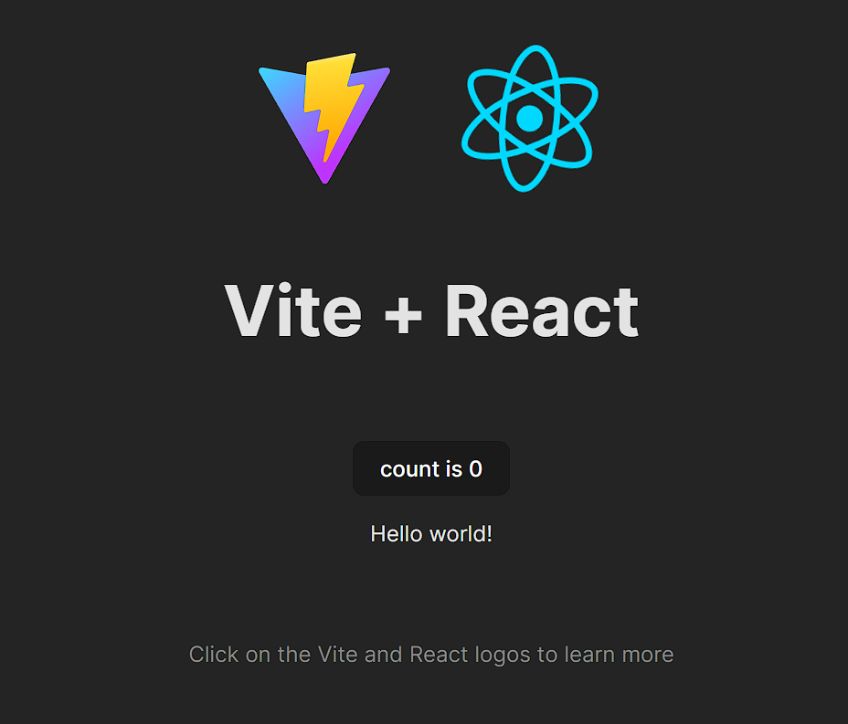
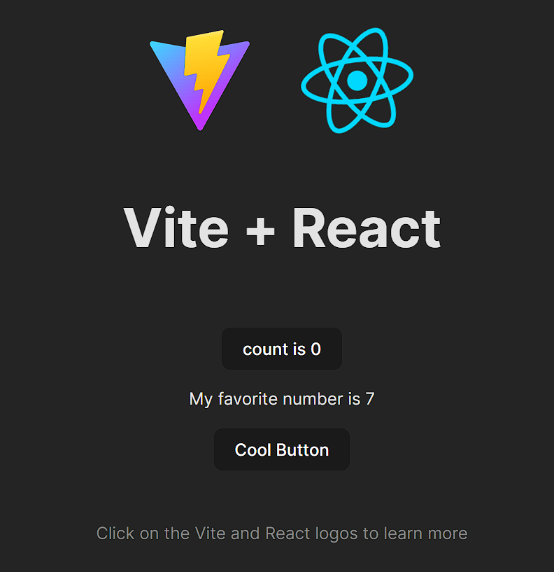
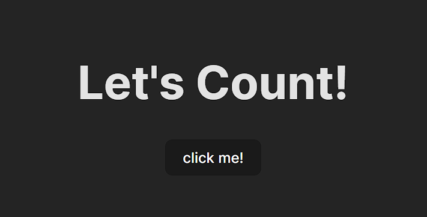
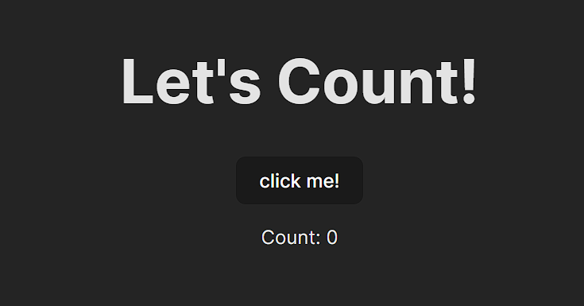

# React 1: Intro to React, Props, and State

## Introduction

Up to now you've learned HTML, CSS, and JavaScript. These 3 technologies form
the basis of the web as we know it, and using just these 3 technologies, you can
build any web-based software product you could imagine! Given that, what else is
there to learn? Let me actually give you a list.

#### Frontend Technologies

- Frontend Frameworks
- Routers
- Component Libraries
- Package Managers
- Frontend/Backend Integration

#### Backend Technologies

- Databases
- Cloud Services
- REST APIs
- HTTP
- Postman
- Authentication

#### Misc.

- UI/UX
- HCD
- DevOps

Whew! That's a lot more than you probably expected, right? Well strap in,
because in the coming sections we'll be covering all of these technologies, and
prefacing even more. Let's get started by focusing on one of the coremost
frontend technologies: React.js.

### What is React?

React is a declarative, efficient, and flexible JavaScript library for building
user interfaces. It lets you compose complex UIs from small and isolated pieces
of code called “UI components”.

If that didn't make any sense, don't worry! I still don't even fully understand
what that means. The use cases of React, as well as what exactly React is, will
hopefully be answered as we dive deeper into React and how to use it. For now,
all you need to know is that you use React to build frontends, it's based on
JavaScript, and that it makes our lives A LOT easier.

#### Why use frameworks and libraries at all?

The biggest reason to use frameworks like React is to make your life as a
developer easier. Frameworks tend to address a common set of concerns that
"vanilla" HTML/CSS/JavaScript have, but each framework addresses them in its own
unique way and has its own philosophy.

One of the biggest advantages to using a framework tends to be reusability. For
example, every time you create a new page in your website, you have to copy
paste in the same code for your navbar into each file, and if you want to make a
small tweak to it, it has be repeated many times, once in each of your files.
Frameworks help alleviate this problem, and many more related to data
management, rendering, and the logic associated with different parts of our
website.

#### Why use React?

React is by far the most popular frontend framework used today. In my opinion,
it is also one of the easiest to work with and has a huge amount of online
support.

A little bit about React:

- It's Open-Source (open source refers to software for which the original source
  code is made freely available and may be redistributed and modified.)
- It was created by Facebook (and is thus consequently used by Facebook, and
  many more companies you've probably heard of).
- It's very unopinionated about how your website should work beyond the basic
  core primitives of composing UIs. While this gives a ton of flexibility, it
  also means that there's no "one right way" to do many things in React, like
  routing between different pages on your site, or fetching data from a backend
  server. In this course, we'll try to stick to teaching React's core principles
  which are consistent across all types of projects.

Some other facts if you have some CS experience (these aren't important in this
course, but cool to know):

- React fits very cleanly into the MVC model of development
- React is incredibly good at scoping and components –– ie, it is object
  oriented and does separation of concerns well.
- It's similar to Bootstrap and Jquery in that it's unrestrictive –– you can use
  as much or as little of it as you desire.
- The biggest power of React, is its renderer. While Javascript is messy with
  how it handles dynamic re-render, React.JS is clean. Something that might take
  you 20 lines of code in JS takes you one in React.

Some last "technical" benefits to using React:

- Development Speed
- Combining HTML, CSS, and Javascript
- App Performance
- Testability
- Dynamic Rendering
- State

#### Cool Resources:

[React Official Documentation](https://react.dev/)

[React Developer Tools](https://chrome.google.com/webstore/detail/react-developer-tools/fmkadmapgofadopljbjfkapdkoienihi?hl=en)

[Why did we build React? - React Blog](https://reactjs.org/blog/2013/06/05/why-react.html)

[Next.js Guide: From JavaScript to React](https://nextjs.org/learn/foundations/from-javascript-to-react)

---

## Why React: An Example

Before we dive into the details of React itself, let's first start by building
some intuition on why we need React in the first place. This section will talk
about working with the DOM, so if you need a refresher, feel free to
[pop over to Lesson 6](/docs/Lessons/Lesson6) first.

Imagine we're trying to make a simple site that just displays the current date
when you load the page. The current date is ever-changing, meaning we can't just
hard-code it into our page's HTML. So how do we solve this? JavaScript, of
course! We can use the `Date` object in JS to dynamically create some text that
shows what day it is.

So, here's how that might look in the "vanilla" HTML/JS we've learned so far:

```html
<!-- index.html -->
<html>
  <body>
    <div id="app"></div>

    <script type="text/javascript">
      // Select the div element with the id of "app"
      const app = document.getElementById("app");

      // Create a new paragraph element
      const header = document.createElement("p");

      // Create a new text node for the `p` element, and add the current date as its content
      const headerContent = document.createTextNode(new Date().toString());

      // Append the text to the `p` element
      header.appendChild(headerContent);

      // Place the `p` element inside the div
      app.appendChild(header);
    </script>
  </body>
</html>
```

If you open this HTML file in a browser, you'll see that we get our date nicely
displayed at the top of the page, even though we never explicitly included the
date in the original HTML!


But there are two major problems with this approach:

- Manipulating the DOM with plain JavaScript is flexible, but quite verbose -
  notice how we used 5 lines just to simply add a single line of text to our
  page.
- This method is also an example of _imperative_ programming - we're telling the
  browser step-by-step how to update the DOM to display some new HTML elements.
  But in reality, we mostly just care about the content our page should show -
  in this case, today's date - and the exact way that the browser makes this
  happen isn't too important. In this case, a _declarative_ programming approach
  would make much more sense. You can think about imperative vs. declarative
  programming with the restaurant analogy: with an imperative approach, if I
  want to order some pasta, I would tell my server the exact list of ingredients
  they should use along with a detailed recipe for the dish, so that I can
  customize my pasta to my liking. Whereas with a declarative approach, I would
  just order a spaghetti carbonara, meaning the chefs get to decide exactly how
  to make the dish and my life is much easier!

React solves these two problems - it's a library that allows programmers to
write UI in a declarative way, letting us use a lot less code to write complex
functionality. To give you a taste of what our example above looks like in
React, here's how we might write our date display as a React component. Don't
worry if this looks a little funky - all will be explained soon!

```jsx
function DateDisplay() {
  const date = new Date().toString();
  return <div>{date}</div>;
}
```

## Installation

Now that we've understood how React can help us, let's get set up to use it.
Make sure that Node and npm are installed on your computer - you should have
installed Node and npm in the previous lesson. If you haven't, you can jump to
the relevant section of the last reading by
[clicking here](/docs/Lessons/Lesson8#installing-node). If you have Node and npm
installed, there are no extra downloads required to use React.

## Useful Tools

### Prettier

It's important to keep quality high when writing code. Or at least that's how I
sell ESLint and Prettier. In reality I'm super lazy and want the machine to do
as much work as possible so I can focus more on architecture and problem-solving
and less on syntax and style. While there are many tools that can help you keep
code quality high, these two I consider core to my workflow.

[Prettier](https://github.com/prettier/prettier) is an amazing tool from the
brain of [James Long](https://twitter.com/jlongster). James, like many of us,
was sick of having to constantly worry about the style of his code: where to
stick indents, how many, when to break lines, etc etc. Coming from languages
like Go, Reason, or Elm where all that is just taken care of by the tooling for
the language, this quickly wears. James did something about it and made a tool
to take care of it: Prettier.

Prettier is a really fancy pretty printer. It takes the code you write, breaks
it down, throws away all of your code style you made and prints it back out
using a predefined style. While this sounds a little scary, it's actually really
cool. Since you no longer have control of the style of your code, you no longer
have to think about it at all. Your code is always consistent, as is the code
from the rest of your team. No more bikeshedding!! As I like to put it: if your
brain is a processor, you get to free up the thread of your brain that worries
about code styles and readability: it just happens for you. Don't like
semicolons? Don't write them! It puts them in for you. I _love_ Prettier.

**Trust me.** Use Prettier. Don't write messy code. This is **MANDATORY**.

Let's go integrate this into our project.

Either install Prettier globally `npm install --global prettier`, or use the
[VSCode extension](https://marketplace.visualstudio.com/items?itemName=esbenp.prettier-vscode&WT.mc_id=reactintro-github-brholt).
I would recommend using the VSCode extension if you are using Visual Studio Code
as your primary IDE (which I also highly, _highly_, recommend).

If you're using the VSCode extension, set it to only run Prettier when it
detects a Prettier config file. Makes it so you never have to turn it off. In
order to do that, set `prettier.requireConfig` to `true` and
`editor.formatOnSave` to `true`. This can be done in the VSCode settings.

#### **How to access VSCode Settings**

- Windows Users `File > Preferences > **Settings**`
- Mac Users `Code > Preferences > **Settings**`

So that our IDE can know to use prettier, we're going to create a file called
`.prettierrc` in the root of our project and put `{}` in it. Your `.prettierrc`
file should be on the same level as package.json and your README file. This lets
everyone know this is a Prettier project that uses the default configuration.
You can put other configs here if you hold strong formatting opinions.

### ESLint

On top of Prettier which takes of all the formatting, you may want to enforce
some code styles which pertain more to usage: for example you may want to force
people to never use `with` which is valid JS but ill advised to use.
[ESLint](https://eslint.org/) comes into play here. It will lint for these
problems. Essentially, it will yell at you when you make mistakes like these by
underlining your code in red or yellow, depending on the severity of the
mistake.

First of all, run `npm install -D eslint eslint-config-prettier` in your console
while in your project directory to install eslint in your project development
dependencies. Then you may configure its functionalities.

There are dozens of preset configs for ESLint and you're welcome to use any one
of them. The [Airbnb config](https://github.com/airbnb/javascript) is very
popular, as is the standard config. I'm going to use a looser one for this
class: `eslint:recommended`. Let's create an `.eslintrc.json` file in the root
directory of our project to start linting our project.

```jsx
{
  "extends": ["eslint:recommended", "prettier"],
  "plugins": [],
  "parserOptions": {
    "ecmaVersion": 2021,
    "sourceType": "module",
    "ecmaFeatures": {
      "jsx": true
    }
  },
  "env": {
    "es6": true,
    "browser": true,
    "node": true
  }
}
```

ESLint is a cinch to get working with Visual Studio Code. Just down
[the extension](https://marketplace.visualstudio.com/items?itemName=dbaeumer.vscode-eslint).

## Getting started

That was a lot of setup work, but trust me when I say that downloading prettier
and ESLint will probably the best decision you'll make in your development
career. Second to taking this course of course! And of course, without Node and
npm installed you won't be able to get anything to work in the first place, so
make sure that those are good to go.

Now, we can finally create our very first React project. In today's world, the
best way to get started with writing React is actually a little tricky to
answer - even the
[official React docs](https://react.dev/learn/start-a-new-react-project) have a
multitude of options to choose from!

If you look up any starter React tutorial, almost all of the ones that were
published before ~2022 will tell you to use
[`create-react-app`](https://github.com/facebook/create-react-app) as a starting
point. Even this DeCal used to teach React with `create-react-app`. But this
project has since been deprecated in favor of other alternatives which are more
customizable, secure, and faster. In this course, we'll be using
[Vite](https://vite.dev/) to run our React project because it's the simplest to
understand, but if you're curious, I'd recommend checking out
[Next.js](https://nextjs.org/) for a React framework which is more complex but
has quite a few nice features.

With that tangent about React's history out of the way, let's dive into actually
creating our project. We can get started by creating a basic "boilerplate" file
structure for our React app, via this terminal command:

```bash
npm create vite@latest -- --template react-swc
```

This creates a directory named `vite-project` (or whichever name you chose)
containing the boilerplate React code that's generated by Vite. If you open up
`vite-project` in VS Code via the command `code vite-project`, you'll see the
following:


That's a lot to take in! We'll explain exactly what each of these files and
folders represents in a typical React project soon, but first we'll dive into
basic React principles and aim to move towards the bigger picture as we explain
how React works.

Let's start up our project by running the following inside the root directory of
our new React project directory:

```bash
npm install
npm run dev
```

This does two things - it installs our project's dependencies using npm, and
starts the Vite development server so that we can run our React app locally.
After some time, you should see a message saying something like "ready in 500
ms" along with a localhost URL. Open up this URL, in your browser - it's usually
[localhost:5173](http://localhost:3000/). You should see the following:


By running `npm run dev`, we started up our React app, similarly to how we
opened up an HTML file to view our websites. Going forward, running a command in
the console will be how we run and view the output of our code.

### Making Changes

Navigate to `src/App.jsx`. You should see the following. We'll explain each part
of this file soon, but for now, pay attention to what is being returned by our
function `App`.

```jsx
import { useState } from "react";
import reactLogo from "./assets/react.svg";
import viteLogo from "/vite.svg";
import "./App.css";

function App() {
  const [count, setCount] = useState(0);

  return (
    <>
      <div>
        <a href="https://vitejs.dev" target="_blank">
          
        </a>
        <a href="https://react.dev" target="_blank">
          
        </a>
      </div>
      <h1>Vite + React</h1>
      <div className="card">
        <button onClick={() => setCount((count) => count + 1)}>
          count is {count}
        </button>
        <p>
          Edit <code>src/App.jsx</code> and save to test HMR
        </p>
      </div>
      <p className="read-the-docs">
        Click on the Vite and React logos to learn more
      </p>
    </>
  );
}

export default App;
```

Hmmm. What's being returned looks exactly like what's being rendered on our
browser! Lets try changing the line that says
`Edit <code>src/App.jsx</code> and save to reload.` such that it reads
`Hello World!`. Now save the file and navigate back to your browser. Your screen
should now look like this. if it doesn't then give it a couple seconds and make
sure that you saved your changes to App.jsx.



We've just made a change to our website without having to reload it! This is a
pretty nifty feature of Vite called _hot reloading_. This feature already makes
our lives much easier, and all we needed to do was start using some of the cool
tools at our disposal when working with React!

### Looking at `App.jsx`

As you've probably figured out, whatever is returned by our function `App` is
what will show up on our screen, and that our function has to return some form
of HTML. There are a few differences, but we'll go over them shortly. First of
all, let's address something you may have noticed: what's with the `.jsx` file
extension, and why does our file look like a funky mix of JavaScript and HTML?

The answer is that `App.jsx` is actually written in JSX, which is an extension
of JavaScript: it essentially allows us to write HTML inside of JavaScript,
which is super powerful when developing UIs with React. Since JSX is pretty much
just a combination of the HTML and JS we've already learned, there's almost no
new syntax you have to learn, besides just making sure to follow the
[rules of JSX](https://react.dev/learn/writing-markup-with-jsx#the-rules-of-jsx).

The addition of JSX is actually one of the main reasons why we need a tool like
Vite - browsers don't understand this nifty JSX code, so we need an extra step
to convert our JSX into raw HTML and JS. Vite handles that for us, so no need to
worry about how it works!

Generally speaking, all React JSX files should export a JavaScript function
which returns some HTML elements - these are called _components_. You may also
see
[class components](https://react.dev/reference/react/Component#defining-a-class-component)
used in older documentation online (as opposed to the "function components" we
have here), but since these have been mostly phased out by React, we won't be
covering them. We'll get into what exactly components are very shortly, but for
now, this is a good working definition.

As you can see in `App.js`, we define a function `App` that returns some HTML.
We then `export default` our function at the bottom of our file, which is a
common practice with React components. Don't worry too much about what
`export default` means and `export` vs. `export default`. We will cover that
later. Just know that by having `export default App` at the bottom of our file,
we are exporting our function `App` so that it may be used by other files in our
application.

Now lets go to the top of `App.jsx` and look at the following.

```jsx
import viteLogo from "/vite.svg";
import "./App.css";
```

This is how we import anything into our React component. Looking at our files,
we can see `App.css`. In order to use the CSS in `App.css`, we don't need to use
a style tag like we used to. Instead, we can simply import its
[relative path](https://desktop.arcgis.com/en/arcmap/10.3/tools/supplement/pathnames-explained-absolute-relative-unc-and-url.htm#:~:text=A%20relative%20path%20refers%20to,moving%20up%20in%20the%20hierarchy.)
into our component. As for images, we no longer need to put the path of the
image into the `src` attribute of our `img` tags. Instead, we can just import
them using their path relative to the `public` directory, and use the import
value itself as our image's `src` attribute. This is probably a bit confusing
now, but a lot of learning React is simply learning the correct syntax, and
learning why we use that syntax will come with time.

Looking further down, we see that our `img` tag looks like the following:

```jsx

```

Notice how we have curly brackets around the `src` attribute. Using curly
brackets, we can pass in variables to our HTML. More on this later.

Lastly, I'd like to point out the fact that our code uses `className` instead of
`class` when trying to use classes to specify the CSS that is being applied to
each HTML element. This is simply because `class` is a reserved word in
JavaScript, and since we are writing our HTML in a JavaScript file, we have to
make this small change in order for our code to work properly.

### Variables in Our Code

Lets dive deeper into `{logo}`. One powerful feature of React is that we can use
variables in our code simply by surrounding the variable name with curly
brackets! Lets take an example. Define the following in `App.js`, right above
our return statement.

```jsx
const myFavoriteNumber = 7;
```

And so we've defined a new variable that we can use in our `App` function. But
how can we display this data in our browser? Sure, we could replace our current
"Hello World!" with "My favorite number is 7", but what if we're really
indecisive and our favorite number changes daily? Alternatively, what if we want
to let the user have their own favorite number be displayed in the browser? We
could use JavaScript and some DOM methods to do this, but React makes this task
much easier.

Lets go down to the following line we edited earlier:

```jsx
<p>Hello World!</p>
```

and replace it so that it uses our new `myFavoriteNumber` variable. Now it
should look like the following.

```jsx
<p>My favorite number is {myFavoriteNumber}</p>
```

Lets go back to the browser and see what's happened.


Viola! We've successfully used a JavaScript variable in our HTML code. Play
around with the value of `myFavoriteNumber` and make sure to save `App.js` each
time before going back and checking your browser. You'll see that what's shown
on your screen will reflect whatever value your variable holds. This capability
extends to introducing any logic into your HTML. For example, you could do the
following.

```jsx
<p>My favorite number is 7</p>
```

```jsx
<p>My favorite number {"is " + "7"}</p>
```

```jsx
<p>My favorite number is {3 + parseInt("4")}</p>
```

```jsx
<p>My favorite number is {(myFavoriteNumber * 2) / 2}</p>
```

These snippets will all result in the same thing being shown in the browser.
We've learnt a powerful way to combine JavaScript, HTML, and CSS.

To recap, our `App.jsx` should now look like the following.

```jsx
import { useState } from "react";
import reactLogo from "./assets/react.svg";
import viteLogo from "/vite.svg";
import "./App.css";

function App() {
  const [count, setCount] = useState(0);
  const myFavoriteNumber = 7;
  return (
    <>
      <div>
        <a href="https://vitejs.dev" target="_blank">
          
        </a>
        <a href="https://react.dev" target="_blank">
          
        </a>
      </div>
      <h1>Vite + React</h1>
      <div className="card">
        <button onClick={() => setCount((count) => count + 1)}>
          count is {count}
        </button>
        <p>My favorite number is {myFavoriteNumber}</p>
      </div>
      <p className="read-the-docs">
        Click on the Vite and React logos to learn more
      </p>
    </>
  );
}

export default App;
```

## Components

We've used the term component a lot in the last few sections, and now it's
finally time to explain what exactly that means. Conceptually speaking, a
component is a building block of UI which can be easily reused and combined with
other components to create your website. It's similar to how we can use
JavaScript functions as a unit of code reuse - each function has a certain
functionality, and by combining functions in clever ways, we can make complex
JavaScript logic.

Similarly, in a website, you may want to make your navbar a component since it's
used on every page. If you're building a social media platform, you may want to
make a generic Post component that can display different information depending
on the post, but still share the same styling and HTML structure between all the
posts.

Going further into the social media example, think about writing the entirety of
Facebook in one JavaScript file. That would be a lot of code in one place! This
is where components come in handy. We can make a Post component, a Reply
component, a Navbar component, a Profile component, etc., and each component can
handle its own data and logic. For example, the User Profile logic and the Post
logic could be completely different, so seperating them into components makes it
easier to manage your code.

In `App.jsx`, we have created a component called `App`. We did this by defining
a function called `App` which returns JSX, and exporting that function `App`.
Our `App` function can have whatever logic you need it to contain, but it must
return JSX. How do we use these components? Good question! To answer this, lets
try creating a new component called `Button`, and then using it in our newly
created React App.

### Creating Components

To create a brand new component, let's start by creating a new file called
`Button.jsx`. Remember that to create a React component, we have to create a
function that returns JSX. We then `export default` that new component. Lets
create a bare bones button component using what we've seen so far.

```
const Button = () => {
  return <button>Cool Button</button>;
};

export default Button;
```

One small detail to note is that here we defined our `Button` component as a
JavaScript arrow function, vs our `App` component used a more traditional
JavaScript function syntax. Both are functions in JavaScript, and either is
valid when creating components!

Now that we have a button component, but if we look at our browser, it doesn't
show up anywhere. This is because we haven't included it in our `App.jsx` file.
In the structure of our new React project, everything you want to be shown in
the browser must be included in your `App.jsx` file. We can use our new `Button`
component in `App.js` by importing it like so at the top of our `App.js` file.

```jsx
import Button from "./Button";
```

Notice how we didn't need to import from `"./Button.jsx"`, and were able to
leave out the ".js". This is a small feature of React, where we can just import
the file names of JavaScript files and can leave out the ".js" or ".jsx" part of
the filename. Howeveer, other file types have to be written in full, as we see
with our `import './App.css'` statement.

### Using Components

We've now imported our Button component into `App.js`, but how do we actually
use it? Here's the cool part of using React, and what sets JSX apart from plain
HTML - we can use our `Button` component as we would a regular tag! If that
doesn't make total sense, lets look at an example.

```jsx
<Button />
```

This is basically equivelent to writing the following.

```jsx
<button>Cool Button</button>
```

But now we've been able to simplify how much code we need to write. This is a
pretty small example, but let's say we want to create a Navbar component - it
would be a lot easier to write all the HTML for a Navbar in it's own file, and
then simply add `import Navbar from './Navbar'` and then just add `<Navbar />`
to your main file (which in our case is `App.jsx`), compared to writing all that
HTML in one file!

Another benefit is reusability. Continuing out the button example, let's say
that I want 3 buttons in my website, and I want them all to say the exact same
thing. One way to do this is to use the regular html `button` tag 3 times and
update each tag if I want to make a change to my button's text. But, if we were
to instead use the `Button` component we've just made, changing all 3 buttons
would simply consist of making 1 edit to our `Button` component. Pretty neat,
right! Now imagine you had 1000 buttons all across your site. As we'll show
later, even if they're slightly different, we still only need 1 component for
all of these buttons, and consequently only need to make changes to one file if
we want to change the buttons on our site.

Let's go through one example of what using our `Button` component may actually
look like inside of our new website. Lets add our `Button` component to
`App.jsx`. Your `App.jsx` should now look like the following.

```jsx
import { useState } from "react";
import reactLogo from "./assets/react.svg";
import viteLogo from "/vite.svg";
import "./App.css";
import Button from "./Button";

function App() {
  const [count, setCount] = useState(0);
  const myFavoriteNumber = 7;
  return (
    <>
      <div>
        <a href="https://vitejs.dev" target="_blank">
          
        </a>
        <a href="https://react.dev" target="_blank">
          
        </a>
      </div>
      <h1>Vite + React</h1>
      <div className="card">
        <button onClick={() => setCount((count) => count + 1)}>
          count is {count}
        </button>
        <p>My favorite number is {myFavoriteNumber}</p>
        <Button />
      </div>
      <p className="read-the-docs">
        Click on the Vite and React logos to learn more
      </p>
    </>
  );
}

export default App;
```

Make sure to save your file and go back to your browser. You should now see the
following.



What if we wanted a bunch of buttons in our app? Instead of writing

```jsx
<button>Cool Button</button>
<button>Cool Button</button>
<button>Cool Button</button>
<button>Cool Button</button>
<button>Cool Button</button>
```

we can simply use our `Button` component like so.

```jsx
<Button />
<Button />
<Button />
<Button />
<Button />
```

We should now see the following.


Here's where a big part of React's power comes in - we can change all of our 5
buttons by only making edits to our `Button.js` file! Lets make some changes to
`Button.js` and make it a bit more complicated. Let's have our `Button`
component return the following.

```jsx
<div>
  <h1>Alert: New Button</h1>
  <button>The latest version of my button!</button>
</div>
```

Save the file, and go back to the browser to see the changes you've made! While
you won't be able to see all of the `Button` components on your screen at once,
they're all there! Just scroll a bit and you'll see all 5.


## Rendering to HTML

We might have said that everything in `App.jsx` is what's shown in your browser,
but we actually lied (sorry). In reality, everything in `main.jsx` is what's
displayed in your browser. Open up `main.jsx` in your IDE. You should see the
following.

```jsx
import React from "react";
import ReactDOM from "react-dom/client";
import App from "./App.jsx";
import "./index.css";

ReactDOM.createRoot(document.getElementById("root")).render(
  <React.StrictMode>
    <App />
  </React.StrictMode>
);
```

Let's dissect this. We're importing a couple different things here:

- The React library itself, so that we can use it in our project.
- Our `App.jsx` component which contains all of our website's actual content
- A CSS file called `index.css` - this is a "global" CSS file that applies
  styles to all components in our app even if they don't import `index.css`
  themselves - similar to the way a `<style>` tag works in regular HTML

skipping around a bit we see `import './index.css';`. No surprise there either,
just importing a CSS file to use. Let's look at the line after that.

```jsx
import App from "./App";
```

Looking at the rest of `main.jsx`, though, it doesn't look like we're creating a
new component. This is because in `main.jsx` we're actually telling React to
"render" all of our components (in this case, just the `App` component) in the
browser.

```jsx
ReactDOM.createRoot(document.getElementById("root")).render(
  <React.StrictMode>
    <App />
  </React.StrictMode>
);
```

:::info

In the code above you see that our `App` component is wrapped in a
`React.StrictMode` tag. By wrapping a component in `React.StrictMode`, all we've
done is make it so that we receive a warning if React detects that there might
be potential problems with the code we write or any imports we use.

:::

Now we'll explain what the line `document.getElementById('root')` does, and why
we pass it in to `ReactDOM.createRoot().render()`. First, a question - How do
you think we're able to get all of our fancy JavaScript and JSX to show up in
our browsers, when HTML and CSS are supposed to be what shows up on your screen?
We just create an HTML document with a single `div` with `id="root"`, and then
use our magical ReactDOM library to convert all of our JSX into plain HTML, and
then insert that HTML into our main HTML document! If that seemed like a lot,
let's take a look at what we're talking about.

Navigate to `index.html` at the root of our project. You should see a regular
HTML file, similar to the one's we've worked with in the past. If you scroll to
the body of our HTML document, you'll see `<div id="root"></div>`. Our
`ReactDOM.createRoot` function essentially just compiles all of our React code
into HTML, which is the first argument we pass it, and then puts it into a div
in an HTML file, and this HTML file is actually what's being displayed in our
browser. The actual rendering process is a bit more complicated than this, but
if you're curious, check out the
[render and commit](https://react.dev/learn/render-and-commit) docs.

:::note

Don't worry about what's going on in `main.jsx` too heavily. We explained a bit
of the details here, but you'll rarely ever need to make changes to this file.

:::

Viola! We've covered a lot of ground, and now understand how to create and use
components, as well as gaining a rough understanding of how our React code is
rendered in the browser. Strap in, however, because that's just the start of
what React can do.

## Props

The next big React concept we'll cover is props. Props are basically a way to
pass in data to your components. For example, what if you want all of your 5
buttons to have the same styling, but say different things? Instead of manually
creating 5 different buttons using HTML and not using components, or god-forbid,
creating 5 different button components, we can use props to stick with just one
button component, even though we want all of our buttons to look different in
our browser.

:::info

props is short for properties!

:::

The way we pass in props and use them is fairly simple. We can pass props to one
of our components the same way that we pass in an attribute to a regular HTML
element. For example, we want our `Button` component to have a prop (property)
called text, which tells the button what text it should display. We can achieve
that by doing the following.

```jsx
<Button text="What I want my button to say!" />
```

Nice! Now we've successfully given our `Button` component a prop called text.
Now how do we use it? Let's go back to our old `Button` component.

```jsx title="src/App.jsx"
const Button = () => {
  return <button>Cool Button</button>;
};

export default Button;
```

To use props in `Button`, we can accept a `props` parameter in our function:

```jsx title="src/Button.jsx"
const Button = (props) => {
  return (
    <div>
      <button>Cool Button</button>
    </div>
  );
};
```

We can now access all the props that we pass into our `Button` component when we
use it! Let's access our text component like so. Remember that we can use
variables in our HTML by adding `{}` around them.

```jsx title="src/Button.jsx"
const Button = (props) => {
  return (
    <div>
      <button>{props.text}</button>
    </div>
  );
};
```

Now lets say that we pass in a `title` prop into our `Button` component.

```jsx
<Button text="example text" title="Cool Button">
```

We can then use it in a similar manner.

```jsx title="src/Button.jsx"
const Button = (props) => {
  return (
    <div>
      <p>{props.title}</p>
      <button>{props.text}</button>
    </div>
  );
};
```

TODO: resume editing here

Hopefully this example makes sense! To solidify that this works, let's try
creating 3 different buttons in our `App.js` that all say different things, but
all use our improved `Button` component. While we're doing so, let's clean up
our `App` component a bit.

```jsx title="src/App.jsx"
function App() {
  return (
    <div className="App">
      <header className="App-header">
        <Button text="wow," title="First Button" />
        <Button text="props are" title="Middle Button" />
        <Button text="so useful!" title="Last Button" />
      </header>
    </div>
  );
}
```

Save your file and go back to the browser. You should see the following.


Congrats! You've successfully learnt the basic of props in React.

:::info

Please note that props are **immutable**. What this means is that trying to do
something like `props.text = "new text" inside of your `Button` component will
cause an error. More generally, trying to change your props inside of the
component that those props are being passed to will cause an error.

:::

## State

There are 2 main ways of passing around data in your new React app. The first
one is props, which we introduced above, and the second one is state.

### State vs. Props

Let's go back to our house analogy to conceptualize the difference between state
and props. Let's focus on our door. The color of our door is a **property** of
our door. This is, for the most part, hard to change, and only needs to change
depending on our house. For example, say we create a `House` component, and
we're trying to build a neighborhood. We might want to make `doorColor` a
property that we pass into our `House` component. State, however, is meant for
more dynamic changes. In this example, you could think of whether the door is
opened or closed as the **state** of the door. This is something that is easily
changeable, and says more about teh state of the door than the door itself. It
doesn't matter what the properties of the door are - all doors open and close.

### Introduction to Hooks

When we want to engage in state management within React (which you'll learn
about extensively in the coming React lessons, examples, and labs), we use
**hooks**. As contained within the term, state management has to do with
controlling the state.

Going back to our door example, If we want to create a button to open or close
the door, or just in general record when the door has opened or closed, we would
use a hook to keep track and even change the state of the door. Using a more
concrete web development example, let's say that we want to keep track of a
user's account balance in some sort of banking website or web app. using React
speak, the user's balance wouldn't be a property of their account, since it's
dynamic and can change often. The balance would instead be part of the **state**
of the account. An example of a prop that the account might instead have is it's
account number, name, and other things that aren't dynamic and instead a mostly
unchanging property of the account.

### useState

Now that we've explained the concept behind state in React, let's demonstrate
how we can actually use it! To do so, we'll make a simple app that counts the
number of times that our user has clicked a button.

#### Setup

Before getting started, let's clean up what we currently have a bit. Please make
sure your `App.js` looks like the following.

```jsx title="/src/App.js"
import "./App.css";

function App() {
  return (
    <div className="App">
      <header className="App-header">
        <h1>Let's Count!</h1>
        <button>click me!</button>
      </header>
    </div>
  );
}

export default App;
```

You should see the following.



#### Importing Hooks

Now lets import our `useState` hook. In order to use state, we have to import
and use the `useState` hook in our app. We can import `useState` by doing the
following at the top of our `App.js` file.

```jsx
import React, { useState } from 'react'.
```

In general, this is how we import hooks in React. If we wanted to import the
useEffect and useMemo hooks as well (which you don't need to worry about), you
would do the following.

```jsx
import React, { useState, useEffect, useMemo } from 'react'.
```

#### Using Hooks

Let's take a step back and figure out how we want to go about accomplishing our
task of creating a counter. We would need to have a `count` variable to figure
out how many times that our button has been clicked, and we'd also need a
function to increase the number of times that our button has been clocked. This
function would need to occur whenever the button is clicked.

Let's add these into our code like so.

```jsx {2,4,5,6,13}
function App() {
  let count = 0;

  const updateCount = () => {
    count = count + 1;
  };

  return (
    <div className="App">
      <header className="App-header">
        <h1>Let's Count!</h1>
        <button>click me!</button>
        <p>Count: {count}</p>
      </header>
    </div>
  );
}
```

Next, let's make sure that our `updateCount` is called every time our button is
clicked. To accomplish this, simply pass our `updateCount` function into the
`onClick` attribute of the button like so.

```jsx
<button onClick={updateCount}>click me!</button>
```

You should see the following.



Try clicking your new button. If you're confused about why your counter isn't
going up, you've just run into the problem of **rendering**, an incredibly
important React, and frontend issue. Rendering is an incredibly complicated
topic within the frontend space, so we'll keep it simple in this lesson.
Essentially, all you need to know about rendering is that React only re-renders
your screen when state is updated. What does this mean? It means that every time
state is updated, React runs through your JSX again and displays the new code in
our browser. In our case, that would mean that it would show the exact same
things, except our count variable would be different. Since in our above code
snippet we didn't change state in any way, React didn't re-render what ou saw on
screen, so the initial value of the count variable is all you could see on
screen.

So how do you use state? This is where it gets confusing. Going back to our
`App.js`, let's make sure it looks like the following.

```jsx {1,6}
import React, { useState } from "react";

import "./App.css";

function App() {
  const [count, setCount] = useState(0);

  return (
    <div className="App">
      <header className="App-header">
        <h1>Let's Count!</h1>
        <button>click me!</button>
      </header>
    </div>
  );
}

export default App;
```

Let's take a closer look at the following line.

```jsx
const [count, setCount] = useState(0);
```

Let's break down what we see above. Using the `useState` hook, we've created 2
variables, `count` and `setCount`. `count` is a variable that is equal to a
number. With the `useState` hook, whatever value we pass into the `useState`
hook is the initial value of the first variable we're defining. Here we passed
in `0` into `useState`, so `count` starts off being equal to 0. To solidify
this, lets look at one more example.

```jsx
const [name, setName] = useState("Joshua");
```

Here, I'm creating a variable called `name` that is initialized to the value
"Joshua". Thus, if I used the `name` variable in my JSX code, it would show up
as "Joshua". Same with our counter code. Add the following line to your code.

```jsx {13}
import React, { useState } from "react";

import "./App.css";

function App() {
  const [count, setCount] = useState(0);

  return (
    <div className="App">
      <header className="App-header">
        <h1>Let's Count!</h1>
        <button>click me!</button>
        <p>Count: {count}</p>
      </header>
    </div>
  );
}
```

Now you should see the same thing that we saw earlier when we weren't using
state. If you try to click the button, the counter still won't increment, but
that sort of behavior should now make sense since we haven't told the button to
call any function or do anything when it's clicked yet.

Next let's talk about `setCount`. We've learnt that the first variable created
by the `useState` hook is a variable that starts off with whatever value was
passed into the `useState` hook, but how do we update this variable? We can't do
`count = count + 1` or anything similar for variables declared through the
`useState` hook. Instead, we have to use the **updater function** tied to that
variable. The updater function is the second variable declared by the `useState`
hook, In this case, `setCount` is our updater function for `count`.

To use an updater function, simply pass in a value. This passed in value becomes
the new value of the associated variable. For example, calling `setCount(5)`
would se our `count` variable equal to 5. Calling setCount(-999) would make
`count` equal to -999. Basically, our updater function sets whatever our
variable is.

Going back to our name example for some more clarity, let's say we have
`const [name, setName] = useState('Joshua')` as before. If the `name` variable
represents our username in a game, we might want to change it later. Let's say
we want to change it to "reactgod007". We simply call `setName("reactgod007)`
and now our `name` variable is equal to "reactgod007".

We want to increase our `count` variable by 1 every time our button is clicked,
however, and not just set `count` to whatever we want! To set this up in our
code, let's bring back our old friend, the `updateCount` function, and pass it
into our button.

```jsx {4,11}
function App() {
  const [count, setCount] = useState(0);

  const updateCount = () => {};

  return (
    <div className="App">
      <header className="App-header">
        <h1>Let's Count!</h1>
        <button onClick={updateCount}>click me!</button>
        <p>Count: {count}</p>
      </header>
    </div>
  );
}
```

Right now, our `updateCount` function is called every time our button is
clicked, but nothing happens because the body of the function is empty. Going
backwards, what we want `updateCount` to do is increment our `count` variable
by 1. We can change our `count` variable by calling `setCount`. Thus, all we
need to do is call `setCount(count + 1)`. This would set the value of our
`count` variable equal to the old value of the `count` variable plus 1. Adding
this to the body of our `updateCount` function, we get the following.

```jsx {4,5,6}
function App() {
  const [count, setCount] = useState(0);

  const updateCount = () => {
    setCount(count + 1);
  };

  return (
    <div className="App">
      <header className="App-header">
        <h1>Let's Count!</h1>
        <button onClick={updateCount}>click me!</button>
        <p>Count: {count}</p>
      </header>
    </div>
  );
}
```

Congrats! Every time you click your button, you should see the counter increment
by 1. You've made a full-fledged counter!

### Calling onClick with Parameters (Optional)

Before concluding this lesson, I'd like to show you one last way to accomplish
what we did above.

Instead of creating a new `updateCount` function to call our `setCount` function
every time our button is clicked, we can call our `setCount` function directly
from our button like so.

```jsx
<button onClick={() => setCount(count + 1)}>click me!</button>
```

What we've done is create an arrow function that, when called, calls
`setCount(count + 1)`, which is what we want to call in order to increment our
`count` variable by 1. In general when you want to call a function with
parameters when you click a button, you have to use this arrow function method.

What if our `updateCount` function took in a parameter called `value` which
dictated how much to increment our `count` variable by? It would look like this.

```jsx
const updateCount = (value) => {
  setCount(count + value);
};
```

We can no longer pass in `updateCount` into our button's `onClick` directly
since it now has a parameter. Instead, we have to do what we did above.

```jsx
<button onClick={() => updateCount(1)}>click me!</button>
```

## Conclusion

While this may seem like a somewhat straightforward application, you've learnt a
LOT in this lesson. To recap, you've learnt the basics of components, JSX,
props, and state in React. Using these fundamentals, you can build almost
anything you want!

Make sure to go through the example for this lesson after going through the
reading:

[React 1 example lab - building a game of tic-tac-toe](/docs/Lessons/Lesson9-2)

Work through this example step-by-step by yourself. This will help put all the
concepts we've learnt today into perspective and help you understand how we can
use them outside of our simple counter example and in a more complicated use
case.

---

**Contributors**

- [Samarth Goel](https://www.linkedin.com/in/samarth-goel-1047b8187/)
- [Brian Holt](https://www.linkedin.com/in/btholt/)
