# Basic UI/UX + Design Systems

## Intro to Design

Design is the foundation to products and solutions all around us. It is the instruction manual for developers and it is the roadmap that allows us to achieve the goals of our site.

> “Design is not just what it looks like and feels like. Design is how it works.” –Steve Jobs
> 

Where is design? Everywhere. From this webpage, to your shirt, to street crosswalks, design hides in plain sight in our everyday lives.

### Importance of Design

Design is the first impression, the face of your product. Your design represents your product in the most easily judged ways: visually and usability. Design is also how your user interacts with your product. Good design ensures your users will have the intended experience with your product. Without good design, the user experience of your product will be negatively impacted greatly.

### What is Good Design?

Good design is **user centered**. By keeping your designs user centered, your products/solutions will be designed specifically for your user needs. This will create a more targeted and effective solution. Good design is also **accessible**. There are many different kinds of people in the world. Good design targets user groups but also understands that even within user groups, there are many different kinds of people with different needs. Finally, good design is **intuitive and seamless**. Users should interact with your designs easily. There should be absolutely no confusion as to how to use or navigate your product.

:::tip

Attractiveness ≠ good design! Good design is a marriage of usefulness and beauty.

:::

> “Just because something looks good doesn’t mean it’s useful. And just because something is useful does not make it beautiful.” — Joshua Brewer, Co-founder and CEO of Abstract
> 

### Norman’s Door: A Case of Bad Design

Many times, it’s easier to spot bad design than good design. Good design allows you to flow seamlessly through the experience while bad design creates bumps in your experience.

Norman’s Door is a door that is difficult or confusing to use. For any door, it should be apparent how you should interact with it. You should easily tell whether to push or pull and which side the hinges are on. A Norman door brings about confusion and self doubt over how you interact with it. 

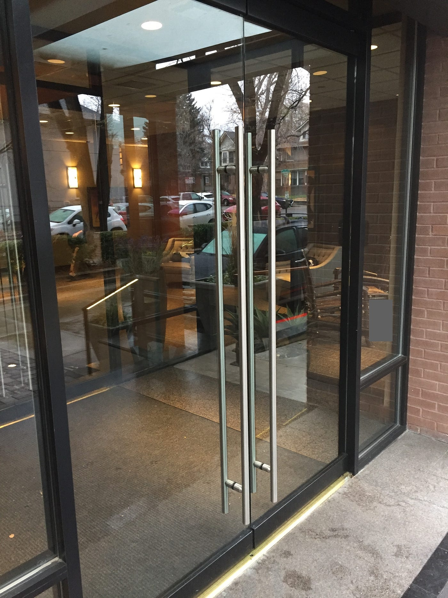

With even the most creative and artistic door, a plain door with a doorknob wins in goal completion. In design, usability always wins over creativity.

Feel free to read more about Norman’s Door [here](https://uxdesign.cc/intro-to-ux-the-norman-door-61f8120b6086).

## What is UI/UX?

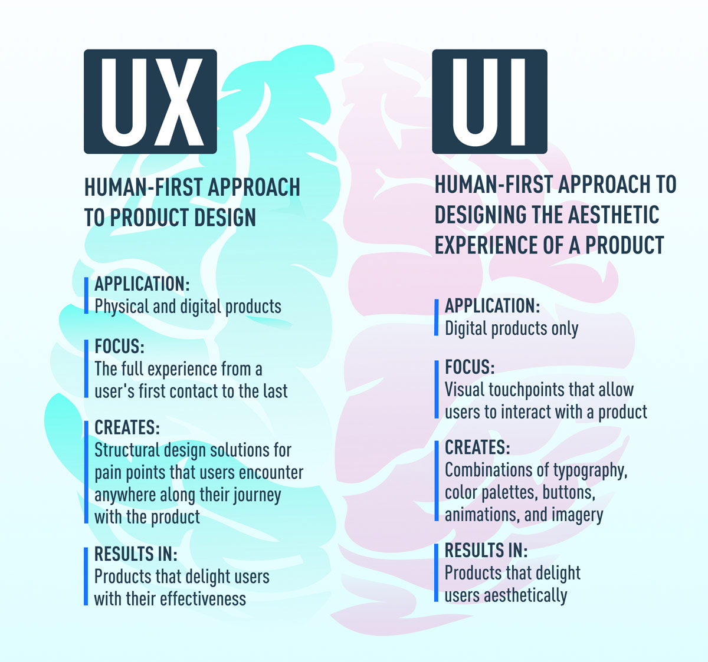

### UI: User Interface

UI design concerns the visual experience of a product. With good UI, you create a visually appealing product. Examples of UI include:

- Typography and Color Palettes
- Images
- Buttons

### UX: User Experience

UX design focuses on the customer experience with a product. It mainly concerns how it feels to use a product. UX is user centered. With good UX, you create a useful and user targeted product.

**UX Research**: research often aimed to further understand your users

TIP

UI and UX go hand in hand. Your UX research should determine how your UI should be designed. Similarly, the way the UI is designed heavily influences the experience of your product.

## UI Elements

Choose/design all your UI elements with intention and your users in mind! Make sure to be consistent with your choices as well. 

This list is not completely comprehensive. There are many UI Elements, too many to go over in one lesson. For a more comprehensive list check out [this site](https://designvault.io/patterns/).

### Fonts/Typography

**Typeface**

- Definition: the design of lettering; a particular set of glyphs that share a common design
- The typeface you choose can have a large impact on the look and feel of your design. It can dictate the branding and tone of your product.

**Sans-serif vs Serif**

- Serifs = embellished
- Sans-serif = without embellishments
- When choosing fonts for your site, typically designers pick one serif and one sans serif.
- Serif fonts tend to look more authoritative and professional, while Sans-serif typically feel more modern
    
    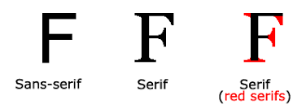
    

**Hierarchy**

- Role: keep the website organized so users can easily identify which category of information they are viewing
- Heading 1, heading 2, text etc.

**Weights**

- Bold, italics, condensed etc.

**Size**

- Desktop: > 15px
- Mobile: > 12px

This is a very simple breakdown of fonts and typography. For more information, feel free to check out [this medium article](https://medium.com/gravitdesigner/typography-elements-everyone-needs-to-understand-5fdea82f470d).

Here are some resources to help choose sets of fonts:

- [fontjoy](https://fontjoy.com/)
- [freefaces](https://www.freefaces.gallery/)

### Colors

There are different colors that correspond to different feelings and emotions. A desired image and branding should reflect in the chosen colors as well! 

You can ensure chosen colors are harmonious by utilizing the color wheel.

Here are some additional resources to help you select a color palette:

- [Adobe Color](https://color.adobe.com/create/color-wheel)
- [Coolors](https://coolors.co/)
    
    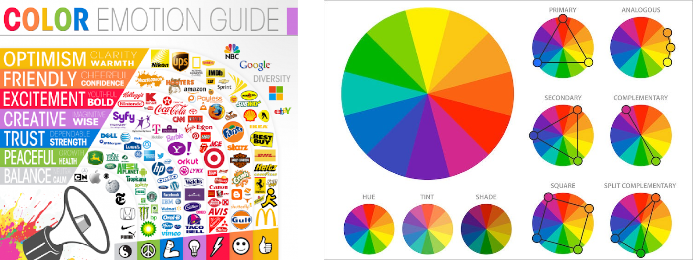
    

TIP

"Less is more" - the more colors you have to work with, the harder it is to get them all to work together

**Contrast**

Make sure your colors are contrasting with each other. Also, make sure the color of your text contrasts the color of the background. Here is a good use of colors and contrast:

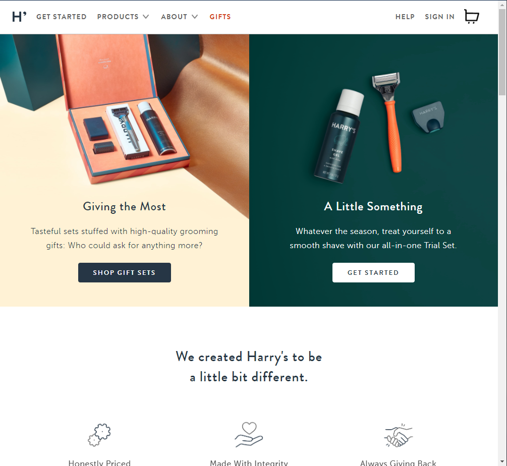

**Accessibility**

Color blindness is a common visual impairment that designers must consider when choosing their colors. Here are some tips in designing with accessibility in mind with colors:

- Use icons and colors
- Keep it minimal
- Use textures
- Use contrasting hues
- Avoid bad color combos popular with color blindness (ex: green-red)

For a more detailed breakdown of how to choose colors with accessibility in mind, check out [this article](https://www.getfeedback.com/resources/ux/how-to-design-for-color-blindness/).

Again, this is a very simple breakdown of colors. For additional information on choosing your colors, check out [this youtube video](https://www.youtube.com/watch?v=C1rQQ_YpgcI).

### Spacing

Most designers like to use a 4 point or 8 point system, where spacing between items is always a multiple of 4 or 8 respectively. 

For example, in a 4 point system, the base unit of spacing will be 4px and increased spacing will be multiples of 4 (ex: 4px, 8px, 16px). It’s recommended to use a modular scale when increasing spacing size to maintain consistency throughout your design.

Using space effectively will allow you to create a visual hierarchy, improve readability, and increase aesthetic appeal.

### Cards

As content has become more compartmentalized and personalized over the last few years, cards have been proven to be a great way to aggregate individual pieces of information in one place.

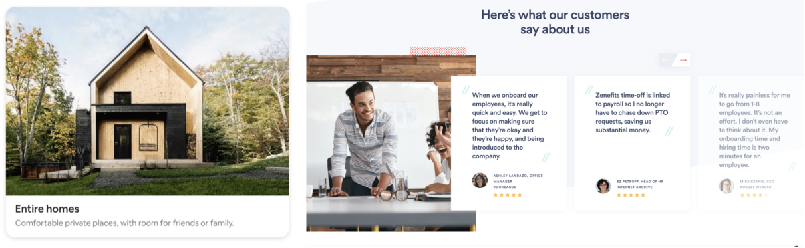

### Nav Bar

The Nav Bar is your user’s directory. It gives easy access to the main pages and simplifies flows.

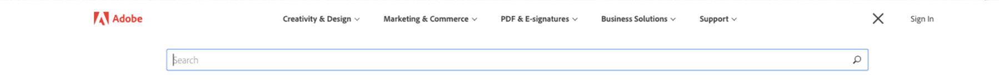

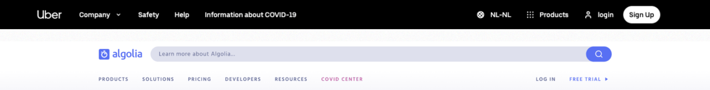

### Buttons

Pressing a button allows a user to perform some sort of action designated by the designer.

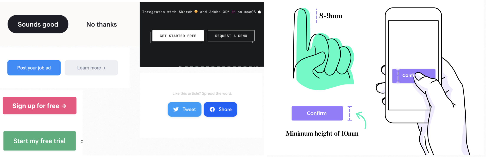

### States

States communicate the status of a UI element.

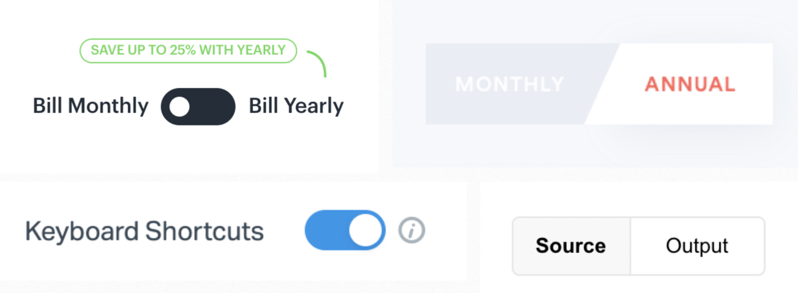

### Forms

Forms allow the product to collect a set of information from the user.

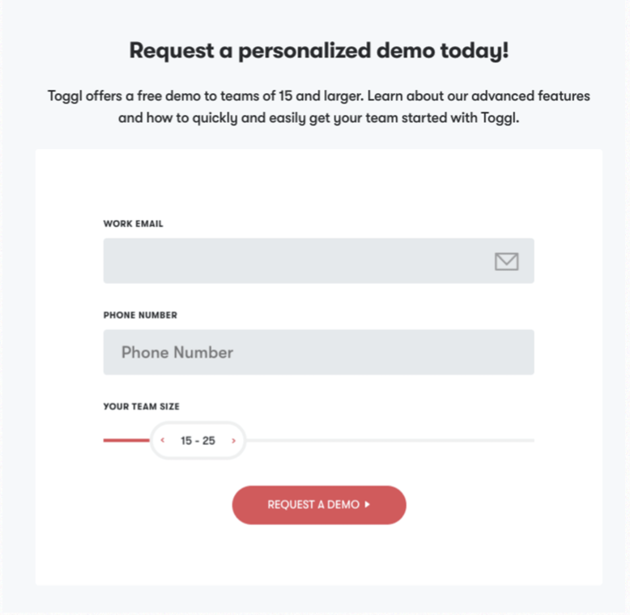

## Role of the Designer

Every user who interacts with your product will have some need: buying something, acquiring information, signing up, logging in, or using a certain feature. **It’s up to the designer to ensure the smoothest and most attractive way for the user to accomplish their goal.**

Here are some typical responsibilities of a web designer:

- Create graphics and features
    - Designing the UI of the website
    - Deciding what is the best way to implement (or not implement) a certain feature
- Design the user flow
    - Where does this button lead to? How do we get to a certain page?
- Conduct UX research
    - Conduct interviews, develop surveys etc
    - Define user personas and storyboard to identify target users and their pain points/needs
- Communicate with developers and clients
    - Visualize and put to paper the needs and visions of clients
    - Ensure their designs are feasible for developers to build
    - Relay intended behaviors of features and designs to developers

## Tools of the Trade

### Adobe Illustrator

Illustrator is a powerful tool that is typically used for graphic design. It’s not commonly used for web or interface design but is often used to create graphics that are used in an interface. Examples of designs made in Illustrator:

### Figma

Figma is a tool for prototyping and designing interfaces. Compared to Illustrator, it is not as good for complex graphics, however, Figma is also occasionally used for more simple graphic designs. The tool is targeted towards UI/UX and Product Designers with features such as simulating clicks, buttons, swipes, animations, and live updates/collaboration. To download Figma for education, follow [this link](https://www.figma.com/education/). Examples of designs made in Figma:

[Barra Labs](https://www.figma.com/proto/5V6vxbrBIjTiboGlLeaE33/BarraLabs-Drafts?node-id=308%3A4&scaling=min-zoom)

[Best Path Transport](https://www.figma.com/proto/XyvI8u5I8NvhFey7gkUrnN/Table-Pages?node-id=257%3A1506&scaling=contain)

### Other Tools

- **Framer**: for prototyping interfaces specifically, integration with Figma
- **Sketch**: not a web application, similar to Figma though
- **Adobe *XD***: An Adobe product, not for teams. Interface design tool.

## Industry Jobs

The ability to design is a hard skill that can be applied to many different industry careers. Here are some popular design jobs you can further explore:

- UI/UX Designer: Designing the user interface and user experience of a digital product
- Product Designer: Designing and evaluating the features of a product
- UX Researcher: Conducting research that will be the backbone of the product’s design
- Graphic Designer: Designing graphics and visuals

# Design Systems

As defined by the [Nielsen Norman Group](https://www.nngroup.com/articles/design-systems-101/), design systems are “a set of standards to manage design at scale by reducing redundancy while creating a shared language and visual consistency across different pages and channels”. 

Acting as a visual reference and guideline, design systems make it much easier to create a new product both from scratch and within an already-existing organization.

> “Design systems are always evolving, and the way you share and encourage adoption of new iterations will evolve along the way as well.” –Diana Mounter, design systems manager at GitHub
> 

Often, a design system includes:

- Color Palette
- Typography
- Sizing and spacing
- Imagery
- Components
- Icons

Hence, a design system has a big role in the branding, or identity, of a product or organization.

Here are some great examples of design systems:

- [Google](https://material.io/)
- [Apple](https://developer.apple.com/design/)
- [Shopify](https://polaris.shopify.com/)

When building your own sites or working with smaller companies, your design system will likely be a lot smaller as there wouldn’t be a need to create a system so comprehensive. Here are a few examples:

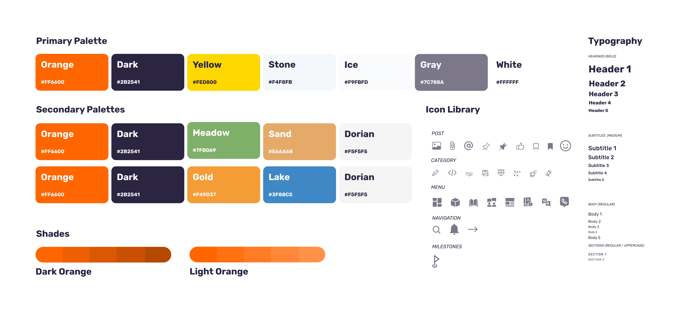

Clicked Co’s Design System (developed through a WDB industry project)

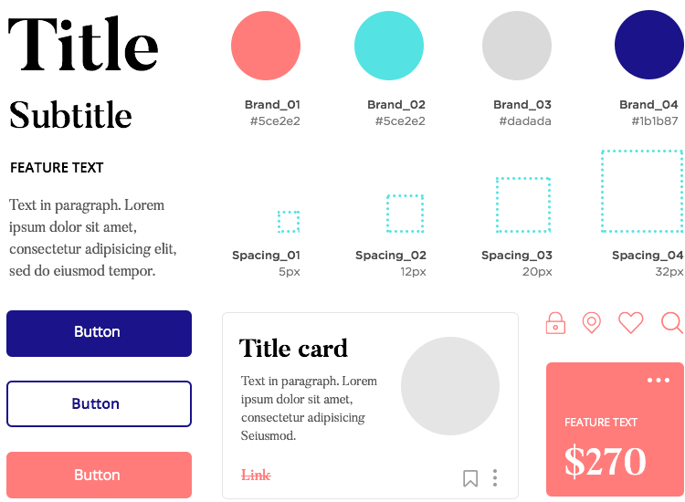

A design system built by [justinmind.com](https://www.justinmind.com/blog/create-and-manage-a-design-system-with-justinmind/)