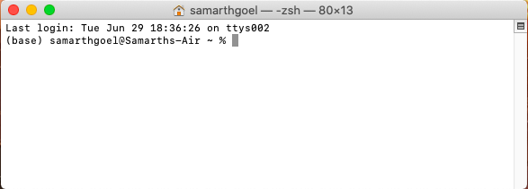
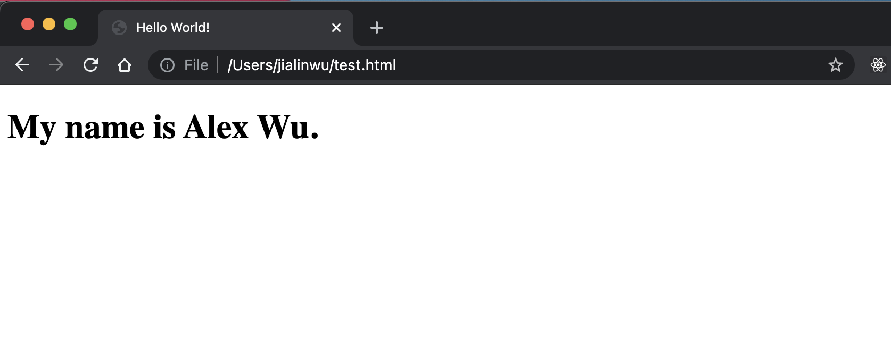
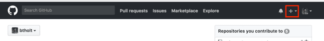
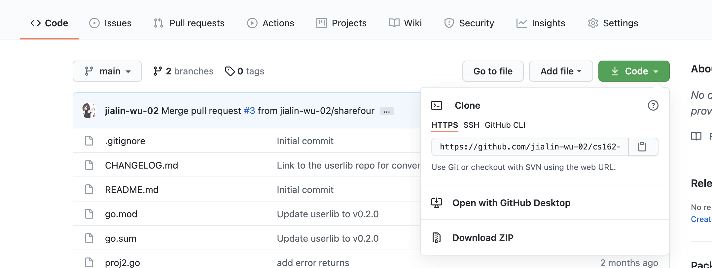
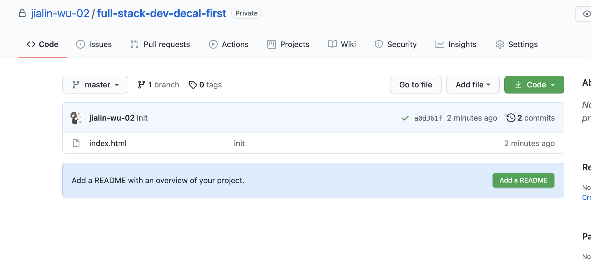
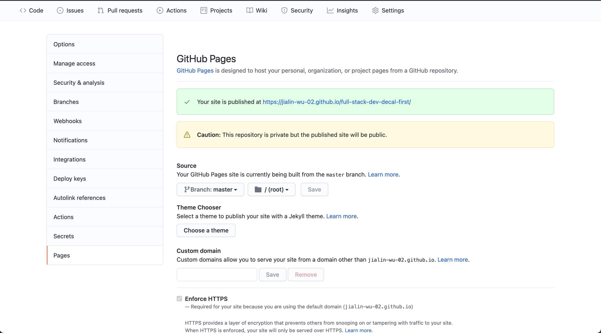
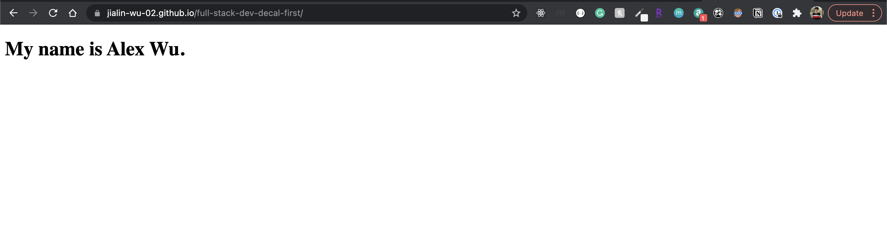

# HW 0 - Getting Started

## Introduction

Welcome to [Web Development at Berkeley's](https://webatberkeley.org/)
full-stack web development decal! This homework will help get you set up and
ready for the rest of the semester. This homework is definitely on the longer
side if you don't have a technical background or have never taken a CS course,
so I recommend starting ASAP if you're new to this stuff. If you have a strong
technical background (CS61A + CS61B or experience with git, Github, and the
terminal), feel free to skip to part 4. If your technical background consists
mostly of CS 61A, Data 8, or another intro programming class, please read
through and do the entire homework.x

## Learning Outcomes

In this homework, you'll learn:

1. How to read technical documentation
2. Set up git on your local computer and how to use git
3. Set up a Github account and a Github repo.
4. Save your work from your local computer into a Github repo.
5. Set up your first website using Github pages!

Let's get started!

## Part 0: Read the Syllabus and the Notes

Pretty self-explanatory. Head over to the [Course Policies](/Syllabus)
and go over it if you haven't already! We'll try to keep the syllabus as
up-to-date as possible, but lecture videos might not be uploaded until a day or
two after the lecture (depending on how good the wifi is and such).

Next, head over to the [lesson notes](https://fullstackdecal.com/docs/Lessons/Lesson1) for this lesson and
read through them. Reading through the lesson notes is extremely important in
this course, as they'll often cover essential material we won't be able to get
to in lecture. This should take 30 minutes. Make sure you read all parts of the
reading.

## Part 1: Learning The Language

For people without a technical background, having to navigate through the vast
set of terminology required to understand the world of development can be a
daunting task, so we'll start by having you go through some documentation.
Documentation is often the best way to get started with learning a new language,
and one of the most important references you can use when programming. All
programmers regardless of experience and background use documentation
religiously, for the simple reason that it's near impossible, and most
definitely inefficient, to memorize every single thing about a language or
technology when the information is easily accessible on the internet.

Start by scanning through this guide:
[A Beginner's Guide to Using Developer Documentation Like a Pro](http://cassandrawilcox.me/beginners-guide-developer-documentation/).
If you don't have a technical background and have trouble understanding the
guide, that's totally fine, just try your best to understand the underlying
ideas and principles the guide is conveying.

Another important resource is StackOverflow, a Q and A site used religiously by
developers to find the answers to their questions. Please read
[How to ask a good Stack Overflow question](https://stackoverflow.com/help/how-to-ask)
and
[Writing the perfect Stack Overflow question](https://codeblog.jonskeet.uk/2010/08/29/writing-the-perfect-question/)
next in order to understand how to best use and navigate StackOverflow.

## Part 2: Verifying git And Creating a Github

First, lets make sure that you have git installed, and if you don't, that we
install it.

### Installation

#### Windows Users

If you don't already have git installed,
[download git here](https://git-scm.com/downloads). This should also download
git bash, which is what we'll reference when we talk about the terminal.

#### Mac Users

If you're using a Mac, you should already have git installed by default.

To verify that you have git installed, follow the following instructions.

1.  Open up Windows (On Mac it can be found under the applications folder ⇒
    Utilities ⇒ Windows). It should like this.

    

2.  Type in this command

    ```bash
    $ git --version
    ```

3.  If your response looks like this (it's fine if you have a different version
    number), you have git installed.

    ```bash
    $ git --version
    git version 2.20.1
    ```

4.  (Mac users only) If your response does not look like the above, install git
    from here: [https://git-scm.com/downloads](https://git-scm.com/downloads).

:::info

Lines that start with a $ are commands that we type in. Lines that don't start
with $ are responses we get from the terminal!

:::

### Create a Github Account

Nice, now you've installed git! Next, let's create a Github account.

Create an account here:

[Github: Where the world builds software](https://github.com/)

Now that you've installed and verified git and created a Github account, let's
talk about why these are necessary tools for all developers and programmers. git
is a distributed source control management tool. That's a fancy way of saying
that it's an easy way to share code and work on it together with a large team.
It's also a very convenient way to backup your code off your computer and an
easy way for you to post code online so other people can use it.
[Here's a great high-level overview of git](https://docs.microsoft.com/en-us/azure/devops/learn/git/what-is-git).
Github is a centralized repository for git projects. It allows strangers across
the world to collaborate on code and make cool stuff. It has become the modern
developer's resume. Many companies host their code there for all their various
open and closed source projects. It's a cool way to browse other people's code
and see how they do things. If you see a mistake, you can **fork** their code,
which means make your own copy of and fix it yourself. Once fixed, you can open
a **pull request** against it. A pull request (often abbreviated as PR) is a
request for them to merge your commits in with theirs. They will then decide if
they want to (since it's their repo) and will merge it or not.

## Part 3: Interacting with the terminal and git

We are going to interact with git from the terminal. If you're on Mac or Linux,
just open your terminal.

### Windows Basics

If you're on Windows, either find a way to interact with the Linux subsystem or
go download [git for Windows](https://gitforwindows.org/). git for Windows is
very bash-like so most of the commands we'll be using should just work. If
you're using the Linux subsystem, everything will definitely work.

#### **bash**

Open your terminal, let's get comfortable with navigating in bash. In bash,
you're just navigating around the folders in your computer. You know how you use
the File Finder (or whatever your operating system has) to find files and you
click in and out-of folders? It's the same for bash, we're just using text
commands to do it now.

#### **pwd**

You should see a fairly empty screen. Type `pwd` and hit enter. `pwd` stands for
"print working directory" (directory is synonymous with folder) and sure enough
it prints where you are in your terminal. It's basically asking bash "where am I
right now?" It should print something like: `/Users/<your user name here>`. This
is probably your home directory. Every user on your computer has their own home
directory. Usually you want to be working out of here to keep things organized.

#### **ls**

Now type `ls`. `ls` stands for "list". It lists everything in the directory.
It'll show you a bunch of files and folders you can open or run. `ls` is like
asking "what's here?" Try typing `ls -l`. You'll notice the same files and
folders are being outputted but it's formatted in a different way. `-l` is
what's called a **flag**. It's something that's passed to the `ls` program and
it modifies what it does. In this case, `-l` means give us the long output. Try
typing `ls -lah`. This will show you even more files because `-a` means show all
files, including hidden files (which are the ones that start with a `.`) and it
will show you the file sizes in more readable sizes because of `-h`.

If you forget what these means,
[explainshell.com](https://explainshell.com/explain?cmd=ls+-lah) is an extremely
helpful site.

#### **mkdir**

Hopefully you're in your home directory right now. If not, type `cd ~` (I'll
explain what that is in the next section.) Okay, now that we're here, type
`mkdir webdev`. This will create a new directory (it stands for "make
directory") and now you can type `ls` and see it.

```bash
cd ~
mkdir webdev
ls
```

#### **cd**

Type `cd webdev`. This will move us from the home directory into the `webdev`
folder we just created. Type `pwd` to see that we're inside the directory. Type
`ls` to see that there's nothing inside the directory. Type `cd ..` to get out
of this directory and back into your home directory. `..` means up one
directory. Type `cd webdev` to get back into the directory.

```bash
cd webdev
ls
```

#### more bash

If you want more bash skills, please check out Jem Young's
[Full Stack for Front-End Engineers](https://frontendmasters.com/courses/fullstack-v2/)
course, or check out
[Programming 101: How to Use the Windows & Command Line](https://blog.galvanize.com/how-to-use-the-terminal-command-line/).

### git

Okay, let's use git now. Start by creating a file called `index.html` in your
newly created `webdev` folder, then put the following code inside your
`index.html` you create. Don't worry if you don't understand any of this, we
will teach html in the next lesson!

```html
<!DOCTYPE html>
<html lang="en">
  <head>
    <title>Hello World!</title>
  </head>

  <body>
    <h1>My name is INSERT YOUR NAME HERE.</h1>
  </body>
</html>
```

- Remember to replace `INSERT YOUR NAME HERE.` by your name!

After you create this index.html file, try to open it up using a browser. You
should see something like this:



#### git init

Make sure you are inside the `webdev` folder. Then type `git init`. This begins
a git project. If you type `ls -lah` you'll see that it creates a secret `.git`
folder where it keeps track of everything (you don't have to look in there or do
anything with it.)

#### **git status**

Type `git status`. This will tell you that `index.html` is an untracked file.

The way git is organized is that you group you changes into what are called
**commits**. A commit is one group of changes that are made permanent. A git
repository will have many commits. Some will have just one commit, some will
have many. As of May 12, 2018, the git repository for the Linux project has
753,310 commits. A commit is made up of all the changes, the differences between
where the code was and where the code is now. This will add new files, remove
old files, delete some lines in some files, and add lines in others.

So let's make our first commit in this repository.

#### **git add**

The way you add files to a commit is that they have to go through two stages:
being staged and then being committed. Type `git add index.html`. This will make
index.html staged and ready to be committed. Type `git status` and it will show
index.html as a change ready to be committed. You can also type `git add .` to
make everything in this directory staged, or type `git add -A` to add everything
_and_ include anything you deleted to also be deleted from the repo.

#### **git commit**

Type `git commit -m "My first commit"`. It should tell you added your first
commit. Type `git status` and it should tell you you haven't changed anything
since last commit. The `-m` is important because each commit must have a message
with it and it's best to say what you did in that commit, something like "fixed
this bug" or "added this feature". If you forget the `-m` it'll probably throw
you into vim, so be prepared!

### Github

Now, we're going to create our own Github repo.



Click the + (highlighted in red) in the nav and create a new repository. Name
the new repo whatever you would like, do not add the license or README, and
continue.

#### **git remote**

Back to your terminal, navigate to your project using `cd` and write the
following command: `git remote add origin <your project url here>`. Notice about
half way down the page you can see that command, feel free to copy and paste
that.

- you can also find your project url here:
  

This command is going to add a new remote to your project called `origin`. A
remote is somewhere for you to push your computer. If you use a Github-based
flow (most of us do) this will be one of the very few remotes you'll ever use.
git can be used in a more decentralized way; you could have a remote that's your
buddy's computer. But I've never worked that way. We called the remote "origin"
but we could have called it anything. But everyone calls it origin. "origin"
should always be called where _your_ repo is. Sometimes you'll fork someone
else's code and keep track of that repo too, and typically you'd call that
"upstream".

Type `git remote -v` and you should see your newly-added remote. It adds the
remote twice because you can fetch (which is what you call when you pull code
down) from one place and you can push (which is what you call when you send your
code up) to another. I've never seen anyone do that though.

#### **git push**

Okay, now that we're here, type `git push origin main`. `push` is the command
to send your code up to Github `origin` is the name of the remote that we just
added. `main` is the name of the branch that we're on. git has the ability to
keep track of multiple branches of code so that you and your colleague can work
on the same code at the same time but each keep your own copy. For now we're
working out of the main branch which the main branch that everyone will
eventually merge their code into.

#### **more git**

git is so powerful. There are a lot of really cool features. Probably the
biggest thing we didn't talk about here is merging code with others. See
[Nina Zakharenko's course](https://frontendmasters.com/courses/git-in-depth/) to
become a git master. Some other basic functions you'll want to learn is how to
`git log` `git pull`, `git clone`, `git merge`, `git rebase`, `git stash`,
`git checkout`, and `git branch`. Those are the ones that are needed for base
level proficiency in git. There are many more commands that make git an integral
tool to comprehend, but the important ones for the course are the ones mentioned
here.

### Github Pages

Github Pages is a service provided by Github to allow users to host website for
free! It's also very simple and straightforward to use.

First of all, make sure that on your Github repo, you have your `index.html` in
place.



Next, Go to `Settings` ⇒ `Pages`, and then select the Github pages option. You
should see this:



Wait a few minutes, and then click on the url to your site, you should see
something like this:



## Submission

Congratulations! Now you have just created your first web page and Github repo!
Copy the link to your new webpage and submit it to Gradescope.

## Helpful Resources

[A Beginner's Guide to Using Developer Documentation Like a Pro](http://cassandrawilcox.me/beginners-guide-developer-documentation/)

[How do I ask a good question? - Help Center](https://stackoverflow.com/help/how-to-ask)

[Writing the perfect question](https://codeblog.jonskeet.uk/2010/08/29/writing-the-perfect-question/)

[What is git? - Azure DevOps](https://docs.microsoft.com/en-us/azure/devops/learn/git/what-is-git)

[Programming 101: How to Use the Windows & Command Line](https://blog.galvanize.com/how-to-use-the-terminal-command-line/)

---

**Contributors**

- [Alex Wu](https://www.linkedin.com/in/jialin-wu-alex/)
- [Arushi Somani](https://www.linkedin.com/in/arushisomani/)
- [Brian Holt](https://www.linkedin.com/in/btholt/)
- [Samarth Goel](https://www.linkedin.com/in/samarth-goel-1047b8187/)
- Inspiration for part 1 and the beginning of part 2 of this homework taken from
  [Cal Hack](https://calhacks.io/)'s
  [Cubstart: Intro to Building Apps](https://www.notion.so/Cubstart-Intro-to-Building-Apps-d42282d66dd942c399b6ce87167889d6)
